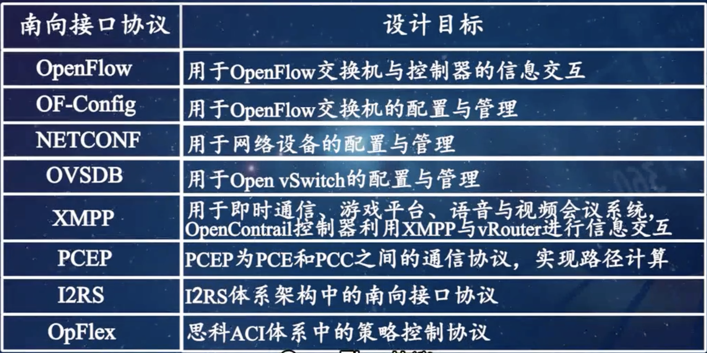

# Southbound Interface Protocol

[TOC]

:link:【软件定义网络技术 Software Defined Networking，SDN 黄辉、施晓秋】 https://www.bilibili.com/video/BV1S4411C7Zx/?p=13&share_source=copy_web&vd_source=7740584ebdab35221363fc24d1582d9d

SIP List :

- OpenFlow

- OF-Config

- NETCONF

- OVSDB

- XMPP

- PCEP
- I2RS
- OpFlex

