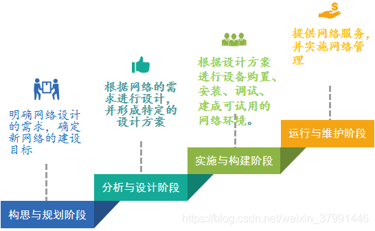
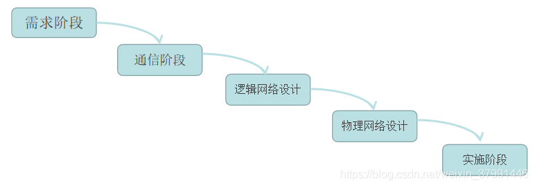
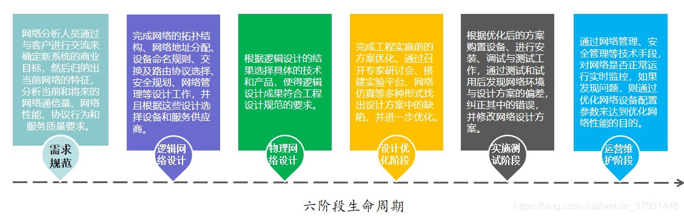

# Networking System

[TOC]

## Networking System Life Circle

一般来说，网络的生命周期至少应该包括：网络系统的构思和计划、分析和设计、运行和维护的过程。网络系统的生命周期与软件工程中的软件生命周期非常类似，首先它是一个循环迭代的过程，每次循环迭代的动力都来自于网络应用需求的变更。其次，每次循环变更过程都存在需求分析、规划设计、实施调试和运营维护等多个阶段。
每一个迭代周期都是网络重构的过程，不同的网络设计方法，对迭代周期的划分方式是不同的，拥有不同的网络文档模板，但是实施后的效果都满足了用户的网络需求。

常见的迭代周期有三种：

1.四阶段周期

2.五阶段周期

按照这种流程构建网络，在下一个阶段开始之前，前一阶段的工作已经完成，一般情况下，不允许返回到前面的阶段，如果出现前一阶段的工作没有完成就开始进入下一个阶段，则会对后续的工作造成较大影响，甚至引起工期拖后和成本超支。
这种方法的主要优势在于所有的计划在较早的阶段完成，系统的所有责任人对系统的具体情况以及工作进度都非常清楚，更容易协调工作。

3.六阶段生命周期

六阶段生命周期偏重于网络的测试和优化，侧重于网络需求的不断变更；由于其严格的逻辑设计和物理设计规范，是的这种模式适合于大型网络的建设工作。
