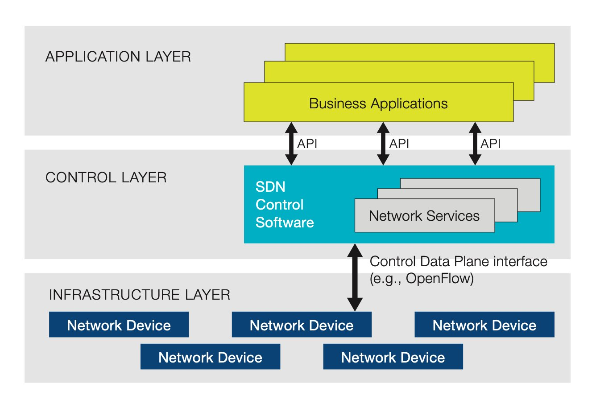
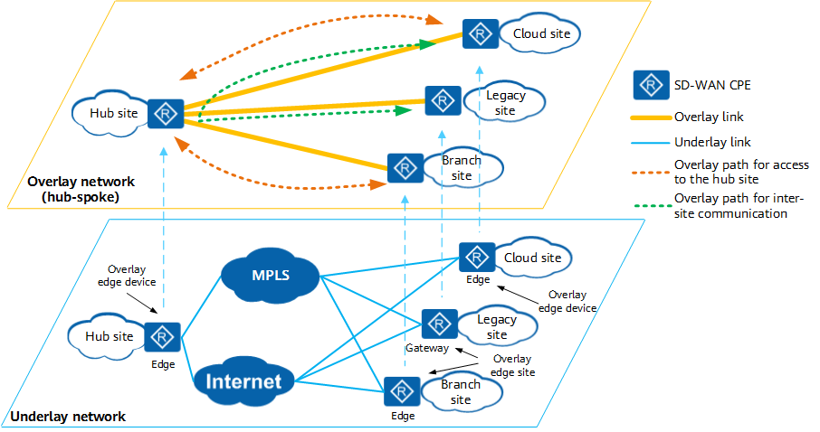
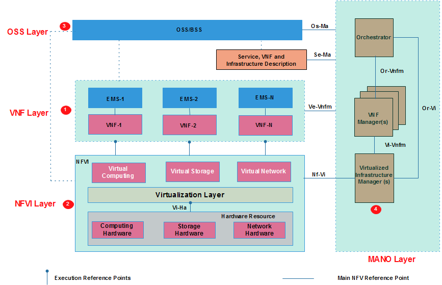
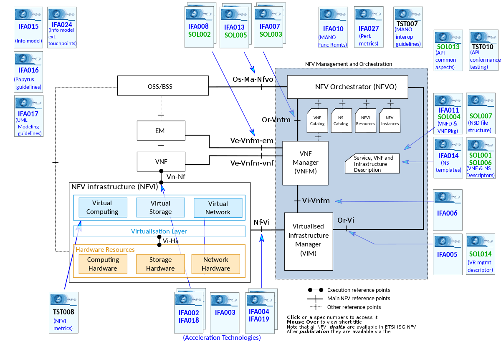

# SDN Standardizations & Architectures

[TOC]

## Res
### Related Topics

## 🎯 SDN Organizations, Institutes, and Standardizations
### ONF (Open Networking Fundation)
https://opennetworking.org

Openflow 

of-config

### IETF

I2RS

### ITU-T

Y.FNsdn-fmV

Y.FNsdn

### ETSI

NFV ISG

## 🎯 SDN Architectures
There are different SDN architecutres as to didfferent norms. Below lists some of them.

### 1️⃣ ONF - OpenFlow
> ↗ [ONF - OpenFlow](../ONF%20-%20OpenFlow/ONF%20-%20OpenFlow.md)

### 2️⃣ IETF

??

TBD

### 3️⃣ Overlay
> ↗ [Overlay Network](../../Network%20Virtualization/Overlay%20Network.md)

#### Overlay
#### Underlay

### 4️⃣ NFV (Network Function Virtualization)
> ↗ [NFV (Network Function Virtualization)](../../Network%20Virtualization/NFV%20(Network%20Function%20Virtualization)/NFV%20(Network%20Function%20Virtualization).md)

## Ref

