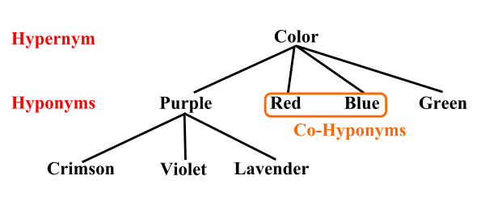
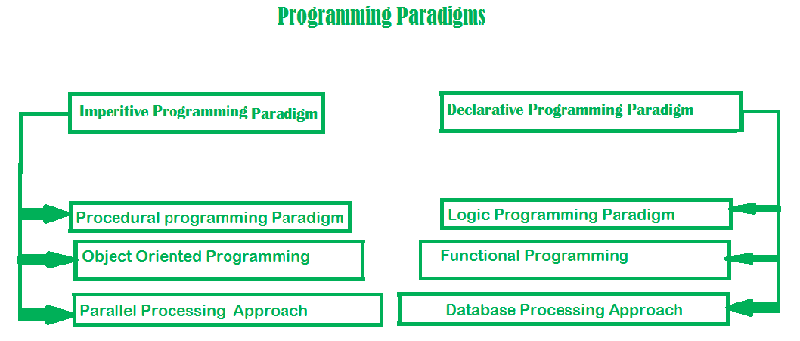

# Computer Languages & Programming Methodology

[TOC]


## Res
### Related Topics
↗ [Automata Theory and (Formal) Language Theory](../../🧮%20Math%20&%20Theoretical%20Computer%20Science%20(TCS)/🤼‍♀️%20Mathematical%20Logics/😶‍🌫️%20Theory%20of%20Computation/🍏%20Automata%20Theory%20and%20(Formal)%20Language%20Theory/Automata%20Theory%20and%20(Formal)%20Language%20Theory.md)
↗ [SCA (Static Code Analysis) & SAST](../../CyberSecurity/🏰%20Cybersecurity%20Basics%20&%20InfoSec/🍦%20Software%20Security/🪆%20Software%20Analysis%20&%20Binary%20Engineering/📌%20Software%20Analysis%20Basics%20Methodologies/📌%20SCA%20(Static%20Code%20Analysis)%20&%20SAST/SCA%20(Static%20Code%20Analysis)%20&%20SAST.md)
↗ [Program Language Translation & Compilation Theory (Compile-time)](../🛣️%20Program%20Compilation%20&%20Execution/🚮%20Program%20Language%20Translation%20&%20Compilation%20Theory%20(Compile-time)/Program%20Language%20Translation%20&%20Compilation%20Theory%20(Compile-time).md)
↗ [Program Compilation & Execution](../🛣️%20Program%20Compilation%20&%20Execution/Program%20Compilation%20&%20Execution.md)
↗ [Program, Computer, and Automation](../../🗺%20CS%20Overview/Program,%20Computer,%20and%20Automation.md)

↗ [Computing Methodologies](../../🧠%20Computing%20Methodologies/Computing%20Methodologies.md)
- ↗ [Concurrent Computing](../../🧠%20Computing%20Methodologies/Concurrent%20Computing/Concurrent%20Computing.md)
- ↗ [Distributed Computing & Systems](../../🧠%20Computing%20Methodologies/Distributed%20Computing%20&%20Systems/Distributed%20Computing%20&%20Systems.md)
- ↗ [Parallel Computing](../../🧠%20Computing%20Methodologies/Parallel%20Computing/Parallel%20Computing.md)
- ↗ [Quantum Computing (and Communication)](../../🧠%20Computing%20Methodologies/Quantum%20Computing%20(and%20Communication)/Quantum%20Computing%20(and%20Communication).md)
- etc.

↗ [Database Languages](../🍕%20Computer%20Storage%20&%20Database%20Systems/Database%20Systems/🗣️%20Database%20Languages/Database%20Languages.md)
↗ [HDL (Hardware Definition Languages)](../../Computer%20Engineering,%20Embedded%20&%20IoT/Embedded%20Programming%20&%20Software%20Development/Languages/HDL%20(Hardware%20Definition%20Languages)/HDL%20(Hardware%20Definition%20Languages).md)
↗ [Web Templating Engines & Languages](../../Software%20Engineering/☝️%20Application%20Software%20Engineering/🕸️%20Web%20Development%20&%20The%20Internet/🖥️%20Web%20FrontEnd%20Dev/⬆️%20Frontend%20Optimization/Web%20Templating/Web%20Templating%20Engines%20&%20Languages/Web%20Templating%20Engines%20&%20Languages.md)

↗ [Program Debugging & Defensive Programming](../../🗺%20CS%20Overview/Program%20Debugging%20&%20Defensive%20Programming.md)
↗ [System Software Engineering](../../Software%20Engineering/👇%20System%20Software%20Engineering/System%20Software%20Engineering.md)
- ↗ [Computer (IO Devices) Drivers & Programming](../👷🏾‍♂️%20Computer%20(Host)%20System/Computer%20Interfaces%20&%20Hardware%20Drivers/🛞%20Computer%20(IO%20Devices)%20Drivers%20&%20Programming/Computer%20(IO%20Devices)%20Drivers%20&%20Programming.md)
- ↗ [Compute Unified Device Architecture & CUDA Programming](../../Software%20Engineering/👇%20System%20Software%20Engineering/System%20Level%20Projects/Compute%20Unified%20Device%20Architecture%20&%20CUDA%20Programming/Compute%20Unified%20Device%20Architecture%20&%20CUDA%20Programming.md)
↗ [Network Programming & RPC](../🏎️%20Computer%20Networking%20and%20Communication/Network%20Programming%20&%20RPC/Network%20Programming%20&%20RPC.md)
- ↗ [DPDK (Data Plane Development Kits)](../🏎️%20Computer%20Networking%20and%20Communication/🚀%20High%20Performance%20Network%20(HPN)%20&%20IDC%20Technologies/DPDK%20(Data%20Plane%20Development%20Kits)/DPDK%20(Data%20Plane%20Development%20Kits).md)
↗ [ML Programming & Frameworks](../../🧠%20Computing%20Methodologies/👽%20Artificial%20Intelligence/🏗️%20AI%20(Data)%20Infrastructure%20&%20Stack/🛫%20Foundation%20Models%20&%20Libraries%20&%20SDKs/ML%20Programming%20&%20Frameworks/ML%20Programming%20&%20Frameworks.md)
↗ [Computer Graphics Programming](../../Software%20Engineering/☝️%20Application%20Software%20Engineering/🎨%20Computer%20Graphics%20Programming/Computer%20Graphics%20Programming.md)
↗ [Concurrent Programming](../👷🏾‍♂️%20Computer%20(Host)%20System/Operating%20System%20&%20OS%20Kernel%20(Theory%20Part)/OS%20Processes%20&%20Automata%20Management%20(CPU%20+%20Main%20Memory%20Resource)/Concurrent%20Programming.md)
↗ [Embedded Programming & Software Development](../../Computer%20Engineering,%20Embedded%20&%20IoT/Embedded%20Programming%20&%20Software%20Development/Embedded%20Programming%20&%20Software%20Development.md)

↗ [Software Engineering](../../Software%20Engineering/Software%20Engineering.md)
↗ [Galleries & Awesome SE](../../Software%20Engineering/🏇%20Galleries%20&%20Awesome%20SE/Galleries%20&%20Awesome%20SE.md)

↗ [Software Security](../../CyberSecurity/🏰%20Cybersecurity%20Basics%20&%20InfoSec/🍦%20Software%20Security/Software%20Security.md)
↗ [Software Analysis & Binary Engineering](../../CyberSecurity/🏰%20Cybersecurity%20Basics%20&%20InfoSec/🍦%20Software%20Security/🪆%20Software%20Analysis%20&%20Binary%20Engineering/Software%20Analysis%20&%20Binary%20Engineering.md)

↗ [Natural Language Processing (NLP)](../../🧠%20Computing%20Methodologies/👽%20Artificial%20Intelligence/🔥%20Natural%20Language%20Processing%20(NLP)/Natural%20Language%20Processing%20(NLP).md)


### Other Resources
[List Of Some Of The Software Development Trends That Have Dominated The Year 2020](https://www.cisin.com/coffee-break/trends/list-of-some-of-the-software-development-trends-that-have-dominated-the-year-2020.html)

🪜 https://www.tiobe.com/tiobe-index/
TIOBE - programming language rank

🎬【实验生存指南：代码风格和定制化 gdb 调试 [南京大学2023操作系统-P18] (蒋炎岩)】 https://www.bilibili.com/video/BV1aT411H77C/?share_source=copy_web&vd_source=7740584ebdab35221363fc24d1582d9d

https://github.com/jobbole
伯乐在线 - 各种编程资源大全


## Intro
### Formal Languages 🆚 Natural Languages
> 🔗 https://runestone.academy/ns/books/published/thinkcspy/GeneralIntro/FormalandNaturalLanguages.html

**Natural languages** are the languages that people speak, such as English, Spanish, and French. They were not designed by people (although people try to impose some order on them); they evolved naturally.

**Formal languages** are languages that are designed by people for specific applications. For example, the notation that mathematicians use is a formal language that is particularly good at denoting relationships among numbers and symbols. Chemists use a formal language to represent the chemical structure of molecules. And most importantly:

> Programming languages are formal languages that have been designed to express computations.

Formal languages tend to have strict rules about syntax. For example, `3+3=6` is a syntactically correct mathematical statement, but `3=+6$` is not. H2O is a syntactically correct chemical name, but 2Zz is not.

Syntax rules come in two flavors, pertaining to **tokens** and **structure**. Tokens are the basic elements of the language, such as words, numbers, and chemical elements. One of the problems with `3=+6$` is that `$` is not a legal token in mathematics (at least as far as we know). Similarly, 2Zz is not legal because there is no element with the abbreviation `Zz`.

The second type of syntax rule pertains to the **structure** of a statement— that is, the way the tokens are arranged. The statement `3=+6$` is structurally illegal because you can’t place a plus sign immediately after an equal sign. Similarly, molecular formulas have to have subscripts after the element name, not before.

When you read a sentence in English or a statement in a formal language, you have to figure out what the structure of the sentence is (although in a natural language you do this subconsciously). This process is called **parsing**.

For example, when you hear the sentence, “The other shoe fell”, you understand that the other shoe is the subject and fell is the verb. Once you have parsed a sentence, you can figure out what it means, or the **semantics** of the sentence. Assuming that you know what a shoe is and what it means to fall, you will understand the general implication of this sentence.

Although formal and natural languages have many features in common — tokens, structure, syntax, and semantics — there are many **differences**:
- ambiguity
	- Natural languages are full of ambiguity, which people deal with by using contextual clues and other information. Formal languages are designed to be nearly or completely unambiguous, which means that any statement has exactly one meaning, regardless of context.
- redundancy
	- In order to make up for ambiguity and reduce misunderstandings, natural languages employ lots of redundancy. As a result, they are often verbose. Formal languages are less redundant and more concise.
- literalness
	- Formal languages mean exactly what they say. On the other hand, natural languages are full of idiom and metaphor. If someone says, “The other shoe fell”, there is probably no shoe and nothing falling.
#### \* Linguistics and Semiotics
> 🔗 https://en.wikipedia.org/wiki/Linguistics

Linguistics is the scientific study of language. The areas of linguistic analysis are syntax (rules governing the structure of sentences), semantics (meaning), morphology (structure of words), phonetics (speech sounds and equivalent gestures in sign languages), phonology (the abstract sound system of a particular language, and analogous systems of sign languages), and pragmatics (how the context of use contributes to meaning). Subdisciplines such as biolinguistics (the study of the biological variables and evolution of language) and psycholinguistics (the study of psychological factors in human language) bridge many of these divisions. 

> 🔗 https://en.wikipedia.org/wiki/Semiotics

Semiotics (/ˌsɛmiˈɒtɪks/ SEM-ee-OT-iks) is the systematic study of sign processes and the communication of meaning. In semiotics, a sign is defined as anything that communicates intentional and unintentional meaning or feelings to the sign's interpreter.

Semiosis is any activity, conduct, or process that involves signs. Signs often are communicated by verbal language, but also by gestures, or by other forms of language, e.g. artistic ones (music, painting, sculpture, etc.). Contemporary semiotics is a branch of science that generally studies meaning-making (whether communicated or not) and various types of knowledge.[1]

Unlike linguistics, semiotics also studies non-linguistic sign systems. Semiotics includes the study of indication, designation, likeness, analogy, allegory, metonymy, metaphor, symbolism, signification, and communication.


### Computer Languages
> 🔗 https://en.wikipedia.org/wiki/Computer_language

A **computer language** is a [formal language](https://en.wikipedia.org/wiki/Formal_language "Formal language") used to communicate with a [computer](https://en.wikipedia.org/wiki/Computer "Computer"). Types of computer languages include:
- [Construction language](https://en.wikipedia.org/wiki/Software_construction#Construction_languages "Software construction") – all forms of communication by which a human can [specify an executable problem solution to a computer](https://en.wikipedia.org/wiki/Computer_programming "Computer programming")
    - [Command language](https://en.wikipedia.org/wiki/Command_language "Command language") – a language used to control the tasks of the computer itself, such as starting programs
    - [Configuration language](https://en.wikipedia.org/wiki/Configuration_file#Configuration_languages "Configuration file") – a language used to write [configuration files](https://en.wikipedia.org/wiki/Configuration_files "Configuration files")
    - [Programming language](https://en.wikipedia.org/wiki/Programming_language "Programming language") – a formal language designed to communicate instructions to a machine, particularly a computer
        - [Scripting language](https://en.wikipedia.org/wiki/Scripting_language "Scripting language") – a type of programming language which typically is interpreted at runtime rather than being compiled
    - [Query language](https://en.wikipedia.org/wiki/Query_language "Query language") – a language used to make [queries](https://en.wikipedia.org/wiki/Information_retrieval "Information retrieval") in [databases](https://en.wikipedia.org/wiki/Databases "Databases") and [information systems](https://en.wikipedia.org/wiki/Information_systems "Information systems")
    - [Transformation language](https://en.wikipedia.org/wiki/Transformation_language "Transformation language") – designed to transform some input text in a certain formal language into a modified output text that meets some specific goal
- [Data exchange language](https://en.wikipedia.org/wiki/Data_exchange#Data_exchange_languages "Data exchange") – a language that is domain-independent and can be used for data from any kind of discipline; examples: [JSON](https://en.wikipedia.org/wiki/JSON "JSON"), [XML](https://en.wikipedia.org/wiki/XML "XML")
- [Markup language](https://en.wikipedia.org/wiki/Markup_language "Markup language") – a grammar for annotating a document in a way that is syntactically distinguishable from the text, such as [HTML](https://en.wikipedia.org/wiki/HTML "HTML")
- [Modeling language](https://en.wikipedia.org/wiki/Modeling_language "Modeling language") – an artificial language used to express information or knowledge, often for use in computer system design
    - [Architecture description language](https://en.wikipedia.org/wiki/Architecture_description_language "Architecture description language") – used as a language (or a conceptual model) to describe and represent system architectures
    - [Hardware description language](https://en.wikipedia.org/wiki/Hardware_description_language "Hardware description language") – used to model [integrated circuits](https://en.wikipedia.org/wiki/Integrated_circuits "Integrated circuits")
- [Page description language](https://en.wikipedia.org/wiki/Page_description_language "Page description language") – describes the appearance of a printed page in a higher level than an actual output [bitmap](https://en.wikipedia.org/wiki/Bitmap "Bitmap")
- [Simulation language](https://en.wikipedia.org/wiki/Simulation_language "Simulation language") – a language used to describe [simulations](https://en.wikipedia.org/wiki/Simulations "Simulations")
- [Specification language](https://en.wikipedia.org/wiki/Specification_language "Specification language") – a language used to describe what a system should do
- [Style sheet language](https://en.wikipedia.org/wiki/Style_sheet_language "Style sheet language") – a computer language that expresses the presentation of structured documents, such as [CSS](https://en.wikipedia.org/wiki/CSS "CSS")

- [Expression language](https://en.wikipedia.org/wiki/Expression_language) -- a [computer language](https://en.wikipedia.org/wiki/Computer_language "Computer language") for creating a [machine readable](https://en.wikipedia.org/wiki/Machine_readable "Machine readable") representation of specific [domain knowledge](https://en.wikipedia.org/wiki/Domain_knowledge "Domain knowledge"). Examples include:
	- [Advanced Boolean Expression Language](https://en.wikipedia.org/wiki/Advanced_Boolean_Expression_Language "Advanced Boolean Expression Language"), an obsolete hardware description language for hardware descriptions
	- [Data Analysis Expressions](https://en.wikipedia.org/wiki/Data_Analysis_Expressions "Data Analysis Expressions") (DAX), an expression language developed by Microsoft and used in Power Pivot, among other places
	- [Jakarta Expression Language](https://en.wikipedia.org/wiki/Jakarta_Expression_Language "Jakarta Expression Language"), a domain-specific language used in Jakarta EE web applications. Formerly known as "Unified Expression Language", "Expression Language" or just "the Expression Language").
	- [Rights Expression Languages](https://en.wikipedia.org/wiki/Rights_Expression_Language "Rights Expression Language"), machine processable language used for representing immaterial rights such as copyright and license information


### Programming Language
> 🔗 https://en.wikipedia.org/wiki/Programming_language

A programming language is a system of notation for writing computer programs. Programming languages are described in terms of their **syntax (form)** and **semantics (meaning)**, usually defined by a formal language. Languages usually provide features such as a **type system**, **variables**, and **mechanisms for error handling**. An implementation of a programming language is required in order to execute programs, namely an interpreter or a compiler. An interpreter directly executes the source code, while a compiler produces an executable program.

Computer architecture has strongly influenced the design of programming languages, with the most common type (imperative languages—which implement operations in a specified order) developed to perform well on the popular von Neumann architecture. While early programming languages were closely tied to the hardware, over time they have developed more abstraction to hide implementation details for greater simplicity.
#### History & Generations of (High-Level) Programming Languages
> ↗ https://en.wikipedia.org/wiki/Hyponymy_and_hypernymy 




> ↗ https://zh.wikipedia.org/zh-cn/程式語言歷史
+ Hyponymy & hyperymy

> ↗ https://en.wikipedia.org/wiki/History_of_programming_languages

1. Early History
	1. During 1842–1849, **Ada Lovelace** translated the memoir of Italian mathematician Luigi Menabrea about Charles Babbage's newest proposed machine: the **Analytical Engine**; she supplemented the memoir with notes that specified in detail a method for calculating Bernoulli numbers with the engine, recognized by most of historians as the **world's first published computer program**.
	2. **Jacquard Looms** and **Charles Babbage**'s **Difference Engine** both were designed to utilize punched cards, which would describe the sequence of operations that their programmable machines should perform.
	3. The **first computer codes** were specialized for their applications: e.g., Alonzo Church was able to express the lambda calculus in a formulaic way and the Turing machine was an abstraction of the operation of a tape-marking machine.
	4. In the 1940s, the **first recognizably modern electrically powered computers** were created. The limited speed and memory capacity forced programmers to write hand-tuned assembly language programs. It was eventually realized that programming in assembly language required a great deal of intellectual effort. An early proposal for a high-level programming language was Plankalkül, developed by Konrad Zuse for his Z1 computer between 1942 and 1945 but not implemented at the time. 
	5. The **first functioning programming languages** designed to communicate instructions to a computer were written in the early 1950s. John Mauchly's Short Code, proposed in 1949, was one of the first high-level languages ever developed for an electronic computer. Unlike machine code, Short Code statements represented mathematical expressions in understandable form. However, the program had to be interpreted into machine code every time it ran, making the process much slower than running the equivalent machine code.
2. 1950 ～ 1967
	1. Some notable languages that were developed in this period include:
	2. 1951 – [Regional Assembly Language](https://en.wikipedia.org/wiki/Assembly_language "Assembly language")
	3. 1952 – [Autocode](https://en.wikipedia.org/wiki/Autocode "Autocode")
	4. 1954 – [IPL](https://en.wikipedia.org/wiki/Information_Processing_Language "Information Processing Language") (forerunner to LISP)
	5. 1955 – [FLOW-MATIC](https://en.wikipedia.org/wiki/FLOW-MATIC "FLOW-MATIC") (led to COBOL)
	6. 1957 – [FORTRAN](https://en.wikipedia.org/wiki/Fortran "Fortran") (first compiler)
	7. 1957 – [COMTRAN](https://en.wikipedia.org/wiki/COMTRAN "COMTRAN") (precursor to COBOL)
	8. 1958 – [LISP](https://en.wikipedia.org/wiki/Lisp_\(programming_language\) "Lisp (programming language)")
	9. 1958 – [ALGOL 58](https://en.wikipedia.org/wiki/ALGOL_58 "ALGOL 58")
	10. 1959 – [FACT](https://en.wikipedia.org/wiki/FACT_computer_language "FACT computer language") (forerunner to COBOL)
	11. 1959 – [COBOL](https://en.wikipedia.org/wiki/COBOL "COBOL")
	12. 1959 – [RPG](https://en.wikipedia.org/wiki/IBM_RPG "IBM RPG")
	13. 1960 – [ALGOL 60](https://en.wikipedia.org/wiki/ALGOL_60 "ALGOL 60")
	14. 1962 – [APL](https://en.wikipedia.org/wiki/APL_\(programming_language\) "APL (programming language)")
	15. 1962 – [Simula](https://en.wikipedia.org/wiki/Simula "Simula")
	16. 1962 – [SNOBOL](https://en.wikipedia.org/wiki/SNOBOL "SNOBOL")
	17. 1963 – [CPL](https://en.wikipedia.org/wiki/Combined_Programming_Language "Combined Programming Language") (forerunner to C)
	18. 1964 – [Speakeasy](https://en.wikipedia.org/wiki/Speakeasy_\(computational_environment\) "Speakeasy (computational environment)")
	19. 1964 – [BASIC](https://en.wikipedia.org/wiki/BASIC "BASIC")
	20. 1964 – [PL/I](https://en.wikipedia.org/wiki/PL/I "PL/I")
	21. 1966 – [JOSS](https://en.wikipedia.org/wiki/JOSS "JOSS")
	22. 1966 – [MUMPS](https://en.wikipedia.org/wiki/MUMPS "MUMPS")
	23. 1967 – [BCPL](https://en.wikipedia.org/wiki/BCPL "BCPL") (forerunner to C)
	24. 1967 – [Logo](https://en.wikipedia.org/wiki/Logo_\(programming_language\) "Logo (programming language)") (an educational language that later influenced [Smalltalk](https://en.wikipedia.org/wiki/Smalltalk "Smalltalk") and [Scratch](https://en.wikipedia.org/wiki/Scratch_\(programming_language\) "Scratch (programming language)")).
3. 1967 ～ 1978
	1. Some notable languages that were developed in this period include:
	2. 1967 – [BCPL](https://en.wikipedia.org/wiki/BCPL "BCPL") (forerunner to B)
	3. 1967 – [Logo](https://en.wikipedia.org/wiki/Logo_\(programming_language\) "Logo (programming language)")
	4. 1969 – [B](https://en.wikipedia.org/wiki/B_\(programming_language\) "B (programming language)") (forerunner to C)
	5. 1970 – [Pascal](https://en.wikipedia.org/wiki/Pascal_\(programming_language\) "Pascal (programming language)")
	6. 1970 – [Forth](https://en.wikipedia.org/wiki/Forth_\(programming_language\) "Forth (programming language)")
	7. 1972 – [C](https://en.wikipedia.org/wiki/C_\(programming_language\) "C (programming language)")
	8. 1972 – [Smalltalk](https://en.wikipedia.org/wiki/Smalltalk "Smalltalk")
	9. 1972 – [Prolog](https://en.wikipedia.org/wiki/Prolog "Prolog")
	10. 1973 – [ML](https://en.wikipedia.org/wiki/ML_\(programming_language\) "ML (programming language)")
	11. 1975 – [Scheme](https://en.wikipedia.org/wiki/Scheme_\(programming_language\) "Scheme (programming language)")
	12. 1978 – [SQL](https://en.wikipedia.org/wiki/SQL "SQL") (a query language, later extended)
4. 1980 ～
	1. Some notable languages that were developed in this period include:
	2. 1980 – [C++](https://en.wikipedia.org/wiki/C%2B%2B "C++") (as [C with classes](https://en.wikipedia.org/wiki/C_with_classes "C with classes"), renamed in 1983)
	3. 1983 – [Ada](https://en.wikipedia.org/wiki/Ada_\(programming_language\) "Ada (programming language)")
	4. 1984 – [Common Lisp](https://en.wikipedia.org/wiki/Common_Lisp "Common Lisp")
	5. 1984 – [MATLAB](https://en.wikipedia.org/wiki/MATLAB "MATLAB")
	6. 1984 – dBase III, dBase III Plus ([Clipper](https://en.wikipedia.org/wiki/Clipper_\(programming_language\) "Clipper (programming language)") and [FoxPro](https://en.wikipedia.org/wiki/FoxPro "FoxPro") as [FoxBASE](https://en.wikipedia.org/wiki/FoxBASE "FoxBASE"))
	7. 1985 – [Eiffel](https://en.wikipedia.org/wiki/Eiffel_\(programming_language\) "Eiffel (programming language)")
	8. 1986 – [Objective-C](https://en.wikipedia.org/wiki/Objective-C "Objective-C")
	9. 1986 – [LabVIEW](https://en.wikipedia.org/wiki/LabVIEW "LabVIEW") ([visual programming language](https://en.wikipedia.org/wiki/Visual_programming_language "Visual programming language"))
	10. 1986 – [Erlang](https://en.wikipedia.org/wiki/Erlang_\(programming_language\) "Erlang (programming language)")
	11. 1987 – [Perl](https://en.wikipedia.org/wiki/Perl "Perl")
	12. 1988 – [PIC (markup language)](https://en.wikipedia.org/wiki/PIC_\(markup_language\) "PIC (markup language)")
	13. 1988 – [Tcl](https://en.wikipedia.org/wiki/Tcl "Tcl")
	14. 1988 – [Wolfram Language](https://en.wikipedia.org/wiki/Wolfram_Language "Wolfram Language") (as part of [Mathematica](https://en.wikipedia.org/wiki/Mathematica "Mathematica"), only got a separate name in June 2013)
	15. 1989 – [FL](https://en.wikipedia.org/wiki/FL_\(programming_language\) "FL (programming language)") (Backus)
5. 1990 ～
	1. Some notable languages that were developed in this period include:
	2. 1990 – [Haskell](https://en.wikipedia.org/wiki/Haskell "Haskell")
	3. 1991 – [Python](https://en.wikipedia.org/wiki/Python_\(programming_language\) "Python (programming language)")
	4. 1991 – [Visual Basic](https://en.wikipedia.org/wiki/Visual_Basic_\(classic\) "Visual Basic (classic)")
	5. 1993 – [Lua](https://en.wikipedia.org/wiki/Lua_\(programming_language\) "Lua (programming language)")
	6. 1993 – [R](https://en.wikipedia.org/wiki/R_\(programming_language\) "R (programming language)")
	7. 1994 – [CLOS](https://en.wikipedia.org/wiki/CLOS "CLOS") (part of ANSI [Common Lisp](https://en.wikipedia.org/wiki/Common_Lisp "Common Lisp"))
	8. 1995 – [Ruby](https://en.wikipedia.org/wiki/Ruby_\(programming_language\) "Ruby (programming language)")
	9. 1995 – [Ada 95](https://en.wikipedia.org/wiki/Ada_95 "Ada 95")
	10. 1995 – [Java](https://en.wikipedia.org/wiki/Java_\(programming_language\) "Java (programming language)")
	11. 1995 – [Delphi](https://en.wikipedia.org/wiki/Delphi_\(software\) "Delphi (software)") ([Object Pascal](https://en.wikipedia.org/wiki/Object_Pascal "Object Pascal"))
	12. 1995 – [Visual FoxPro](https://en.wikipedia.org/wiki/Visual_FoxPro "Visual FoxPro")
	13. 1995 – [JavaScript](https://en.wikipedia.org/wiki/JavaScript "JavaScript")
	14. 1995 – [PHP](https://en.wikipedia.org/wiki/PHP "PHP")
	15. 1996 – [OCaml](https://en.wikipedia.org/wiki/OCaml "OCaml")
	16. 1997 – [Rebol](https://en.wikipedia.org/wiki/Rebol "Rebol")
6. 2000 ～ 
	1. Some notable languages developed during this period include:
	2. 2000 – [ActionScript](https://en.wikipedia.org/wiki/ActionScript "ActionScript")
	3. 2001 – [C#](https://en.wikipedia.org/wiki/C_Sharp_\(programming_language\) "C Sharp (programming language)")
	4. 2001 – [D](https://en.wikipedia.org/wiki/D_\(programming_language\) "D (programming language)")
	5. 2002 – [Scratch](https://en.wikipedia.org/wiki/Scratch_\(programming_language\) "Scratch (programming language)")
	6. 2003 – [Groovy](https://en.wikipedia.org/wiki/Groovy_\(programming_language\) "Groovy (programming language)")
	7. 2003 – [Scala](https://en.wikipedia.org/wiki/Scala_\(programming_language\) "Scala (programming language)")
	8. 2005 – [F#](https://en.wikipedia.org/wiki/F_Sharp_\(programming_language\) "F Sharp (programming language)")
	9. 2005 – [Haxe](https://en.wikipedia.org/wiki/Haxe "Haxe")
	10. 2006 – [PowerShell](https://en.wikipedia.org/wiki/Windows_PowerShell "Windows PowerShell")
	11. 2007 – [Clojure](https://en.wikipedia.org/wiki/Clojure "Clojure")
	12. 2008 – [Nim](https://en.wikipedia.org/wiki/Nim_\(programming_language\) "Nim (programming language)")
	13. 2009 – [Go](https://en.wikipedia.org/wiki/Go_\(programming_language\) "Go (programming language)")
7. 2010 ~
	1. Some notable languages developed during this period include:
	2. 2011 – [Dart](https://en.wikipedia.org/wiki/Dart_\(programming_language\) "Dart (programming language)")
	3. 2011 – [Kotlin](https://en.wikipedia.org/wiki/Kotlin_\(programming_language\) "Kotlin (programming language)")
	4. 2012 – [Julia](https://en.wikipedia.org/wiki/Julia_\(programming_language\) "Julia (programming language)")
	5. 2012 – [TypeScript](https://en.wikipedia.org/wiki/TypeScript "TypeScript")
	6. 2012 – [Elixir](https://en.wikipedia.org/wiki/Elixir_\(programming_language\) "Elixir (programming language)")
	7. 2014 – [Swift](https://en.wikipedia.org/wiki/Swift_\(programming_language\) "Swift (programming language)")
	8. 2014 – [Hack](https://en.wikipedia.org/wiki/Hack_\(programming_language\) "Hack (programming language)")
	9. 2015 – [Rust](https://en.wikipedia.org/wiki/Rust_\(programming_language\) "Rust (programming language)")
	10. 2015 – [Raku](https://en.wikipedia.org/wiki/Raku_\(programming_language\) "Raku (programming language)")
	11. 2016 – [Ring](https://en.wikipedia.org/wiki/Ring_\(programming_language\) "Ring (programming language)")
	12. 2016 – [Zig](https://en.wikipedia.org/wiki/Zig_\(programming_language\) "Zig (programming language)")
8. 2020 ~
	1. Some notable new programming languages include:
	2. 2021 – [Power Fx](https://en.wikipedia.org/wiki/Microsoft_Power_Fx "Microsoft Power Fx")
	3. 2022 – [Carbon](https://en.wikipedia.org/wiki/Carbon_\(programming_language\) "Carbon (programming language)")
	4. 2023 – [Mojo](https://en.wikipedia.org/wiki/Mojo_\(programming_language\) "Mojo (programming language)")

---
> 🔗 https://cs.stackexchange.com/a/102417/174354

There are supposedly generations of languages. According to [Wikipedia](https://en.wikipedia.org/wiki/Fifth_generation_computer):

- First generation: Machine language.
- Second generation: Low-level programming languages such as assembly language.
- Third generation: Structured high-level programming languages such as C, COBOL and FORTRAN.
- Fourth generation: Domain-specific high-level programming languages such as SQL (for database access) and TeX (for text formatting)
- The fifth generation was supposed to be developed by Japan's fifth generation project in the 1980s but didn't really go anywhere. Some people consider constraint-based languages to be fifth generation ([Wikipedia](https://en.wikipedia.org/wiki/Fifth-generation_programming_language)).

There is also a supposed hierarchy of language power, expressed by Paul Graham as the "[Blub Paradox](https://en.wikipedia.org/wiki/Paul_Graham_\(programmer\)#The_Blub_paradox)" in his essay [Beating the Averages](http://www.paulgraham.com/avg.html). In this controversial approach, languages such as Basic and Cobol are low in the hierarchy, Python and Perl would be in the middle, and Lisp would be at the top.


#### Programming Language Theory
> ↗ [Programming Language Theory (PLT)](🐢%20Programming%20Language%20Theory%20(PLT)/Programming%20Language%20Theory%20(PLT).md)
> 🔗 https://en.wikipedia.org/wiki/Programming_language_theory

Programming language theory (PLT) is a branch of computer science that deals with the design, implementation, analysis, characterization, and classification of formal languages known as programming languages. Programming language theory is closely related to other fields including mathematics, software engineering, and linguistics.


## Programming Languages Taxonomy
### Lists of Programming Languages
> 🔗 https://en.wikipedia.org/wiki/Lists_of_programming_languages

 - [List of programming languages](https://en.wikipedia.org/wiki/List_of_programming_languages "List of programming languages")
 - [List of programming languages by type](https://en.wikipedia.org/wiki/List_of_programming_languages_by_type "List of programming languages by type")
 - [Lists of programming languages](https://en.wikipedia.org/wiki/Lists_of_programming_languages "Lists of programming languages")
 - [List of programming languages for artificial intelligence](https://en.wikipedia.org/wiki/List_of_programming_languages_for_artificial_intelligence "List of programming languages for artificial intelligence")
 - [List of audio programming languages](https://en.wikipedia.org/wiki/List_of_audio_programming_languages "List of audio programming languages")
 - [List of BASIC dialects](https://en.wikipedia.org/wiki/List_of_BASIC_dialects "List of BASIC dialects")
 - [List of C-family programming languages](https://en.wikipedia.org/wiki/List_of_C-family_programming_languages "List of C-family programming languages")
 - [List of CLI languages](https://en.wikipedia.org/wiki/List_of_CLI_languages "List of CLI languages")
 - [List of concurrent and parallel programming languages](https://en.wikipedia.org/wiki/List_of_concurrent_and_parallel_programming_languages "List of concurrent and parallel programming languages")
 - [List of educational programming languages](https://en.wikipedia.org/wiki/List_of_educational_programming_languages "List of educational programming languages")
 - [Generational list of programming languages](https://en.wikipedia.org/wiki/Generational_list_of_programming_languages "Generational list of programming languages")
 - [List of JVM languages](https://en.wikipedia.org/wiki/List_of_JVM_languages "List of JVM languages")
 - [List of Lisp-family programming languages](https://en.wikipedia.org/wiki/List_of_Lisp-family_programming_languages "List of Lisp-family programming languages")
 - [List of open-source programming languages](https://en.wikipedia.org/wiki/List_of_open-source_programming_languages "List of open-source programming languages")
 - [Non-English-based programming languages](https://en.wikipedia.org/wiki/Non-English-based_programming_languages "Non-English-based programming languages")
 - [List of object-oriented programming languages](https://en.wikipedia.org/wiki/List_of_object-oriented_programming_languages "List of object-oriented programming languages")
 - [List of reflective programming languages and platforms](https://en.wikipedia.org/wiki/List_of_reflective_programming_languages_and_platforms "List of reflective programming languages and platforms")
 - [Timeline of programming languages](https://en.wikipedia.org/wiki/Timeline_of_programming_languages "Timeline of programming languages")
 - [Unisys MCP programming languages](https://en.wikipedia.org/wiki/Unisys_MCP_programming_languages "Unisys MCP programming languages")


### 👉 By Programming Eco/Platform/Frameworks
#### [.NET](https://zh.wikipedia.org/wiki/.NET%E6%A1%86%E6%9E%B6 ".NET框架")
- [C#](https://zh.wikipedia.org/wiki/C%E2%99%AF "C♯") 
    - [Visual C#](https://zh.wikipedia.org/wiki/Microsoft_Visual_C%E2%99%AF "Microsoft Visual C♯")
- [C++/CLI](https://zh.wikipedia.org/wiki/C%2B%2B/CLI "C++/CLI") 
	- [Visual C++](https://zh.wikipedia.org/wiki/Microsoft_Visual_C%2B%2B "Microsoft Visual C++")
- [F#](https://zh.wikipedia.org/wiki/F%E2%99%AF "F♯")
- [PowerShell](https://zh.wikipedia.org/wiki/PowerShell "PowerShell")
- [IronPython](https://zh.wikipedia.org/wiki/IronPython "IronPython")
- [IronScheme](https://zh.wikipedia.org/w/index.php?title=IronScheme&action=edit&redlink=1)
- [VB.NET](https://zh.wikipedia.org/wiki/Visual_Basic_.NET "Visual Basic .NET")
- [Small Basic](https://zh.wikipedia.org/wiki/Microsoft_Small_Basic "Microsoft Small Basic")
#### JVM
- [Java](https://zh.wikipedia.org/wiki/Java "Java") 
    - [AspectJ](https://zh.wikipedia.org/w/index.php?title=AspectJ&action=edit&redlink=1)
    - [JSP](https://zh.wikipedia.org/wiki/JSP "JSP")
- [Scala](https://zh.wikipedia.org/wiki/Scala "Scala")
- [Clojure](https://zh.wikipedia.org/wiki/Clojure "Clojure")
- [JRuby](https://zh.wikipedia.org/wiki/JRuby "JRuby")
- [Jython](https://zh.wikipedia.org/wiki/Jython "Jython")
- [Kawa](https://zh.wikipedia.org/w/index.php?title=Kawa&action=edit&redlink=1)
- [Groovy](https://zh.wikipedia.org/wiki/Groovy "Groovy")
- [Kotlin](https://zh.wikipedia.org/wiki/Kotlin "Kotlin")
#### [Xcode](https://zh.wikipedia.org/wiki/Xcode "Xcode")
- [Objective-C](https://zh.wikipedia.org/wiki/Objective-C "Objective-C")
- [AppleScript](https://zh.wikipedia.org/wiki/AppleScript "AppleScript")
- [Swift](https://zh.wikipedia.org/wiki/Swift_(%E7%A8%8B%E5%BC%8F%E8%AA%9E%E8%A8%80) "Swift (程式語言)")


### 👉 By Programming Paradigm
> 🔗 https://www.geeksforgeeks.org/introduction-of-programming-paradigms/

**Paradigm** can also be termed as method to solve some problem or do some task. Programming paradigm is an approach to solve problem using some programming language or also we can say it is a method to solve a problem using tools and techniques that are available to us following some approach. There are lots for programming language that are known but all of them need to follow some strategy when they are implemented and this methodology/strategy is paradigms.


<small><a>https://www.geeksforgeeks.org/introduction-of-programming-paradigms/</a></small>
#### 1️⃣ Declarative Programming Paradigm
> 💡 [Reactive Programming](https://en.wikipedia.org/wiki/Reactive_programming) is a declarative programming paradigm concerned with data streams and the propagation of change. With this paradigm, it's possible to express static (e.g., arrays) or dynamic (e.g., event emitters) data streams with ease, and also communicate that an inferred dependency within the associated execution model exists, which facilitates the automatic propagation of the changed data flow.
> 
> My notes of Reactive Programing Paradigm can be found in ↗ [Software Engineering/Dev Pattern/RX](../../Software%20Engineering/Software%20Development%20Pattern/RX/RX.md)

It is divided as Logic, Functional, Database. In computer science the _declarative programming_ is **a style of building programs that expresses logic of computation without talking about its control flow**. It often considers programs as theories of some logic. It may simplify writing parallel programs. The focus is on what needs to be done rather how it should be done basically emphasize on what code is actually doing. It just declares the result we want rather how it has be produced. This is the only difference between imperative (how to do) and declarative (what to do) programming paradigms. Getting into deeper we would see logic, functional and database.
##### 1. Logic Programming Paradigm
It can be termed as abstract model of computation. It would solve logical problems like puzzles, series etc. In logic programming we have a knowledge base which we know before and along with the question and knowledge base which is given to machine, it produces result. In normal programming languages, such concept of knowledge base is not available but while using the concept of artificial intelligence, machine learning we have some models like Perception model which is using the same mechanism.   
In logical programming the main emphasize is on knowledge base and the problem. The execution of the program is very much like proof of mathematical statement, e.g., Prolog.

↗ [Logic Programming Languages](Other%20Languages%20for%20Specific%20Areas/Logic%20Programming%20Languages/Logic%20Programming%20Languages.md)
##### 2. Functional Programming
👉 [ECMAScript-Based Languages & JavaScript](Compiled%20Languages/🐝%20ECMAScript-Based%20Languages%20&%20JavaScript/ECMAScript-Based%20Languages%20&%20JavaScript.md): developed by Brendan Eich
👉 [Haskell](Compiled%20Languages/Haskell/Haskell.md): developed by Lennart Augustsson, Dave Barton
👉 [Scala](Compiled%20+%20Interpreted%20Languages/⚰️%20JVM-Based%20Languages/Scala/Scala.md): developed by Martin Odersky
👉 **Erlang**: developed by Joe Armstrong, Robert Virding

↗ [Lisp-Based Languages](Compiled%20Languages/Lisp-Based%20Languages/Lisp-Based%20Languages.md)
- 👉 [Lisp](Compiled%20Languages/Lisp-Based%20Languages/Lisp/Lisp.md): developed by John Mccarthy
- 👉 **ML**: developed by Robin Milner
- 👉 [Clojure](Compiled%20Languages/Lisp-Based%20Languages/Clojure/Clojure.md): developed by Rich Hickey
##### 3. Database Processing Approach
```mysql
CREATE DATABASE databaseAddress;
CREATE TABLE Addr (
    PersonID int,
    LastName varchar(200),
    FirstName varchar(200),
    Address varchar(200),
    City varchar(200),
    State varchar(200)
);
```
↗ [Database Languages](../🍕%20Computer%20Storage%20&%20Database%20Systems/Database%20Systems/🗣️%20Database%20Languages/Database%20Languages.md)
- ↗ [Record-Based Data Model Languages](../🍕%20Computer%20Storage%20&%20Database%20Systems/Database%20Systems/🗣️%20Database%20Languages/Record-Based%20Data%20Model%20Languages/Record-Based%20Data%20Model%20Languages.md)
- ↗ [Object-Based Data Model Languages](../🍕%20Computer%20Storage%20&%20Database%20Systems/Database%20Systems/🗣️%20Database%20Languages/Object-Based%20Data%20Model%20Languages/Object-Based%20Data%20Model%20Languages.md)
- ↗ [Query Languages (Data Query Languages, DQL)](../🍕%20Computer%20Storage%20&%20Database%20Systems/Database%20Systems/🗣️%20Database%20Languages/🦆%20Query%20Languages%20(Data%20Query%20Languages,%20DQL)/Query%20Languages%20(Data%20Query%20Languages,%20DQL).md)
#### 2️⃣ Imperative Programming Paradigm
It is one of the oldest programming paradigm. It features close relation to machine architecture. It is based on Von Neumann architecture. It works by changing the program state through assignment statements. It performs step by step task by changing state. The main focus is on how to achieve the goal. The paradigm consist of several statements and after execution of all the result is stored.

> Examples of **Imperative** programming paradigm:
> 
> **C**: developed by Dennis Ritchie and Ken Thompson
> **Fortran**: developed by John Backus for IBM
> **Basic**: developed by John G Kemeny and Thomas E Kurtz
##### 1. Procedural Programming Paradigm
↗ [C-Based Languages](Compiled%20Languages/👔%20C-Based%20Languages/C-Based%20Languages.md)
↗ [C & CPP](Compiled%20Languages/👔%20C-Based%20Languages/🥏%20C%20&%20CPP/C%20&%20CPP.md)
- 👉 **C**: developed by Dennis Ritchie and Ken Thompson
- 👉 **C++**: developed by Bjarne Stroustrup

↗ [JVM-Based Languages](Compiled%20+%20Interpreted%20Languages/⚰️%20JVM-Based%20Languages/JVM-Based%20Languages.md)
👉 [Java](Compiled%20+%20Interpreted%20Languages/⚰️%20JVM-Based%20Languages/☕️%20Java/Java.md): developed by James Gosling at Sun Microsystems
👉 **ColdFusion**: developed by J J Allaire
👉 **Pascal**: developed by Niklaus Wirth
##### 2. Object Oriented Programming, OOP
👉 **Simula**: first OOP language
👉 [Java](Compiled%20+%20Interpreted%20Languages/⚰️%20JVM-Based%20Languages/☕️%20Java/Java.md): developed by James Gosling at Sun Microsystems
👉 **C++**: developed by Bjarne Stroustrup
👉 [Objective-C](Compiled%20Languages/👔%20C-Based%20Languages/Objective-C/Objective-C.md): designed by Brad Cox
👉 [Dot.Net-Based Languages](Compiled%20+%20Interpreted%20Languages/Dot.Net-Based%20Languages/Dot.Net-Based%20Languages.md): developed by Microsoft
👉 [Python](Interpreted%20Languages/Python/Python.md): developed by Guido van Rossum
👉 [Ruby](Interpreted%20Languages/Ruby/Ruby.md): developed by Yukihiro Matsumoto
👉 **Smalltalk**: developed by Alan Kay, Dan Ingalls, Adele Goldberg
##### 3. Parallel Processing Approach
Parallel processing is the processing of program instructions by dividing them among multiple processors. A parallel processing system posses many numbers of processor with the objective of running a program in less time by dividing them. This approach seems to be like divide and conquer. 

Examples are NESL (one of the oldest one) and C/C++ also supports because of some library function.


### 👉 By Programming Scenario
1. scientific computing
2. application development
3. OS/kernel/driver development
4. other?


## Ref
[程序翻译与程序解释 | cnblog]: https://www.cnblogs.com/jvStarBlog/p/11941513.html


**硬件逻辑层**：主要由门电路、触发器等逻辑电路组成，属于电子工程的领域，这里就不展开介绍了。

**微程序机器层**：编程语言主要是微指令集，微指令所组成的微程序直接交由硬件执行，主要是由生产硬件的公司的程序员来编写的。

**传统机器层**：编程语言主要是CPU指令集（机器指令），和硬件是直接相关的，程序员所用机器指令编写的程序可以交由微程序直接进行解析，而这里提到的指令集，存储在CPU内部，对CPU的运算进行指导和优化，拥有指令集，CPU就可以有效地运行。我们知道，CPU的制造商分为AMD和Intel两大阵营，那么这两大厂商生产的CPU最大的区别是——指令集不同，Intel的CPU所使用的指令集不适合AMD的CPU，同样的，AMD的CPU所使用的指令集也不适合Intel。除了不同厂商以后，同一个厂商也可以生产不同指令集的CPU，即不同架构的CPU使用不同的CPU指令集。

**操作系统层**：操作系统，一方面，向上提供了简易的操作界面，使得用户能够容易地操作计算机；同时，向下对接了指令系统，管理硬件资源。操作系统对用户程序所使用机器的各种资源进行管理和分配，包括CPU、存储器等等，比如说，当一个用户程序需要运行的时候，首先由操作系统将其加载到内存中，这就需要操作系统首先为其分配内存空间来进行存储。再比如说，某一个程序需要使用某一个输出设备进行结果输出的时候，需要操作系统为其提供该设备的控制权。由此可见，操作系统是在软件和硬件之间的适配层。

**汇编语言层**：编程语言是汇编语言，汇编语言可以翻译成可直接执行的机器语言，完成这个翻译过程的程序就是汇编器。从这一层开始，它们所使用的编程语言就是人类比较容易理解的语言了。

**高级语言层**：编程语言就是为广大程序员所接受的高级语言，种类非常多，有几百种，常见的编程语言有Python、Java、C/C++、Golang等。

**应用层**：计算机针对某种用途而设计的应用，像Word、Excel等。