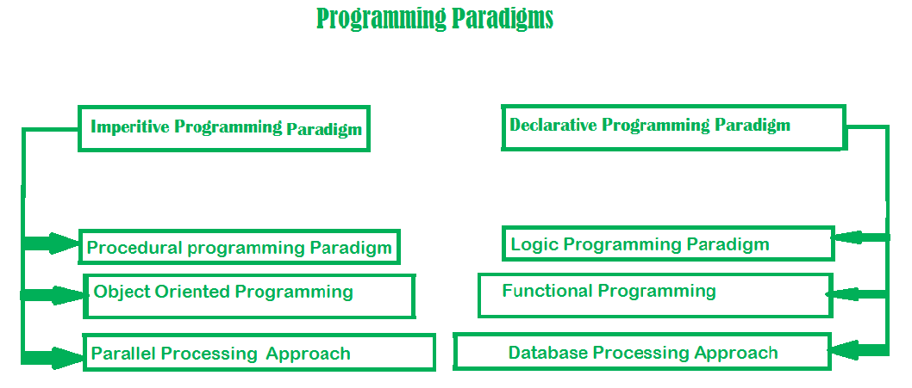

# Programming Methodology and Languages

[TOC]


## Res
### Related Topics
↗ [(Formal) Language Theory](../../🧮%20Math%20&%20Theoretical%20Computer%20Science%20(TCS)/🤼‍♀️%20Mathematical%20Logics/😶‍🌫️%20Theory%20of%20Computation/Automata%20Theory%20and%20(Formal)%20Language%20Theory/(Formal)%20Language%20Theory/(Formal)%20Language%20Theory.md)
↗ [SCA (Static Code Analysis)](../../CyberSecurity/🏰%20Cybersecurity%20Basics%20&%20InfoSec/🍦%20Software%20Security/🪆%20Binary%20Engineering%20&%20Software%20Analysis/📌%20SCA%20(Static%20Code%20Analysis)/SCA%20(Static%20Code%20Analysis).md)
↗ [Program Language Translation & Compilation Theory (Compile-time)](../🛣️%20Program%20Execution%20&%20Compilation%20System/🚮%20Program%20Language%20Translation%20&%20Compilation%20Theory%20(Compile-time)/Program%20Language%20Translation%20&%20Compilation%20Theory%20(Compile-time).md)
↗ [Program Execution & Compilation System](../🛣️%20Program%20Execution%20&%20Compilation%20System/Program%20Execution%20&%20Compilation%20System.md)

↗ [Database Languages](../🍕%20Computer%20Storage%20&%20Database%20Systems/Database%20Systems/🗣️%20Database%20Languages/Database%20Languages.md)
↗ [HDL (Hardware Definition Languages)](../../Embedded%20&%20Internet%20of%20Things/Embedded%20Programming/HDL%20(Hardware%20Definition%20Languages)/HDL%20(Hardware%20Definition%20Languages).md)
↗ [Web Templating Engines & Languages](../../Software%20Engineering/Web%20Development/🖥️%20Web%20FrontEnd%20Dev/⬆️%20Frontend%20Optimization/Web%20Templating/Web%20Templating%20Engines%20&%20Languages/Web%20Templating%20Engines%20&%20Languages.md)


↗ [Program Debugging & Defensive Programming](../../🗺%20CS%20Overview/💋%20Intro%20to%20Computer%20Science/Program%20Debugging%20&%20Defensive%20Programming.md)
↗ [System Level Programming](../🥷🏼%20Operating%20Systems%20&%20Kernels%20(Engineering%20Part)/📟%20System%20Level%20Programming/System%20Level%20Programming.md)
- ↗ [Computer (IO Devices) Drivers & Programming](../🧬%20Computer%20System/Computer%20Interfaces%20&%20Hardware%20Drivers/🛞%20Computer%20(IO%20Devices)%20Drivers%20&%20Programming/Computer%20(IO%20Devices)%20Drivers%20&%20Programming.md)
- ↗ [Compute Unified Device Architecture & CUDA Programming](../🥷🏼%20Operating%20Systems%20&%20Kernels%20(Engineering%20Part)/📟%20System%20Level%20Programming/System%20Level%20Projects/Compute%20Unified%20Device%20Architecture%20&%20CUDA%20Programming/Compute%20Unified%20Device%20Architecture%20&%20CUDA%20Programming.md)
↗ [Network Programming & RPC](../🏎️%20Computer%20Networking%20and%20Communication/Network%20Programming%20&%20RPC/Network%20Programming%20&%20RPC.md)
- ↗ [DPDK (Data Plane Development Kits)](../🏎️%20Computer%20Networking%20and%20Communication/🚀%20High%20Performance%20Network%20(HPN)%20&%20IDC%20Technologies/DPDK%20(Data%20Plane%20Development%20Kits)/DPDK%20(Data%20Plane%20Development%20Kits).md)
↗ [ML Programming & Frameworks](../../Artificial%20Intelligence/🛫%20Frameworks%20&%20Implementations%20&%20SDKs/ML%20Programming%20&%20Frameworks/ML%20Programming%20&%20Frameworks.md)
↗ [Computer Media Programming](../../Software%20Engineering/Computer%20Media%20Programming/Computer%20Media%20Programming.md)
↗ [Concurrent Programming](../🧬%20Computer%20System/Operating%20System%20&%20OS%20Kernel%20(Theory%20Part)/OS%20Processes%20&%20Automata%20Management%20(CPU%20+%20Main%20Memory%20Resource)/Concurrent%20Programming.md)
↗ [Embedded Programming](../../Embedded%20&%20Internet%20of%20Things/Embedded%20Programming/Embedded%20Programming.md)

↗ [Software Security](../../CyberSecurity/🏰%20Cybersecurity%20Basics%20&%20InfoSec/🍦%20Software%20Security/Software%20Security.md)
↗ [Binary Engineering & Software Analysis](../../CyberSecurity/🏰%20Cybersecurity%20Basics%20&%20InfoSec/🍦%20Software%20Security/🪆%20Binary%20Engineering%20&%20Software%20Analysis/Binary%20Engineering%20&%20Software%20Analysis.md)


### Other Resources
[List Of Some Of The Software Development Trends That Have Dominated The Year 2020](https://www.cisin.com/coffee-break/trends/list-of-some-of-the-software-development-trends-that-have-dominated-the-year-2020.html)

🪜 [TIOBE](https://www.tiobe.com/tiobe-index/)


## Intro


## History of programming languages
> <https://zh.wikipedia.org/zh-cn/程式語言歷史>
+ Hyponymy & hyperymy

> https://en.wikipedia.org/wiki/Hyponymy_and_hypernymy 


#### 1940～
#### 1950 ～ 1960
+ FORTRAN
+ LISP
+ COBOL
#### 1967 ～ 1978
+ C
#### 1980 ～
+ Ada
+ C++
+ Perl
#### 1990 ～
+ Python
+ Java
+ PHP
+ JS
+ VB
#### 2000 ～ 
+ .NET
+ swift
+ C#


## Programming Languages Hierarchy


## Programming Languages Taxonomy
### 👉 By Programming Eco/Platform/Frameworks
#### [.NET](https://zh.wikipedia.org/wiki/.NET%E6%A1%86%E6%9E%B6 ".NET框架")
- [C#](https://zh.wikipedia.org/wiki/C%E2%99%AF "C♯") 
    - [Visual C#](https://zh.wikipedia.org/wiki/Microsoft_Visual_C%E2%99%AF "Microsoft Visual C♯")
- [C++/CLI](https://zh.wikipedia.org/wiki/C%2B%2B/CLI "C++/CLI") 
	- [Visual C++](https://zh.wikipedia.org/wiki/Microsoft_Visual_C%2B%2B "Microsoft Visual C++")
- [F#](https://zh.wikipedia.org/wiki/F%E2%99%AF "F♯")
- [PowerShell](https://zh.wikipedia.org/wiki/PowerShell "PowerShell")
- [IronPython](https://zh.wikipedia.org/wiki/IronPython "IronPython")
- [IronScheme](https://zh.wikipedia.org/w/index.php?title=IronScheme&action=edit&redlink=1)
- [VB.NET](https://zh.wikipedia.org/wiki/Visual_Basic_.NET "Visual Basic .NET")
- [Small Basic](https://zh.wikipedia.org/wiki/Microsoft_Small_Basic "Microsoft Small Basic")
#### JVM
- [Java](https://zh.wikipedia.org/wiki/Java "Java") 
    - [AspectJ](https://zh.wikipedia.org/w/index.php?title=AspectJ&action=edit&redlink=1)
    - [JSP](https://zh.wikipedia.org/wiki/JSP "JSP")
- [Scala](https://zh.wikipedia.org/wiki/Scala "Scala")
- [Clojure](https://zh.wikipedia.org/wiki/Clojure "Clojure")
- [JRuby](https://zh.wikipedia.org/wiki/JRuby "JRuby")
- [Jython](https://zh.wikipedia.org/wiki/Jython "Jython")
- [Kawa](https://zh.wikipedia.org/w/index.php?title=Kawa&action=edit&redlink=1)
- [Groovy](https://zh.wikipedia.org/wiki/Groovy "Groovy")
- [Kotlin](https://zh.wikipedia.org/wiki/Kotlin "Kotlin")
#### [Xcode](https://zh.wikipedia.org/wiki/Xcode "Xcode")
- [Objective-C](https://zh.wikipedia.org/wiki/Objective-C "Objective-C")
- [AppleScript](https://zh.wikipedia.org/wiki/AppleScript "AppleScript")
- [Swift](https://zh.wikipedia.org/wiki/Swift_(%E7%A8%8B%E5%BC%8F%E8%AA%9E%E8%A8%80) "Swift (程式語言)")


### 👉 By Programming Paradigm
> 🔗 https://www.geeksforgeeks.org/introduction-of-programming-paradigms/

**Paradigm** can also be termed as method to solve some problem or do some task. Programming paradigm is an approach to solve problem using some programming language or also we can say it is a method to solve a problem using tools and techniques that are available to us following some approach. There are lots for programming language that are known but all of them need to follow some strategy when they are implemented and this methodology/strategy is paradigms.


<small>https://www.geeksforgeeks.org/introduction-of-programming-paradigms/</small>
#### 1️⃣ Declarative Programming Paradigm
> 💡 [Reactive Programming](https://en.wikipedia.org/wiki/Reactive_programming) is a declarative programming paradigm concerned with data streams and the propagation of change. With this paradigm, it's possible to express static (e.g., arrays) or dynamic (e.g., event emitters) data streams with ease, and also communicate that an inferred dependency within the associated execution model exists, which facilitates the automatic propagation of the changed data flow.
> 
> My notes of Reactive Programing Paradigm can be found in 👉 [Software Engineering/Dev Pattern/RX](../../Software%20Engineering/Dev%20Pattern/RX/RX.md)

It is divided as Logic, Functional, Database. In computer science the _declarative programming_ is **a style of building programs that expresses logic of computation without talking about its control flow**. It often considers programs as theories of some logic. It may simplify writing parallel programs. The focus is on what needs to be done rather how it should be done basically emphasize on what code is actually doing. It just declares the result we want rather how it has be produced. This is the only difference between imperative (how to do) and declarative (what to do) programming paradigms. Getting into deeper we would see logic, functional and database.
##### 1. Logic Programming Paradigm
It can be termed as abstract model of computation. It would solve logical problems like puzzles, series etc. In logic programming we have a knowledge base which we know before and along with the question and knowledge base which is given to machine, it produces result. In normal programming languages, such concept of knowledge base is not available but while using the concept of artificial intelligence, machine learning we have some models like Perception model which is using the same mechanism.   
In logical programming the main emphasize is on knowledge base and the problem. The execution of the program is very much like proof of mathematical statement, e.g., Prolog.
##### 2. Functional Programming
**JavaScript**: developed by Brendan Eich

👉 [Haskell](Compiled%20Languages/Haskell/Haskell.md): developed by Lennart Augustsson, Dave Barton

**Scala**: developed by Martin Odersky
**Erlang**: developed by Joe Armstrong, Robert Virding
**Lisp**: developed by John Mccarthy
**ML**: developed by Robin Milner
**Clojure**: developed by Rich Hickey
##### 3. Database Processing Approach
```mysql
CREATE DATABASE databaseAddress;
CREATE TABLE Addr (
    PersonID int,
    LastName varchar(200),
    FirstName varchar(200),
    Address varchar(200),
    City varchar(200),
    State varchar(200)
);
```
#### 2️⃣ Imperitive Programming Paradigm
It is one of the oldest programming paradigm. It features close relation to machine architecture. It is based on Von Neumann architecture. It works by changing the program state through assignment statements. It performs step by step task by changing state. The main focus is on how to achieve the goal. The paradigm consist of several statements and after execution of all the result is stored.

> Examples of **Imperative** programming paradigm:
> 
> **C**: developed by Dennis Ritchie and Ken Thompson
> **Fortran**: developed by John Backus for IBM
> **Basic**: developed by John G Kemeny and Thomas E Kurtz
##### 1. Procedural Programming Paradigm
**C**: developed by Dennis Ritchie and Ken Thompson
**C++**: developed by Bjarne Stroustrup

👉 [C & CPP](Compiled%20Languages/👔%20C-Based%20Languages/🥏%20C%20&%20CPP/C%20&%20CPP.md)

**Java**: developed by James Gosling at Sun Microsystems
**ColdFusion**: developed by J J Allaire
**Pascal**: developed by Niklaus Wirth
##### 2. Object Oriented Programming, OOP
**Simula**: first OOP language

👉 [Java](Compiled%20+%20Interpreted%20Languages/⚰️%20JVM-Based%20Languages/☕️%20Java/Java.md): developed by James Gosling at Sun Microsystems

**C++**: developed by Bjarne Stroustrup
**Objective-C**: designed by Brad Cox
**Visual Basic .NET**: developed by Microsoft
**Python**: developed by Guido van Rossum
**Ruby**: developed by Yukihiro Matsumoto 
**Smalltalk**: developed by Alan Kay, Dan Ingalls, Adele Goldberg
##### 3. Parallel Processing Approach
Parallel processing is the processing of program instructions by dividing them among multiple processors. A parallel processing system posses many numbers of processor with the objective of running a program in less time by dividing them. This approach seems to be like divide and conquer. 

Examples are NESL (one of the oldest one) and C/C++ also supports because of some library function.


### 👉 By Programming Scenario 


## Ref
[程序翻译与程序解释 | cnblog]: https://www.cnblogs.com/jvStarBlog/p/11941513.html


**硬件逻辑层**：主要由门电路、触发器等逻辑电路组成，属于电子工程的领域，这里就不展开介绍了。

**微程序机器层**：编程语言主要是微指令集，微指令所组成的微程序直接交由硬件执行，主要是由生产硬件的公司的程序员来编写的。

**传统机器层**：编程语言主要是CPU指令集（机器指令），和硬件是直接相关的，程序员所用机器指令编写的程序可以交由微程序直接进行解析，而这里提到的指令集，存储在CPU内部，对CPU的运算进行指导和优化，拥有指令集，CPU就可以有效地运行。我们知道，CPU的制造商分为AMD和Intel两大阵营，那么这两大厂商生产的CPU最大的区别是——指令集不同，Intel的CPU所使用的指令集不适合AMD的CPU，同样的，AMD的CPU所使用的指令集也不适合Intel。除了不同厂商以后，同一个厂商也可以生产不同指令集的CPU，即不同架构的CPU使用不同的CPU指令集。

**操作系统层**：操作系统，一方面，向上提供了简易的操作界面，使得用户能够容易地操作计算机；同时，向下对接了指令系统，管理硬件资源。操作系统对用户程序所使用机器的各种资源进行管理和分配，包括CPU、存储器等等，比如说，当一个用户程序需要运行的时候，首先由操作系统将其加载到内存中，这就需要操作系统首先为其分配内存空间来进行存储。再比如说，某一个程序需要使用某一个输出设备进行结果输出的时候，需要操作系统为其提供该设备的控制权。由此可见，操作系统是在软件和硬件之间的适配层。

**汇编语言层**：编程语言是汇编语言，汇编语言可以翻译成可直接执行的机器语言，完成这个翻译过程的程序就是汇编器。从这一层开始，它们所使用的编程语言就是人类比较容易理解的语言了。

**高级语言层**：编程语言就是为广大程序员所接受的高级语言，种类非常多，有几百种，常见的编程语言有Python、Java、C/C++、Golang等。

**应用层**：计算机针对某种用途而设计的应用，像Word、Excel等。
