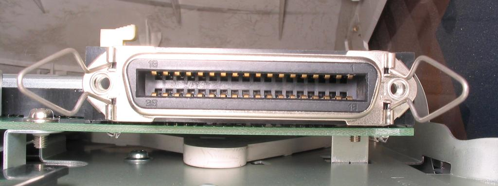
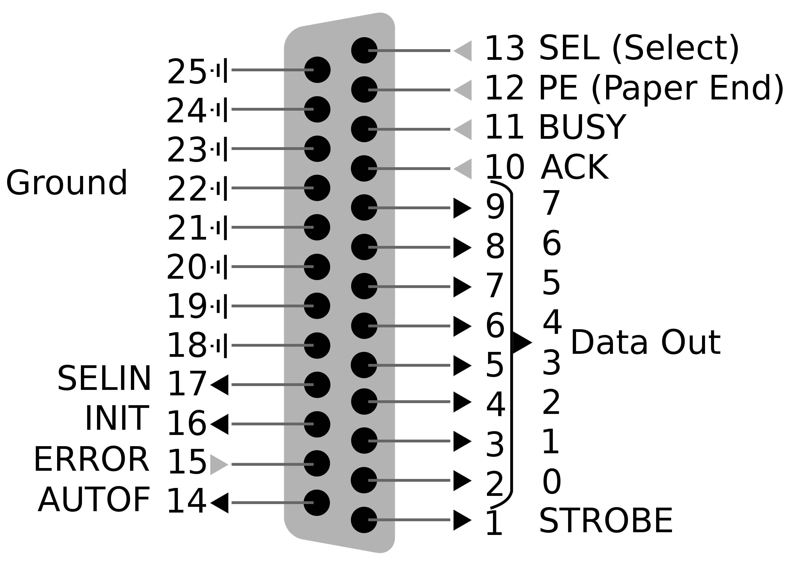

# Parallel Port

[TOC]

## Res

## Intro
> 🔗 https://en.wikipedia.org/wiki/Parallel_port

In computing, a parallel port is a type of interface found on early computers (personal and otherwise) for connecting peripherals. The name refers to the way the data is sent; parallel ports send multiple bits of data at once (parallel communication), as opposed to serial communication, in which bits are sent one at a time. To do this, parallel ports require multiple data lines in their cables and port connectors and tend to be larger than contemporary serial ports, which only require one data line.

<small>Micro ribbon 36-pin female, such as on printers and on some computers, particularly industrial equipment and early (pre-1980s) personal computers.</small>

There are many types of parallel ports, but the term has become most closely associated with the printer port or Centronics port found on most personal computers from the 1970s through the 2000s. It was an industry de facto standard for many years, and was finally standardized as IEEE 1284 in the late 1990s, which defined the **Enhanced Parallel Port (EPP)** and **Extended Capability Port (ECP)** bi-directional versions. Today, the parallel port interface is virtually non-existent in new computers because of the rise of **Universal Serial Bus (USB)** devices, along with network printing using Ethernet and Wi-Fi connected printers.

The parallel port interface was originally known as the Parallel Printer Adapter on IBM PC-compatible computers. It was primarily designed to operate printers that used IBM's eight-bit extended ASCII character set to print text, but could also be used to adapt other peripherals. Graphical printers, along with a host of other devices, have been designed to communicate with the system.

<small>IBM PC-compatible parallel port pinout</small>

## Ref

