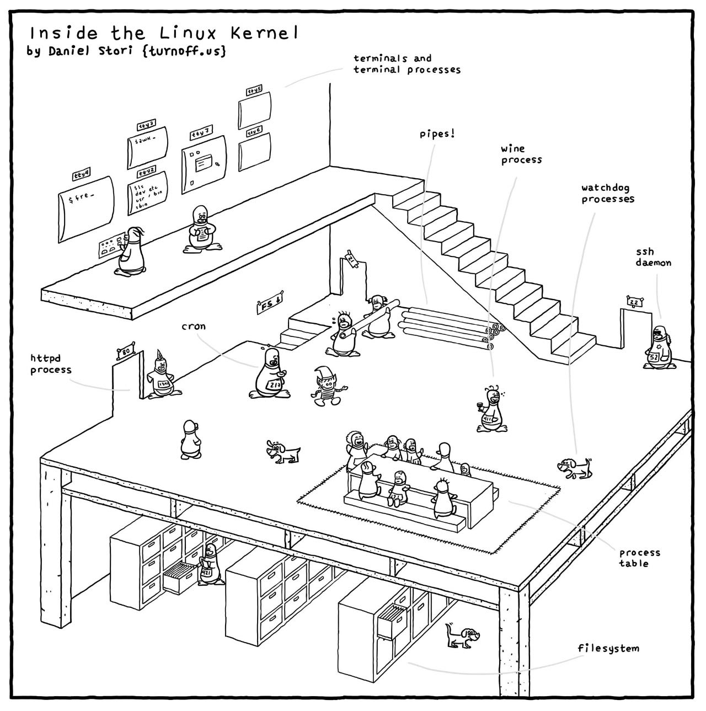

# Linux Kernel

[TOC]

## Res
🏠 https://www.kernel.org (**The Linux Kernel Organization**)
📂 https://docs.kernel.org/
📂 https://www.wiki.kernel.org/
- [Git Trees](https://git.kernel.org/)
- [Kernel Mailing Lists](https://lore.kernel.org/)
- [Patchwork](https://patchwork.kernel.org/)
- [Bugzilla](https://bugzilla.kernel.org/)
- [Mirrors](https://mirrors.kernel.org/)
- [Linux.com](https://www.linux.com/)
- [Linux Foundation](http://www.linuxfoundation.org/)

The **Linux Kernel Organization** is a California Public Benefit Corporation established in 2002 to distribute the Linux kernel and other Open Source software to the public without charge. We are recognized by the IRS as a 501(c)3 private operating foundation.
- [IRS determination letter](https://www.kernel.org/static/corporate/irs-nonprofit-ok-redacted.pdf)
- [California determination letter](https://www.kernel.org/static/corporate/state-nonprofit-ok-redacted.pdf)

The Linux Kernel Organization is managed by ↗ [The Linux Foundation](../The%20Linux%20Foundation.md), which provides full technical, financial and staffing support for running and maintaining the kernel.org infrastructure.

### Related Topics
↗ [Linux Security](../../../../CyberSecurity/System%20Security/Operating%20System%20Security/🐏%20Linux%20Security/Linux%20Security.md)
↗ [Operating System Kernel (Kernel Mode)](../../../🧬%20Computer%20System/Operating%20System%20&%20OS%20Kernel%20(Theory%20Part)/😴%20Operating%20System%20Components%20&%20Runtime%20Libraries/Operating%20System%20Kernel%20(Kernel%20Mode).md)
↗ [Operating System & OS Kernel (Theory Part)](../../../../../🧬%20Computer%20System/Operating%20System%20&%20OS%20Kernel%20(Theory%20Part)/Operating%20System%20&%20OS%20Kernel%20(Theory%20Part).md)

↗ [Linux System Libraries & Runtime Environments](../🏆%20Linux%20System%20Libraries%20&%20Runtime%20Environments/Linux%20System%20Libraries%20&%20Runtime%20Environments.md)
- ↗ [GNU C Library (glibc)](../🏆%20Linux%20System%20Libraries%20&%20Runtime%20Environments/👎%20GNU%20C%20Library%20(glibc)/GNU%20C%20Library%20(glibc).md)

↗ [Operating System Components & Runtime Libraries](../../../🧬%20Computer%20System/Operating%20System%20&%20OS%20Kernel%20(Theory%20Part)/😴%20Operating%20System%20Components%20&%20Runtime%20Libraries/Operating%20System%20Components%20&%20Runtime%20Libraries.md)
↗ [OS Level Programming with C & CPP](../../📟%20System%20Level%20Programming/OS%20Level%20Programming%20in%20Different%20Languages/OS%20Level%20Programming%20with%20C%20&%20CPP/OS%20Level%20Programming%20with%20C%20&%20CPP.md)

↗ [Linux Kernel (Modules) Management](../Linux%20Free%20Software%20&%20OSS%20(Open%20Source%20Software)/Host%20Management/Linux%20Kernel%20(Modules)%20Management.md)
↗ [Firmware and Computer (OS) Booting](../../../🧬%20Computer%20System/Firmware%20and%20Computer%20(OS)%20Booting/Firmware%20and%20Computer%20(OS)%20Booting.md)

↗ [Linux Security Modules (LSM)](../../../../CyberSecurity/System%20Security/Operating%20System%20Security/🐏%20Linux%20Security/Linux%20Kernel%20Security%20Mechanisms/Linux%20Security%20Modules%20(LSM).md)

### Learning Guides
👍 https://en.wikipedia.org/wiki/Portal:Linux
Wikipedia - Linux Portal

📂 👍 https://github.com/0voice/linux_kernel_wiki
Linux内核学习资料：200+篇经典内核文章，100+篇内核论文，50+内核项目，500+道内核面试题，80+内核讲解视频

http://kerneltravel.net (Linux 内核之旅 | 西安邮电大学)
Linux内核之旅是一个完全自由和开放的平台，它的建设是在西邮陈莉君教授和在腾讯工作十多年的许振文师兄的指导下完成的，我们的运作方式与国际开源社区一样，所有人都可以共建Linux内核之旅平台，我们都是贡献者，也是受益者。
我们与其他社区合作共同分享内核知识，旨在让更多的人受益。在这里，你可以和我们一起学习Linux内核知识，你可以在Linux内核之旅网站和Linux内核之旅微信公众平台投稿你的学习笔记和心得，你可以在我们的GitHub平台学习和分享内核实验代码，你还可以免费报名陈莉君教授主讲的内核mooc，在讨论区留下你的疑问，就有机会获得陈莉君教授的亲自答疑。

👨‍💻 👍 https://linux-kernel-labs.github.io/refs/heads/master/index.html 🔥🔥🔥
Linux Kernel Teaching
This is a collection of lectures and labs Linux kernel topics. The lectures focus on theoretical and Linux kernel exploration.
- This content is based on the [Operatings Systems 2](http://ocw.cs.pub.ro/courses/so2) course from the Computer Science and Engineering Department, the Faculty of Automatic Control and Computers, **University POLITEHNICA of Bucharest**.
- You can get the latest version at [http://github.com/linux-kernel-labs](http://github.com/linux-kernel-labs).

📖 http://www.kroah.com/lkn/
Linux Kernel in a Nutshell
Professional Linux Kernel Architecture - Wolfgang Mauerer

📂 [Embedded Linux Wiki](https://elinux.org/Main_Page)

📄 https://developer.ibm.com/articles/l-linux-kernel/
IBM | Anatomy of Linux Kernel

## Intro
> 🔗 https://en.wikipedia.org/wiki/Linux_kernel#

<small>https://en.wikipedia.org/wiki/Linux_kernel</small>

<small>https://en.wikipedia.org/wiki/Linux_kernel#Further_reading</small>

### Linux Kernel Development
> 🔗 https://www.kernel.org/doc/html/next/index.html

- [A guide to the Kernel Development Process](https://www.kernel.org/doc/html/next/process/development-process.html)
- [Submitting patches: the essential guide to getting your code into the kernel](https://www.kernel.org/doc/html/next/process/submitting-patches.html)
- [Code of conduct](https://www.kernel.org/doc/html/next/process/code-of-conduct.html)
- [Kernel Maintainer Handbook](https://www.kernel.org/doc/html/next/maintainer/index.html)
- [All development-process docs](https://www.kernel.org/doc/html/next/process/index.html)

- [Linux kernel licensing rules](https://www.kernel.org/doc/html/next/process/license-rules.html)
- [How to write kernel documentation](https://www.kernel.org/doc/html/next/doc-guide/index.html)
- [Development tools for the kernel](https://www.kernel.org/doc/html/next/dev-tools/index.html)

- [Kernel Testing Guide](https://www.kernel.org/doc/html/next/dev-tools/testing-overview.html)
- [Kernel Hacking Guides](https://www.kernel.org/doc/html/next/kernel-hacking/index.html)
- [Linux Tracing Technologies](https://www.kernel.org/doc/html/next/trace/index.html)
- [fault-injection](https://www.kernel.org/doc/html/next/fault-injection/index.html)
- [Kernel Livepatching](https://www.kernel.org/doc/html/next/livepatch/index.html)
#### Linux development model
> 📎 https://linux-kernel-labs.github.io/refs/heads/master/lectures/intro.html

The Linux kernel is one the largest open source projects in the world with thousands of developers contributing code and millions of lines of code changed for each release.

It is distributed under the GPLv2 license, which simply put, requires that any modification of the kernel done on software that is shipped to customer should be made available to them (the customers), although in practice most companies make the source code publicly available.

There are many companies (often competing) that contribute code to the Linux kernel as well as people from academia and independent developers.

The current development model is based on doing releases at fixed intervals of time (usually 3 - 4 months). New features are merged into the kernel during a one or two week merge window. After the merge window, a release candidate is done on a weekly basis (rc1, rc2, etc.)
#### Maintainer hierarchy
> 📎 https://linux-kernel-labs.github.io/refs/heads/master/lectures/intro.html

In order to scale the development process, Linux uses a hierarchical maintainership model:

- Linus Torvalds is the maintainer of the Linux kernel and merges pull requests from subsystem maintainers
- Each subsystem has one or more maintainers that accept patches or pull requests from developers or device driver maintainers
- Each maintainer has its own git tree, e.g.:
    - Linux Torvalds: git://git.kernel.org/pub/scm/linux/kernel/git/torvalds/linux-2.6.git
    - David Miller (networking): git://git.kernel.org/pub/scm/linux/kernel/git/davem/net.git/
- Each subsystem may maintain a -next tree where developers can submit patches for the next merge window

Since the merge window is only a maximum of two weeks, most of the maintainers have a -next tree where they accept new features from developers or maintainers downstream while even when the merge window is closed.

Note that bug fixes are accepted even outside merge window in the maintainer's tree from where they are periodically pulled by the upstream maintainer regularly, for every release candidate.

## 🎯 Linux Kernel Components & Architecture
> 🔗 https://en.wikipedia.org/wiki/Linux_kernel
> 🔗 https://en.wikipedia.org/wiki/Linux_kernel#Architecture_and_features

<small>Image source from wikipedia: Linux Kernel </small>

<small>Linux Kernel Architecture. src: <a>https://linux-kernel-labs.github.io/refs/heads/master/lectures/intro.html</a></small>

### Linux Kernel Source Code Layout
> 📎 https://linux-kernel-labs.github.io/refs/heads/master/lectures/intro.html

> ↗ 

These are the top level of the Linux source code folders:
- arch - contains architecture specific code; each architecture is implemented in a specific sub-folder (e.g. arm, arm64, x86)
- block - contains the block subsystem code that deals with reading and writing data from block devices: creating block I/O requests, scheduling them (there are several I/O schedulers available), merging requests, and passing them down through the I/O stack to the block device drivers
- certs - implements support for signature checking using certificates
- crypto - software implementation of various cryptography algorithms as well as a framework that allows offloading such algorithms in hardware
- Documentation - documentation for various subsystems, Linux kernel command line options, description for sysfs files and format, device tree bindings (supported device tree nodes and format)
- drivers - driver for various devices as well as the Linux driver model implementation (an abstraction that describes drivers, devices buses and the way they are connected)
- firmware - binary or hex firmware files that are used by various device drivers
- fs - home of the Virtual Filesystem Switch (generic filesystem code) and of various filesystem drivers
- include - header files
- init - the generic (as opposed to architecture specific) initialization code that runs during boot
- ipc - implementation for various Inter Process Communication system calls such as message queue, semaphores, shared memory
- kernel - process management code (including support for kernel thread, workqueues), scheduler, tracing, time management, generic irq code, locking
- lib - various generic functions such as sorting, checksums, compression and decompression, bitmap manipulation, etc.
- mm - memory management code, for both physical and virtual memory, including the page, SL*B and CMA allocators, swapping, virtual memory mapping, process address space manipulation, etc.
- net - implementation for various network stacks including IPv4 and IPv6; BSD socket implementation, routing, filtering, packet scheduling, bridging, etc.
- samples - various driver samples
- scripts - parts the build system, scripts used for building modules, kconfig the Linux kernel configurator, as well as various other scripts (e.g. checkpatch.pl that checks if a patch is conform with the Linux kernel coding style)
- security - home of the Linux Security Module framework that allows extending the default (Unix) security model as well as implementation for multiple such extensions such as SELinux, smack, apparmor, tomoyo, etc.
- sound - home of ALSA (Advanced Linux Sound System) as well as the old Linux sound framework (OSS)
- tools - various user space tools for testing or interacting with Linux kernel subsystems
- usr - support for embedding an initrd file in the kernel image
- virt - home of the KVM (Kernel Virtual Machine) hypervisor
#### \*arch subsystem
> 📎 https://linux-kernel-labs.github.io/refs/heads/master/lectures/intro.html

- Architecture specific code
- May be further sub-divided in machine specific code
- Interfacing with the boot loader and architecture specific initialization
- Access to various hardware bits that are architecture or machine specific such as interrupt controller, SMP controllers, BUS controllers, exceptions and interrupt setup, virtual memory handling
- Architecture optimized functions (e.g. memcpy, string operations, etc.)

This part of the Linux kernel contains architecture specific code and may be further sub-divided in machine specific code for certain architectures (e.g. arm).

"Linux was first developed for 32-bit x86-based PCs (386 or higher). These days it also runs on (at least) the Compaq Alpha AXP, Sun SPARC and UltraSPARC, Motorola 68000, PowerPC, PowerPC64, ARM, Hitachi SuperH, IBM S/390, MIPS, HP PA-RISC, Intel IA-64, DEC VAX, AMD x86-64 and CRIS architectures.”

It implements access to various hardware bits that are architecture or machine specific such as interrupt controller, SMP controllers, BUS controllers, exceptions and interrupt setup, virtual memory handling.

It also implements architecture optimized functions (e.g. memcpy, string operations, etc.)

### Linux File Layout (Userspace)
↗ [UNIX File System /FHS (Filesystem Hierarchy Standard)](../../UNIX%20Family/📌%20UNIX%20Kernel/UNIX%20IO%20&%20Files%20Management/UNIX%20File%20System/UNIX%20File%20System.md#FHS%20(Filesystem%20Hierarchy%20Standard))
↗ [Linux File System](Linux%20IO%20&%20Files%20Management/🤔%20Linux%20File%20System/Linux%20File%20System.md)
↗ [Linux Directory System](Linux%20IO%20&%20Files%20Management/🤔%20Linux%20File%20System/Linux%20Directory%20System.md)

### Linux Kernel Components Overview

Briefly, the principal kernel components are the following:
- **Signals**: The kernel uses signals to call into a process. For example, signals are used to notify a process of certain faults, such as division by zero. 
- **System calls**: The system call is the means by which a process requests a specific kernel service. There are several hundred system calls, which can be roughly grouped into six categories:
	- file system
	- process
	- scheduling
	- interprocess communication
	- socket (networking)
	- miscellaneous
- **Processes and scheduler**: Creates, manages, and schedules processes.
- **Virtual memory**: Allocates and manages virtual memory for processes.
- **File systems**: Provide a global, hierarchical namespace for files, directories, and other file-related objects and provide file system functions.
- **Network protocols**: Support the Sockets interface to users for the TCP/IP protocol suite.
- **Character device drivers**: Manage devices that require the kernel to send or receive data one byte at a time, such as terminals, modems, and printers.
- **Block device drivers**: Manage devices that read and write data in blocks, such as various forms of secondary memory (magnetic disks, CD-ROMs, etc.).
- **Network device drivers**: Manage network interface cards and communications ports that connect to network devices, such as bridges and routers.
- **Traps and faults**: Handle traps and faults generated by the processor, such as a memory fault.
- **Physical memory**: Manages the pool of page frames in real memory and allocates pages for virtual memory.
- **Interrupts**: Handle interrupts from peripheral devices.

### Linux Kernel Subsystems API Manual
> 🔗 https://www.kernel.org/doc/html/next/subsystem-apis.html#
> 📎 https://docs.kernel.org/subsystem-apis.html
#### 1️⃣ Core Subsystems
- [Core API Documentation](https://www.kernel.org/doc/html/next/core-api/index.html)
- [Driver implementer's API guide](https://www.kernel.org/doc/html/next/driver-api/index.html)
- [Memory Management Documentation](https://www.kernel.org/doc/html/next/mm/index.html)
- [Power Management](https://www.kernel.org/doc/html/next/power/index.html)
- [Scheduler](https://www.kernel.org/doc/html/next/scheduler/index.html)
- [Timers](https://www.kernel.org/doc/html/next/timers/index.html)
##### Locking
📎 https://www.kernel.org/doc/html/next/locking/index.html

- [Lock types and their rules](https://docs.kernel.org/locking/locktypes.html)
- [Runtime locking correctness validator](https://docs.kernel.org/locking/lockdep-design.html)
- [Lock Statistics](https://docs.kernel.org/locking/lockstat.html)
- [Kernel Lock Torture Test Operation](https://docs.kernel.org/locking/locktorture.html)
- [Generic Mutex Subsystem](https://docs.kernel.org/locking/mutex-design.html)
- [RT-mutex implementation design](https://docs.kernel.org/locking/rt-mutex-design.html)
- [RT-mutex subsystem with PI support](https://docs.kernel.org/locking/rt-mutex.html)
- [Sequence counters and sequential locks](https://docs.kernel.org/locking/seqlock.html)
- [Locking lessons](https://docs.kernel.org/locking/spinlocks.html)
- [Wound/Wait Deadlock-Proof Mutex Design](https://docs.kernel.org/locking/ww-mutex-design.html)
- [Proper Locking Under a Preemptible Kernel: Keeping Kernel Code Preempt-Safe](https://docs.kernel.org/locking/preempt-locking.html)
- [Lightweight PI-futexes](https://docs.kernel.org/locking/pi-futex.html)
- [Futex Requeue PI](https://docs.kernel.org/locking/futex-requeue-pi.html)
- [Hardware Spinlock Framework](https://docs.kernel.org/locking/hwspinlock.html)
- [Percpu rw semaphores](https://docs.kernel.org/locking/percpu-rw-semaphore.html)
- [A description of what robust futexes are](https://docs.kernel.org/locking/robust-futexes.html)
- [The robust futex ABI](https://docs.kernel.org/locking/robust-futex-ABI.html)
#### 2️⃣ Human Interfaces
- [Input Documentation](https://www.kernel.org/doc/html/next/input/index.html)
- [Human Interface Devices (HID)](https://www.kernel.org/doc/html/next/hid/index.html)
- [Sound Subsystem Documentation](https://www.kernel.org/doc/html/next/sound/index.html)
- [GPU Driver Developer's Guide](https://www.kernel.org/doc/html/next/gpu/index.html)
- [Frame Buffer](https://www.kernel.org/doc/html/next/fb/index.html)
- [LEDs](https://www.kernel.org/doc/html/next/leds/index.html)
#### 3️⃣ Networking Interfaces
- [Networking](https://www.kernel.org/doc/html/next/networking/index.html)
- [NetLabel](https://www.kernel.org/doc/html/next/netlabel/index.html)
- [InfiniBand](https://www.kernel.org/doc/html/next/infiniband/index.html)
- [ISDN](https://www.kernel.org/doc/html/next/isdn/index.html)
- [MHI](https://www.kernel.org/doc/html/next/mhi/index.html)
#### 4️⃣ Storage Interfaces
- [Filesystems in the Linux kernel](https://www.kernel.org/doc/html/next/filesystems/index.html)
- [Block](https://www.kernel.org/doc/html/next/block/index.html)
- [CD-ROM](https://www.kernel.org/doc/html/next/cdrom/index.html)
- [SCSI Subsystem](https://www.kernel.org/doc/html/next/scsi/index.html)
- [TCM Virtual Device](https://www.kernel.org/doc/html/next/target/index.html)
#### 5️⃣ Other Subsystems
**Fixme**: much more organizational work is needed here.
- [Accounting](https://www.kernel.org/doc/html/next/accounting/index.html)
- [CPUFreq - CPU frequency and voltage scaling code in the Linux(TM) kernel](https://www.kernel.org/doc/html/next/cpu-freq/index.html)
- [FPGA](https://www.kernel.org/doc/html/next/fpga/index.html)
- [I2C/SMBus Subsystem](https://www.kernel.org/doc/html/next/i2c/index.html)
- [Industrial I/O](https://www.kernel.org/doc/html/next/iio/index.html)
- [PCMCIA](https://www.kernel.org/doc/html/next/pcmcia/index.html)
- [Serial Peripheral Interface (SPI)](https://www.kernel.org/doc/html/next/spi/index.html)
- [1-Wire Subsystem](https://www.kernel.org/doc/html/next/w1/index.html)
- [Watchdog Support](https://www.kernel.org/doc/html/next/watchdog/index.html)
- [Virtualization Support](https://www.kernel.org/doc/html/next/virt/index.html)
- [Hardware Monitoring](https://www.kernel.org/doc/html/next/hwmon/index.html)
- [Compute Accelerators](https://www.kernel.org/doc/html/next/accel/index.html)
- [Security Documentation](https://www.kernel.org/doc/html/next/security/index.html)
- [Crypto API](https://www.kernel.org/doc/html/next/crypto/index.html)
- [BPF Documentation](https://www.kernel.org/doc/html/next/bpf/index.html)
- [USB support](https://www.kernel.org/doc/html/next/usb/index.html)
- [PCI Bus Subsystem](https://www.kernel.org/doc/html/next/PCI/index.html)
- [Assorted Miscellaneous Devices Documentation](https://www.kernel.org/doc/html/next/misc-devices/index.html)
- [PECI Subsystem](https://www.kernel.org/doc/html/next/peci/index.html)
- [WMI Subsystem](https://www.kernel.org/doc/html/next/wmi/index.html)
- [TEE Subsystem](https://www.kernel.org/doc/html/next/tee/index.html)

## Linux Kernel & Hardware
> 🔗 https://www.kernel.org/doc/html/next/index.html

- [The Linux kernel firmware guide](https://www.kernel.org/doc/html/next/firmware-guide/index.html)
- [Open Firmware and Devicetree](https://www.kernel.org/doc/html/next/devicetree/index.html)
- [CPU Architectures](https://www.kernel.org/doc/html/next/arch/index.html)

## 🚂 Rust in the Kernel
> 🔗 https://www.kernel.org/doc/html/next/rust/index.html
> ↗ [Rust](../../../👩‍💻%20Programming%20Methodology%20and%20Languages/Compiled%20Languages/Rust/Rust.md)

To start using Rust in the kernel, please read the [Quick Start](https://www.kernel.org/doc/html/next/rust/quick-start.html)guide.

**The Rust support was merged in v6.1 into mainline in order to help in determining whether Rust as a language was suitable for the kernel, i.e. worth the tradeoffs.**

Currently, the Rust support is primarily intended for kernel developers and maintainers interested in the Rust support, so that they can start working on abstractions and drivers, as well as helping the development of infrastructure and tools.

If you are an end user, please note that there are currently no in-tree drivers/modules suitable or intended for production use, and that the Rust support is still in development/experimental, especially for certain kernel configurations.

This documentation does not include rustdoc generated information.
- [Quick Start](https://www.kernel.org/doc/html/next/rust/quick-start.html)
- [General Information](https://www.kernel.org/doc/html/next/rust/general-information.html)
- [Coding Guidelines](https://www.kernel.org/doc/html/next/rust/coding-guidelines.html)
- [Arch Support](https://www.kernel.org/doc/html/next/rust/arch-support.html)

## 👩‍💻 Linux Kernel User & Administrator
> 🔗 https://www.kernel.org/doc/html/next/index.html

- [The Linux kernel user's and administrator's guide](https://www.kernel.org/doc/html/next/admin-guide/index.html)
- [The kernel build system](https://www.kernel.org/doc/html/next/kbuild/index.html)
- [Reporting issues](https://www.kernel.org/doc/html/next/admin-guide/reporting-issues.html)
- [User-space tools](https://www.kernel.org/doc/html/next/tools/index.html)
- [The Linux kernel user-space API guide](https://www.kernel.org/doc/html/next/userspace-api/index.html)

## Other Linux Topics
> 🔗 https://www.kernel.org/doc/html/next/index.html

- [Unsorted Documentation](https://www.kernel.org/doc/html/next/staging/index.html)
- [Reliability, Availability and Serviceability (RAS) features](https://www.kernel.org/doc/html/next/RAS/index.html)

## Ref
[👍 Linux内核应该怎么去学习？ - 知乎]: https://www.zhihu.com/question/58121772

[我为何放弃 Linux 内核学习]: https://happypeter.github.io/learning-kernel.html
[Linux内核入门之路 (非广告) | 51cto]: https://blog.51cto.com/u_15315240/3211777

[👍 👍 Rust std fs 比 Python 慢！真的吗！？]: https://mp.weixin.qq.com/s/m-IBomxu88DlNcEyOgyOew

[Anatomy of the Linux kernel | IBM Docs]: https://developer.ibm.com/articles/l-linux-kernel/
