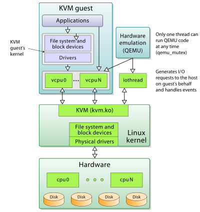

# QEMU

[TOC]

## Res
🏠 https://www.qemu.org
🚧 https://github.com/qemu/qemu
🚧 https://gitlab.com/qemu-project/qemu

📂 https://www.qemu.org/docs/master/
Documentation can be found hosted online at <https://www.qemu.org/documentation/> The documentation for the current development version that is available at <https://www.qemu.org/docs/master/> is generated from the `docs/`folder in the source tree, and is built by [Sphinx](https://www.sphinx-doc.org/en/master/).

📂 https://wiki.qemu.org/Main_Page
📂 https://wiki.qemu.org/Documentation
The QEMU website has a [Documentation page](https://www.qemu.org/documentation/) with pointers to the current actively maintained documentation including rendered versions of the user manual and selection of the developer documentation. More free form documentation can be found here on the wiki.

📂 https://en.wikibooks.org/wiki/QEMU
**[QEMU](https://en.wikipedia.org/wiki/QEMU "w:QEMU")** is quick; it's a [hypervisor](https://en.wikipedia.org/wiki/Hypervisor "w:Hypervisor") that allows you to run virtual machines with complete operating systems that operate like any other program on your desktop. This can be useful for general purpose computing and black box testing. The software, whose website can be found [here](https://www.qemu.org/), is open-source and cross-platform. It targets a range of computer architectures beyond standard IBM PCs such as ARM and PowerPC. On Linux, it also has user-mode emulation where standard executables of one architecture can seamlessly run on another. This book will help you use the modern incarnation of QEMU for a wide variety of purposes.

### 🐕 Getting Started
↗ [FAQ / 👉 Set up `QEMU` on various OS](../../../../../FAQ.md#👉%20Set%20up%20`QEMU`%20on%20various%20OS)
↗ [FAQ / 👉 `QEMU` + `Libvirt` on various OS | How to manage `qemu/kvm` VM with `libvirt`](../../../../../FAQ.md#👉%20`QEMU`%20+%20`Libvirt`%20on%20various%20OS%20|%20How%20to%20manage%20`qemu/kvm`%20VM%20with%20`libvirt`)

### Related Topics
↗ [VirGL](../../../../../../../../Software%20Engineering/🧩%20(3D)%20Graphics%20Rendering%20Frameworks/📌%20Mesa%20Project/VirGL/VirGL.md)

## Intro

<small>QEMU, KVM, Libvirt in Linux</small>

QEMU is a generic and open source machine & userspace emulator and virtualizer.

> 🔗 [What is a hypervisor? | vmware.com](https://www.vmware.com/topics/glossary/content/hypervisor.html)
>
> A hypervisor, also known as a virtual machine monitor or VMM, is **software that creates and runs virtual machines (VMs)**. A hypervisor allows one host computer to support multiple guest VMs by virtually sharing its resources, such as memory and processing.

QEMU is capable of emulating a complete machine in software without any need for hardware virtualization support. By using dynamic translation, it achieves very good performance. 

QEMU can also integrate with the Xen and KVM hypervisors to provide emulated hardware while allowing the hypervisor to manage the CPU. With hypervisor support, QEMU can achieve near native performance for CPUs. When QEMU emulates CPUs directly it is capable of running operating systems made for one machine (e.g. an ARMv7 board) on a different machine (e.g. an x86_64 PC board).

QEMU is also capable of providing userspace API virtualization for Linux and BSD kernel interfaces. This allows binaries compiled against one architecture ABI (e.g. the Linux PPC64 ABI) to be run on a host using a different architecture ABI (e.g. the Linux x86_64 ABI). This does not involve any hardware emulation, simply CPU and syscall emulation.

<small>QEMU without hypervisors </small>

<small>QEMU with KVM</small>

## Res
[QEMU简介 | CSDN]: https://blog.csdn.net/hunanchenxingyu/article/details/43230229

[What is the difference between qemu and kvm]: https://www.packetcoders.io/what-is-the-difference-between-qemu-and-kvm/

[KVM-Qemu-Libvirt三者之间的关系]: https://blog.csdn.net/whatday/article/details/78445932

[XOS 使用 qemu 创建虚拟机]:https://zhjwpku.com/2021/09/28/OSX-create-vm-using-qemu.html
[使用 qemu 搭建内核开发环境]:https://links.jianshu.com/go?to=https%3A%2F%2Fwww.cnblogs.com%2Fhellogc%2Fp%2F7482066.html

[👍 Getting started with qemu]: https://drewdevault.com/2018/09/10/Getting-started-with-qemu.html

[Qemu 入门指南 ｜ CSDN]: https://blog.csdn.net/fontthrone/article/details/104157859

