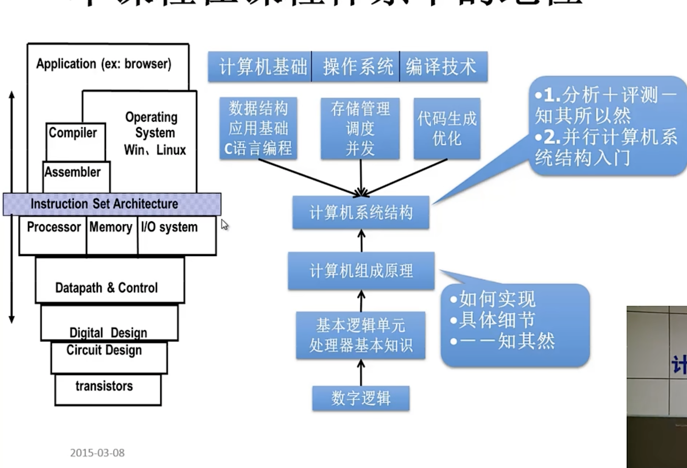

# 👷🏾‍♂️ Computer Architecture

[TOC]

## 🚪 Introduction to Computer Science

🚀 [CMU - ICS - Introduction to Computer Science](../../🏠 Assets/CMU/ICS/Intro.md) 

[Harvard - C50 - Introduction to Computer Science](../../🏠 Assets/Harvard/CS50/Intro.md) 

[Sophomore CollegeThe Intellectual Excitement of Computer Science](https://cs.stanford.edu/people/eroberts/courses/soco/)

## 🎛️ Operating System

## ⚙️ Computer Organization

[计算机体系结构](https://foxsen.github.io/archbase/)

## ⛏  EE

[FPGA & CPU](https://yearn.xyz/docs/fpgacpu/)

## ✏️ Guides
