# Digital Logic Review

[TOC]

## Boolean Algebra

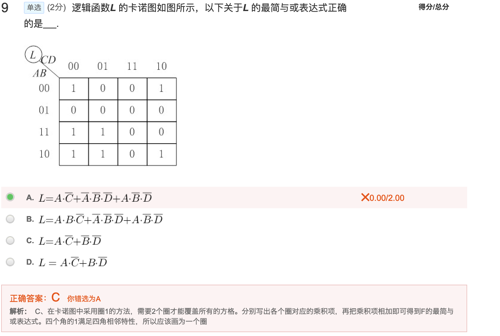

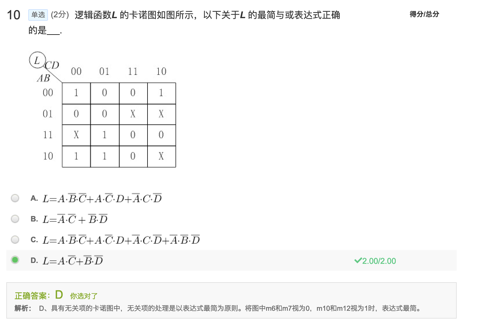

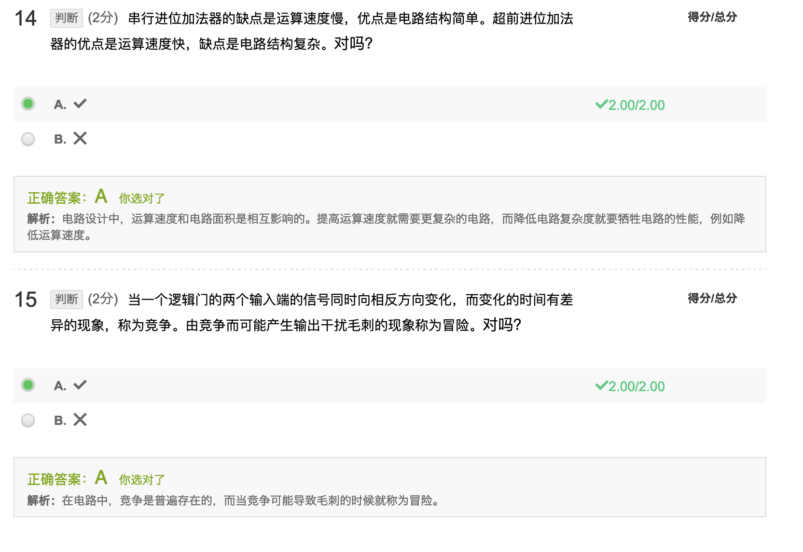

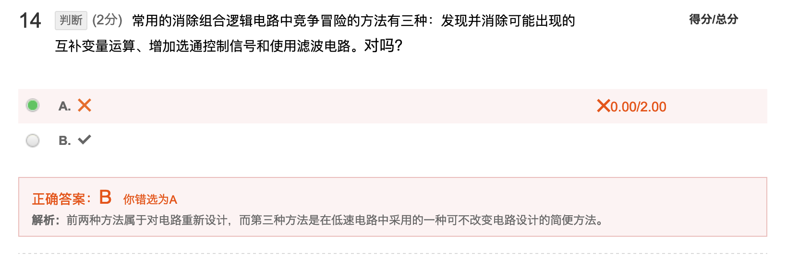

## Logic Gate

## Combinational Logic

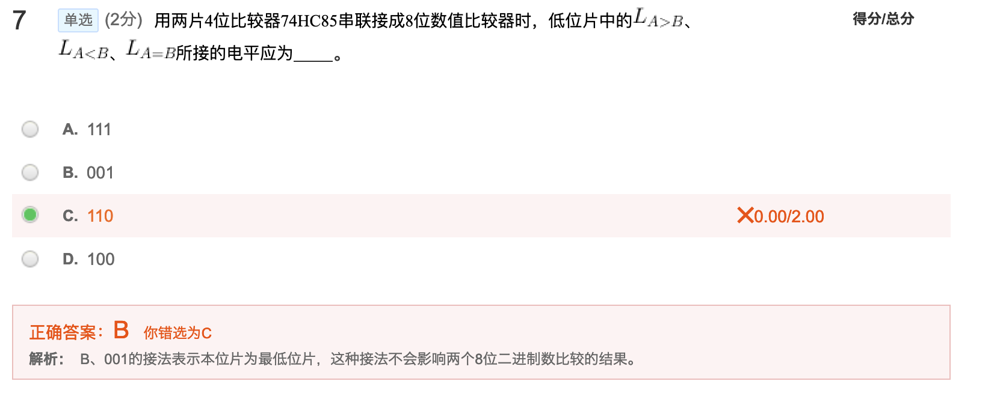

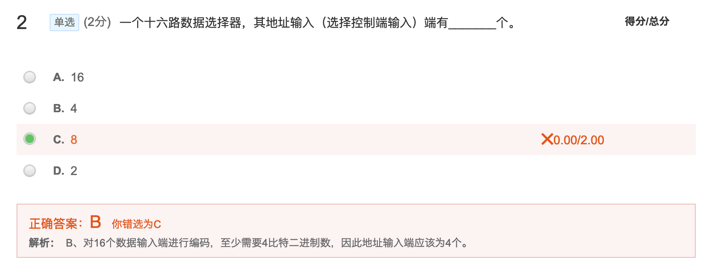

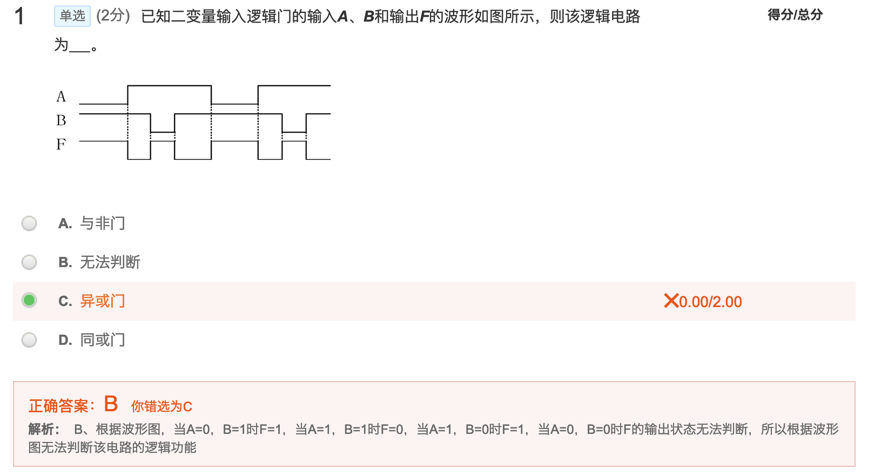

## Latch & Trigger

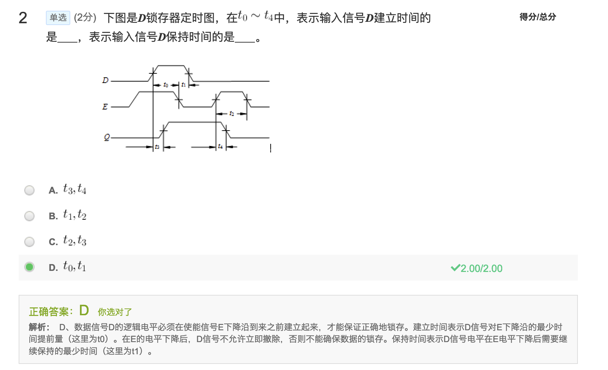

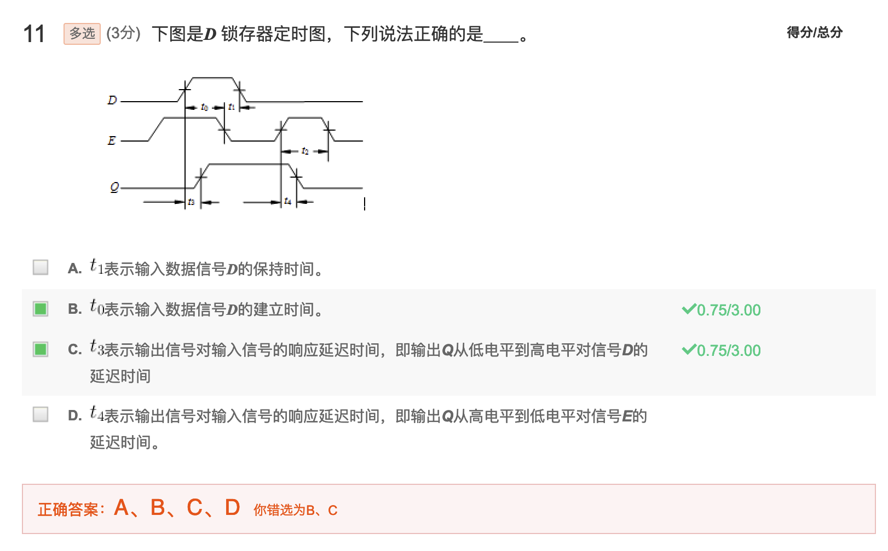

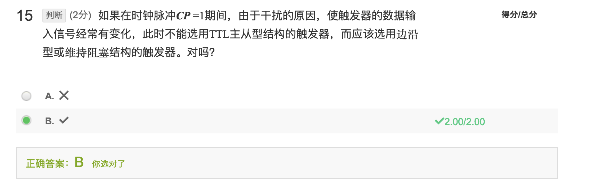

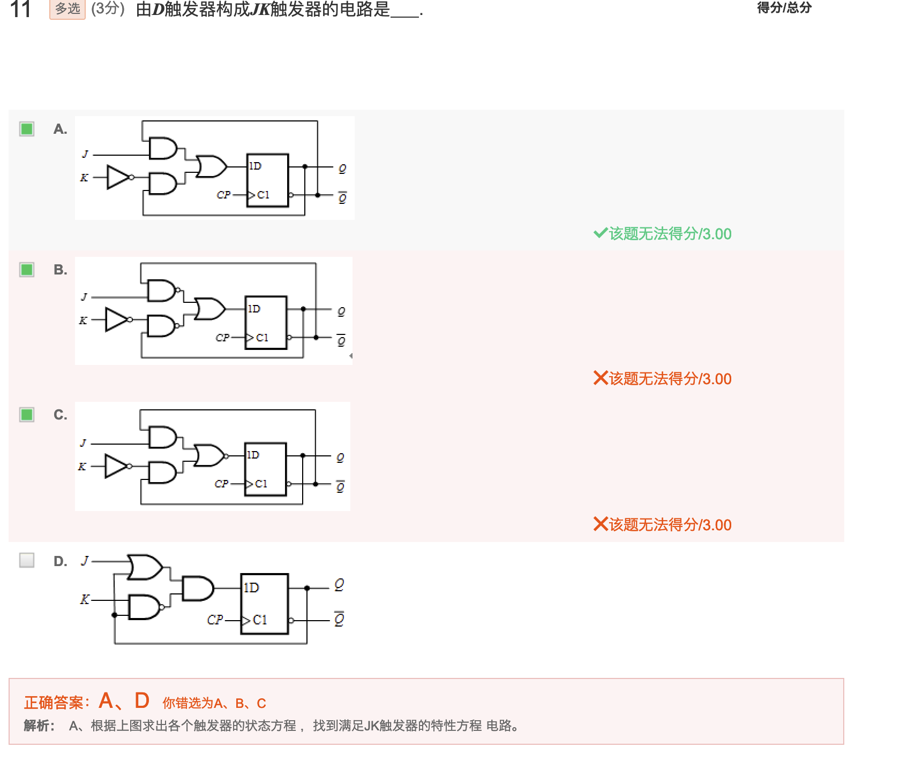

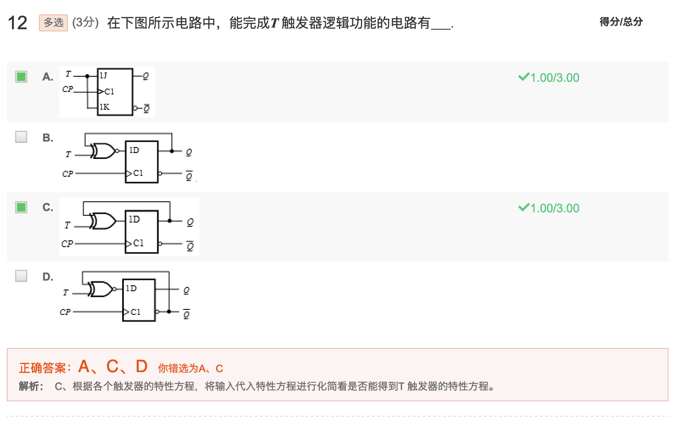

## Sequential Logic

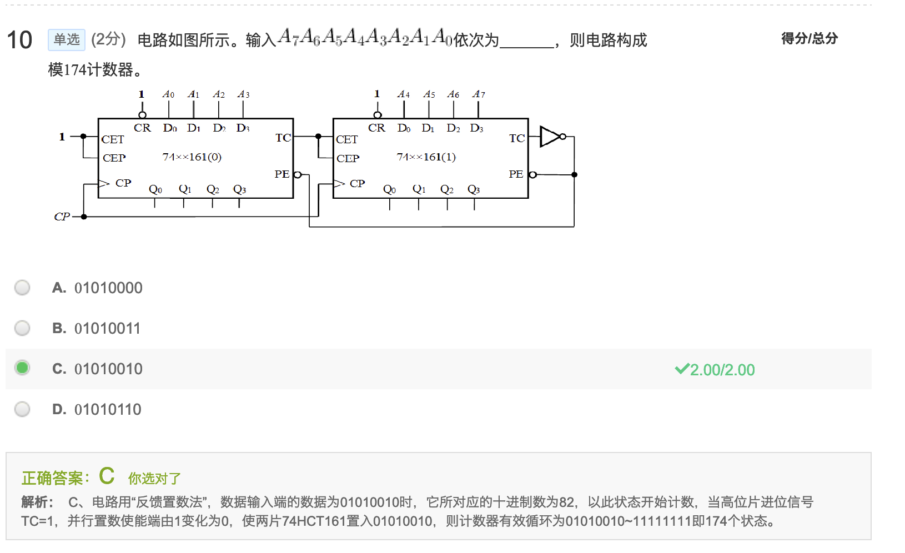

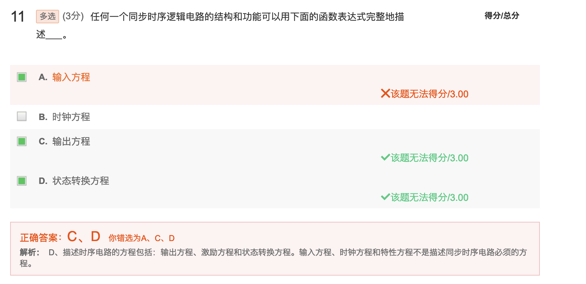

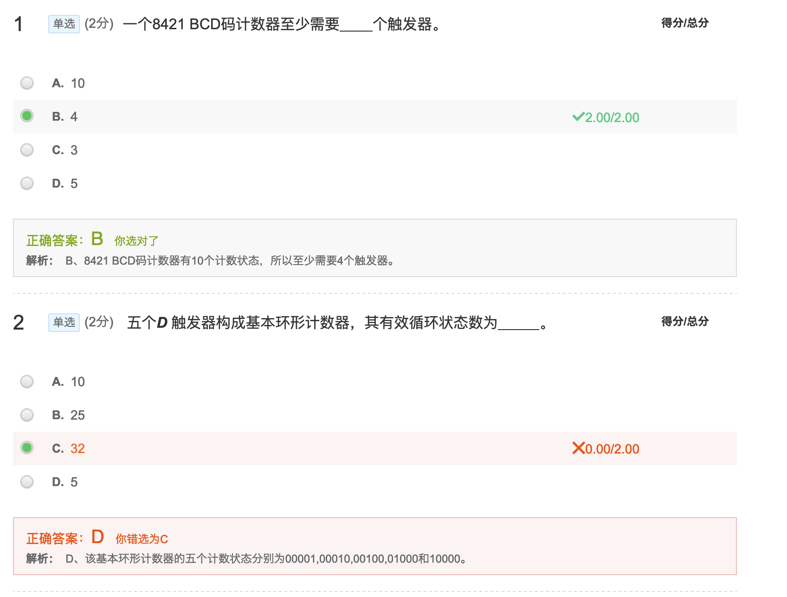

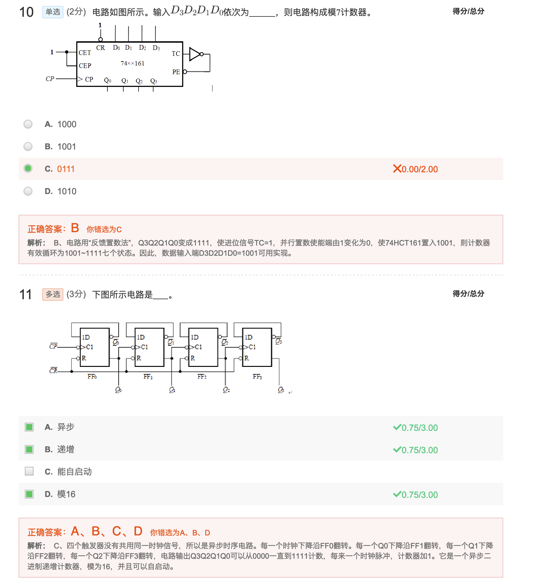

## Verilog

## Pulse Waveforms

## Semiconductor Memory

## ADDA

## Ref

