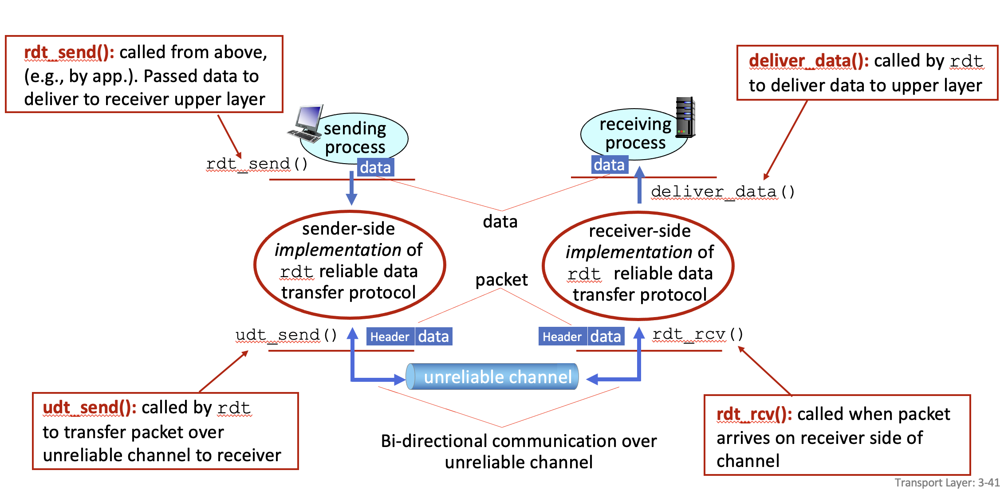
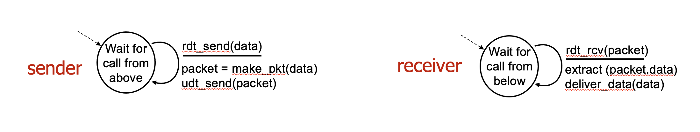
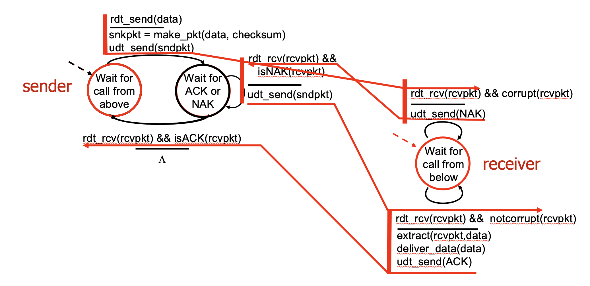
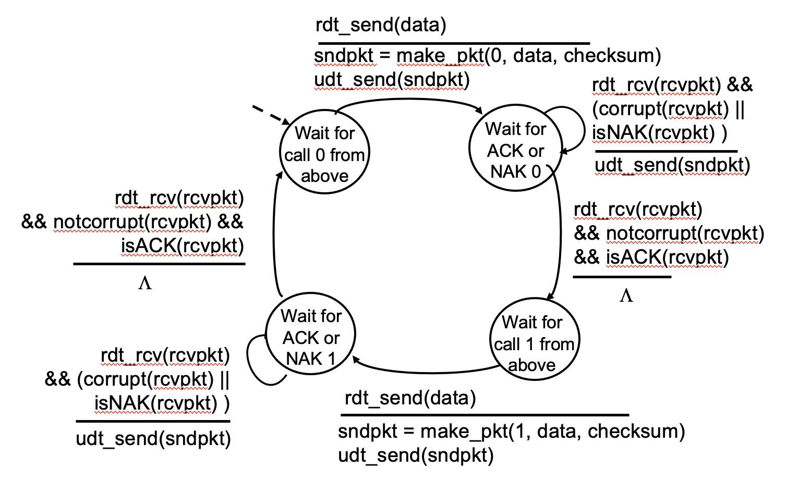
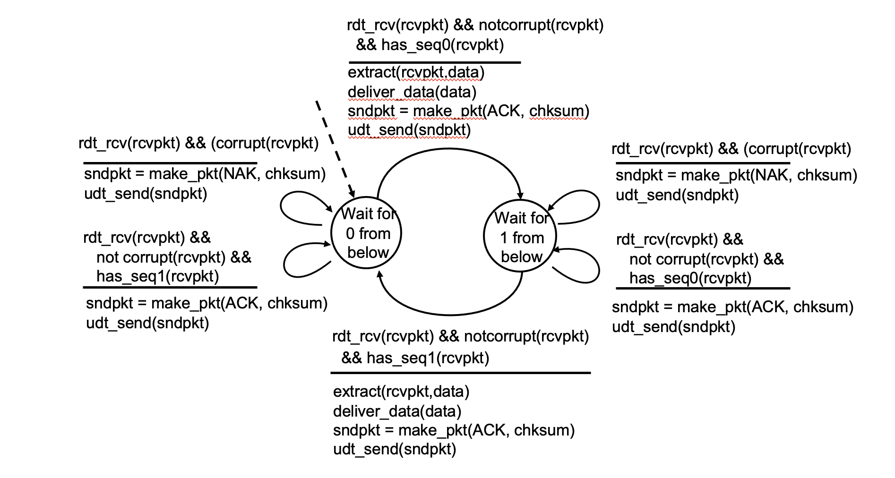
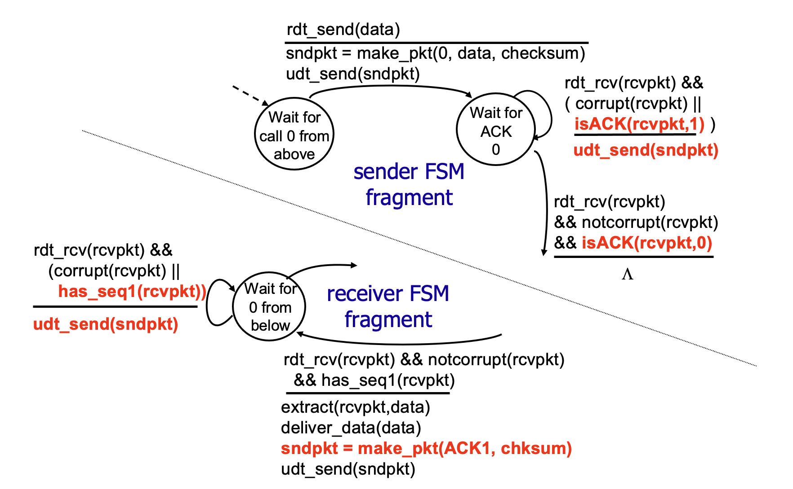
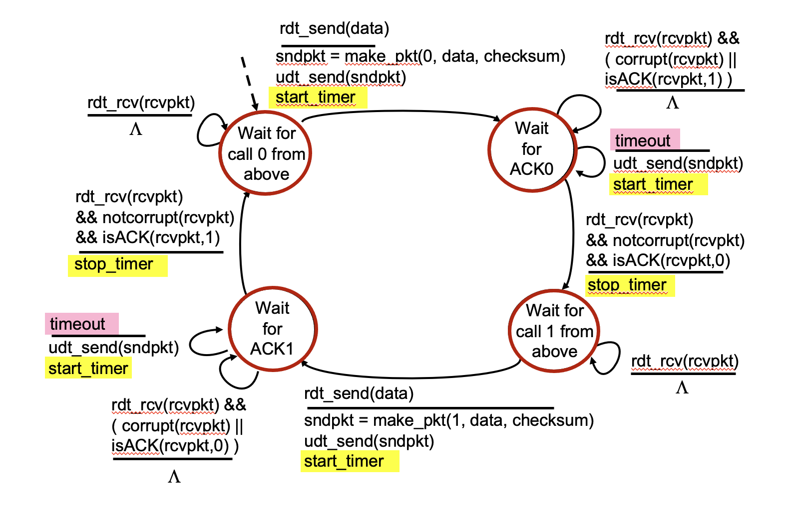

# Principles of Reliable Data Transfer

==RDT exits on every layer of OIS!==

[TOC]

:link: 【深入浅出计算机网络 - 3.2.3 （1）可靠传输的相关基本概念】 https://www.bilibili.com/video/BV1mG41157Tb/?share_source=copy_web&vd_source=7740584ebdab35221363fc24d1582d9d

## FSM

<small>FSM is used for RDT demonstration</small>

:see_no_evil: See [Automaton.md](../../../🧮 Math/Operations Research/COP/Automaton/Automaton.md) for detailed FSM info.

## 🚴‍♀️ Stop-and-Wait (SW)

:link:【深入浅出计算机网络 - 3.2.3 （2）可靠传输的实现机制 - 停止-等待协议】 https://www.bilibili.com/video/BV1WG4y167Gr/?share_source=copy_web&vd_source=7740584ebdab35221363fc24d1582d9d

### rdt 1.0: reliable transfer over reliable channel

### rdt 2.0: channel with bit errors

<small>rdt 2.0 corrupted packet scenario</small>

### rdt 2.1: handling garbled ack/nak

<small>rdt 2.1 Sender, handling garbled ACK/NAKs</small>

<small>rdt 2.1 Reseiver, handling garbled ACK/NAKs</small>

### rdt 2.2: NAK-free

<small>rdt 2.2 Sender, Receiver fragments</small>

### rdt 3.0: channel with errors and loss

<small>rdt 3.0 Sender</small>

## 🚴‍♀️ Go-back-N (GBN)

## 🚴‍♀️ Selective Repeat (SR)

