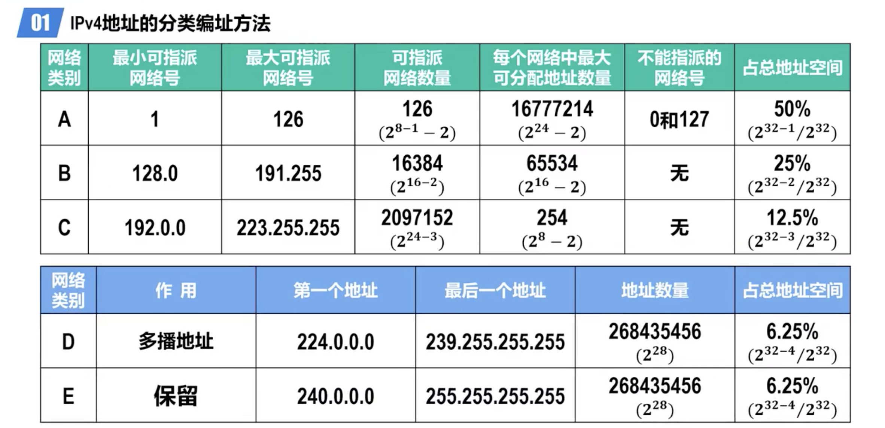
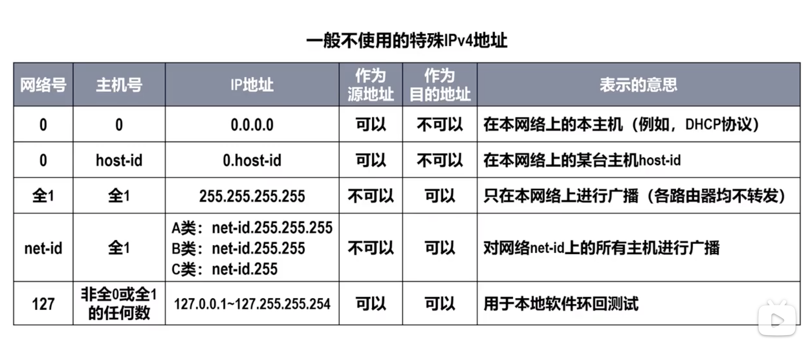
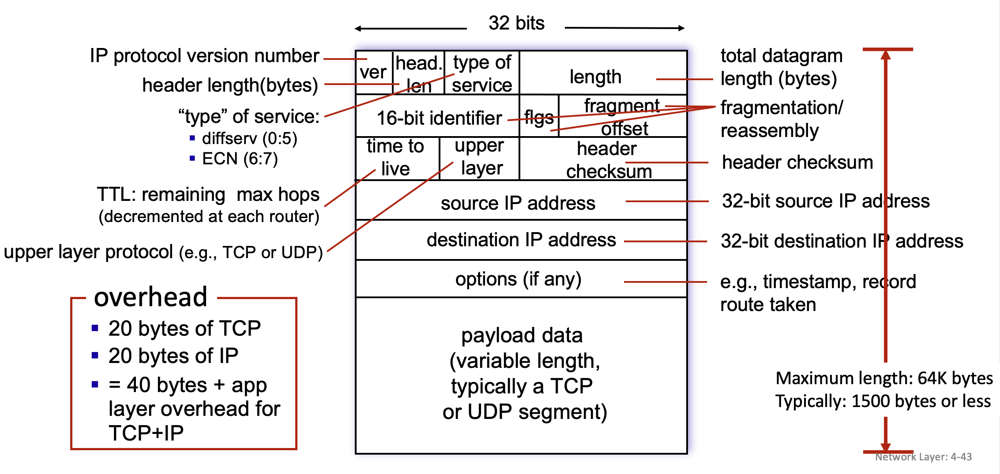
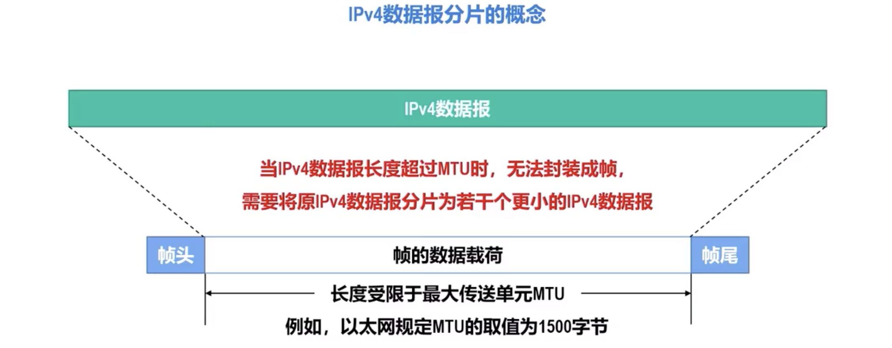
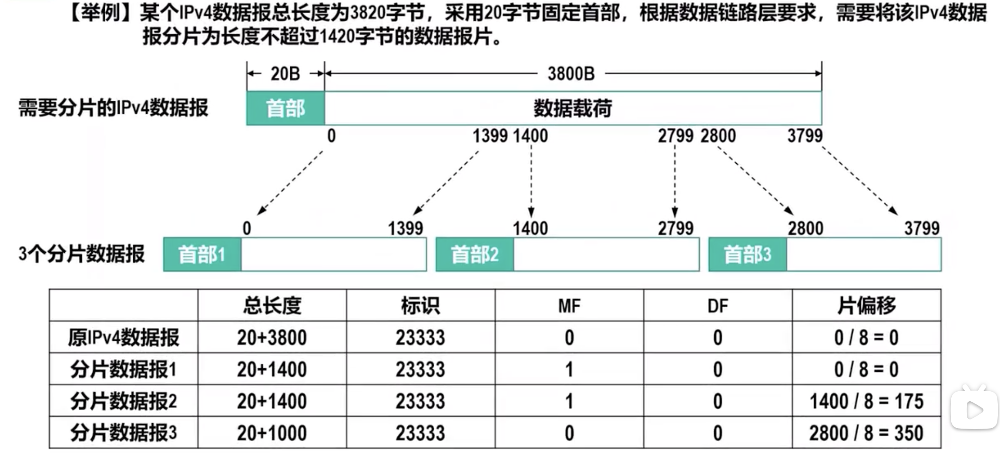
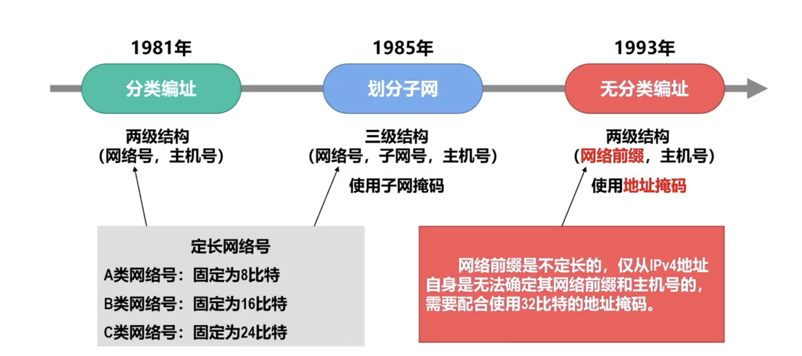
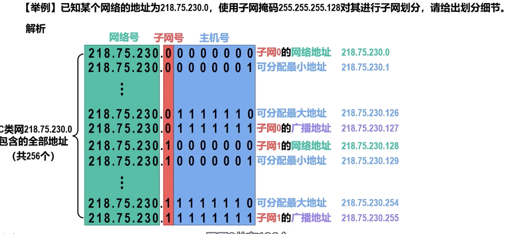
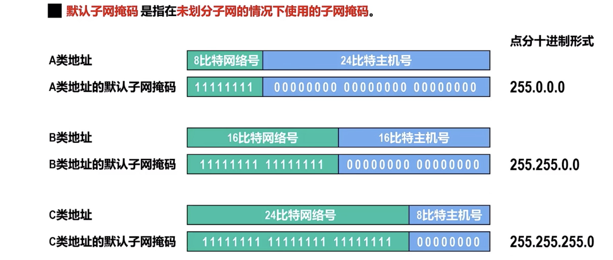
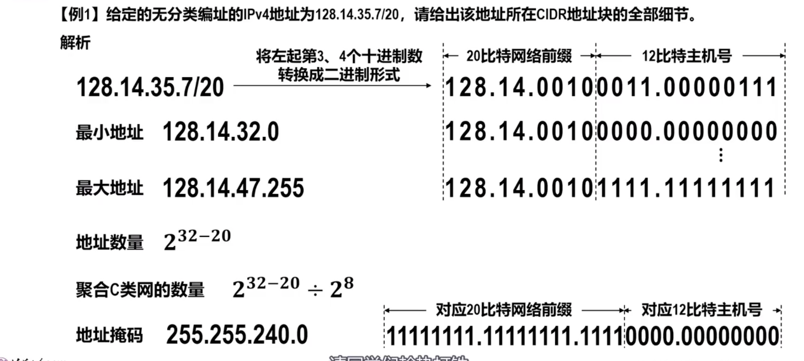

# IPv4

[TOC]

## IPv4 Overview

## IPv4 Header Format

<small>IPv4 Header Format</small>

### Datagram Slicing

 

## 🚚 IPv4 Addressing

### Classful IP Addressing

### Subnetting

#### Subnet Mask

### Classless Inter-Domain Routing, CIDR

:link: 【深入浅出计算机网络 - 4.2.2 IPv4地址及其编址方法——无分类编址方法】 https://www.bilibili.com/video/BV1gD4y1B7iW/?share_source=copy_web&vd_source=7740584ebdab35221363fc24d1582d9d

:question: One Problem Left in the Video .... 

超网

## IPv4 Application Planning

:link: 【深入浅出计算机网络 - 4.2.3 IPv4地址的应用规划】 https://www.bilibili.com/video/BV1J24y1Z72E/?share_source=copy_web&vd_source=7740584ebdab35221363fc24d1582d9d

:question: One Problem Left in the Video .... 

### FLSM&VLSM

## 🛂 ICMPv4

> :running: For more info go to  [ICMPv4](ICMPv4.md) 
