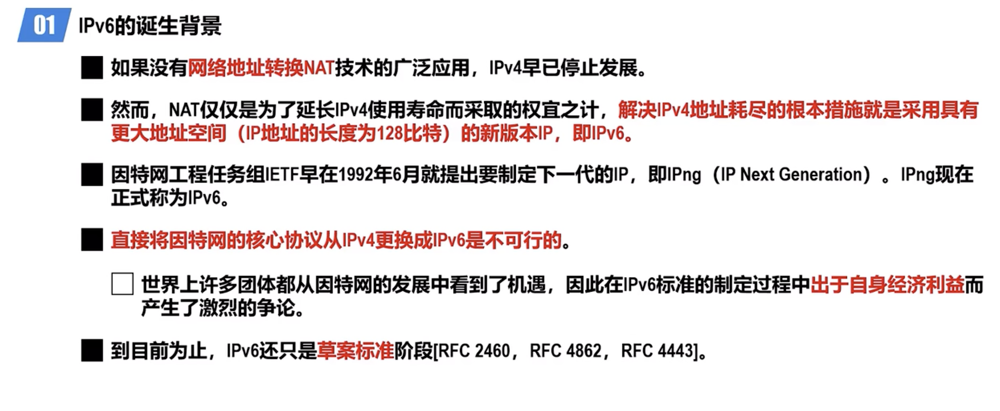
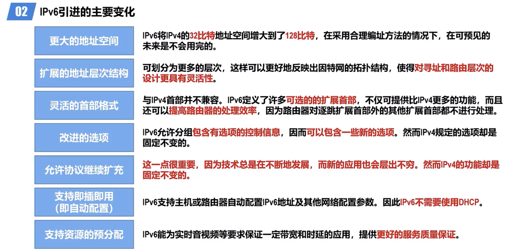
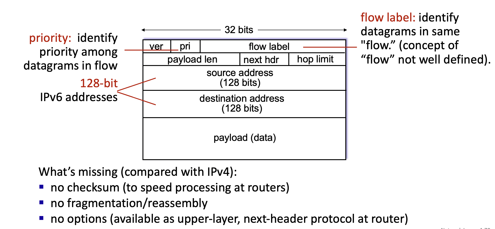

# IPv6

[TOC]

:link:【深入浅出计算机网络 - 4.9.1 IPv6引进的主要变化】 https://www.bilibili.com/video/BV1VY4y1J7GV/?share_source=copy_web&vd_source=7740584ebdab35221363fc24d1582d9d

## Overview

## IPv6 Header Format

:link: 【深入浅出计算机网络 - 4.9.2~4.9.3 IPv6数据报的基本首部和扩展首部】 https://www.bilibili.com/video/BV1wW4y1S7q9/?share_source=copy_web&vd_source=7740584ebdab35221363fc24d1582d9d

<small>IPv6 Header Format</small>

## IPv6 Addressing

## 🛂 ICMPv6

> :running: For more info go to [ICMPv6](ICMPv6.md) 

## Transferring from IPv4 to IPv6

:link: 【深入浅出计算机网络 - 4.9.5 从IPv4向IPv6过渡】 https://www.bilibili.com/video/BV1FY4y1J7ej/?share_source=copy_web&vd_source=7740584ebdab35221363fc24d1582d9d

## :link: Ref

[IPv6 Addressing Overview. -- 「Oracle」System Administration Guide: IP Services]: https://docs.oracle.com/cd/E18752_01/html/816-4554/ipv6-overview-10.html
[IPv4 and IPv6 address formats -- 「IBM」TS3500 Tape Library]: https://www.ibm.com/docs/en/ts3500-tape-library?topic=functionality-ipv4-ipv6-address-formats
