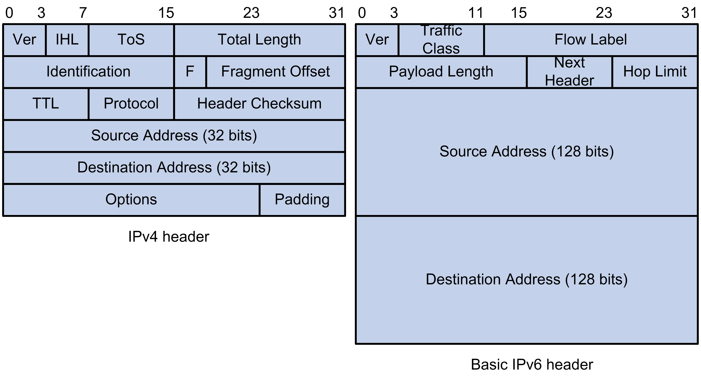
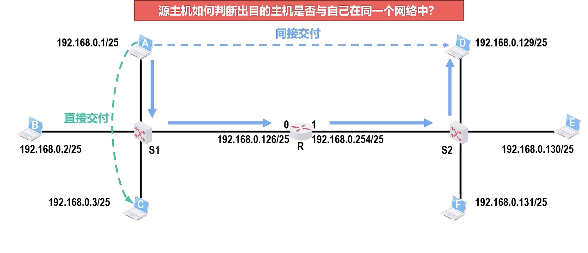
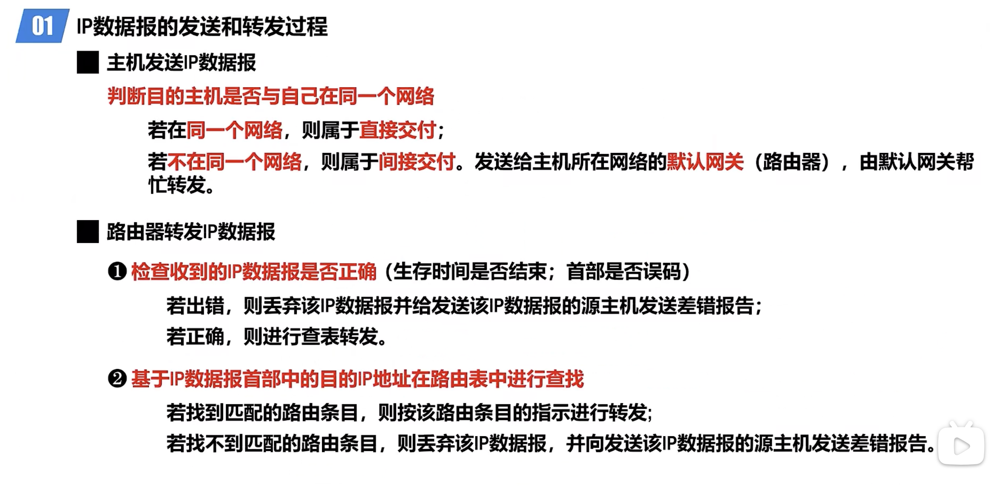
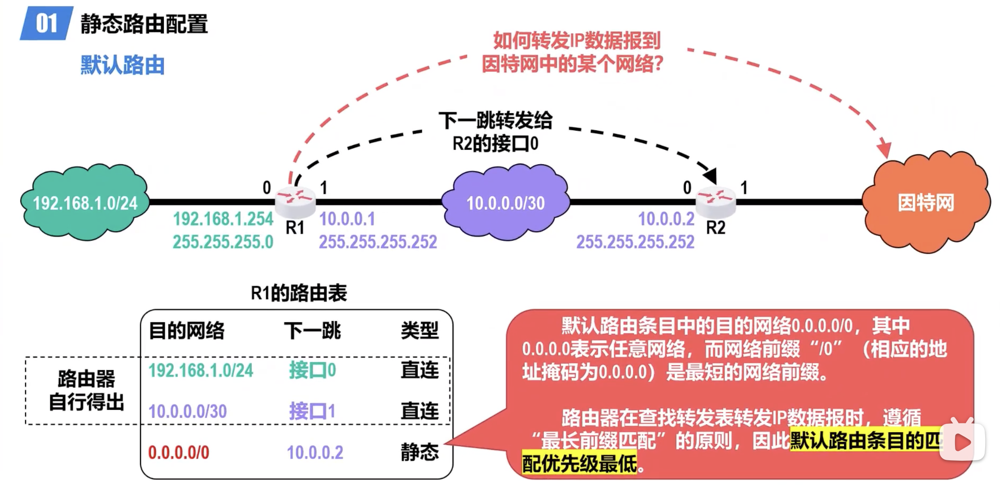
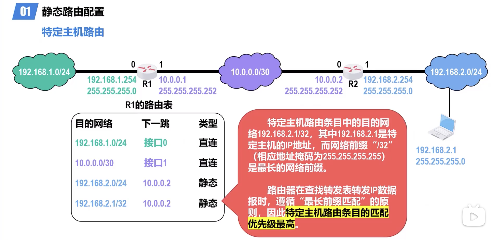
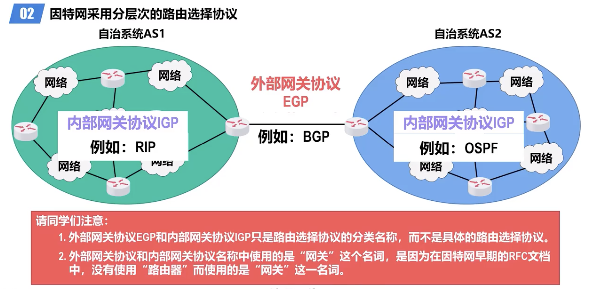

# IP

[TOC]

## IP Overview

## IPv4 Datagram Format

:link: 【深入浅出计算机网络 - 4.2.7 IPv4数据报的首部格式】 https://www.bilibili.com/video/BV19Y4y1K7i7/?share_source=copy_web&vd_source=7740584ebdab35221363fc24d1582d9d

:link: 【深入浅出计算机网络 - 4.9.2~4.9.3 IPv6数据报的基本首部和扩展首部】 https://www.bilibili.com/video/BV1wW4y1S7q9/?share_source=copy_web&vd_source=7740584ebdab35221363fc24d1582d9d

:link: 【深入浅出计算机网络 - 4.9.1 IPv6引进的主要变化】 https://www.bilibili.com/video/BV1VY4y1J7GV/?share_source=copy_web&vd_source=7740584ebdab35221363fc24d1582d9d\

> :running:  For IPv6, go to [Ipv6](IPv6/Ipv6.md).
>
> :running: For more about IPv4, go to [IPv4](IPv4/IPv4.md).

![IPv6 Extension Headers Review and Considerations [IP Version 6 (IPv6)] -  Cisco Systems](../../../../../Assets/Pics/technologies_white_paper0900aecd8054d37d-03.jpg)

<small>IPv4 vs IPv6</small>

<small>IPv4 vs IPv6</small>

## 🎰 IP Addressing

>  :running:
>
> - For IPv4, :see_no_evil: check out  [IPv4](IPv4.md) 
>
> - For IPv6, TBD ... 
>
> - For Mac Addressing, :see_no_evil: check out  [MAC & ARP](MAC & ARP.md) 

> :warning:  As for Mac adressing, it can be catogorized both as Network Layer or Link Layer. Here it falls on Network Layer.

## 🚚 IP Forwarding

:link: 【深入浅出计算机网络 - 4.2.6 IP数据报的发送和转发流程】 https://www.bilibili.com/video/BV1Ne4y187tz/?share_source=copy_web&vd_source=7740584ebdab35221363fc24d1582d9d

## 🚏IP Routing

###  Router

> :running: For more info, go to [Router](Router.md). 

### Routing Protocol

:link: 【深入浅出计算机网络 - 4.4.1~4.4.2 因特网的路由选择协议概述】 https://www.bilibili.com/video/BV1ie4y187ss/?share_source=copy_web&vd_source=7740584ebdab35221363fc24d1582d9d

> :running:  For detailed info, go to  [IP Routing](../../IP Routing/IP Routing.md) 

#### 👷🏻 Static Routing

:link:【深入浅出计算机网络 - 4.3 静态路由配置】 https://www.bilibili.com/video/BV1vB4y1n7pW/?share_source=copy_web&vd_source=7740584ebdab35221363fc24d1582d9d

- 默认路由
- 特定主机路由

#### 🕊️ Dynamic Routing

