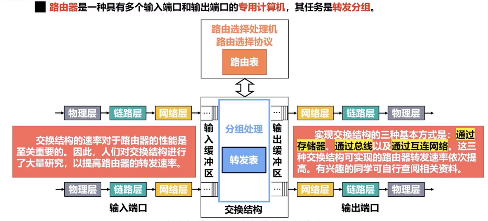

# Router

[TOC]

## Overview

:link: 【深入浅出计算机网络 - 4.4.6 路由器的基本工作原理】 https://www.bilibili.com/video/BV1MW4y187Vo/?share_source=copy_web&vd_source=7740584ebdab35221363fc24d1582d9d

<small>Each port of a router is a FULL-DUPLEX  port. </small>

