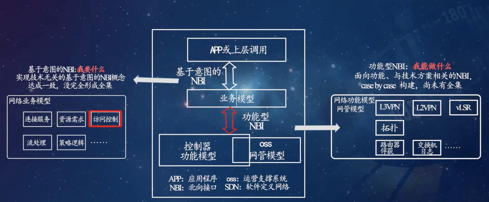
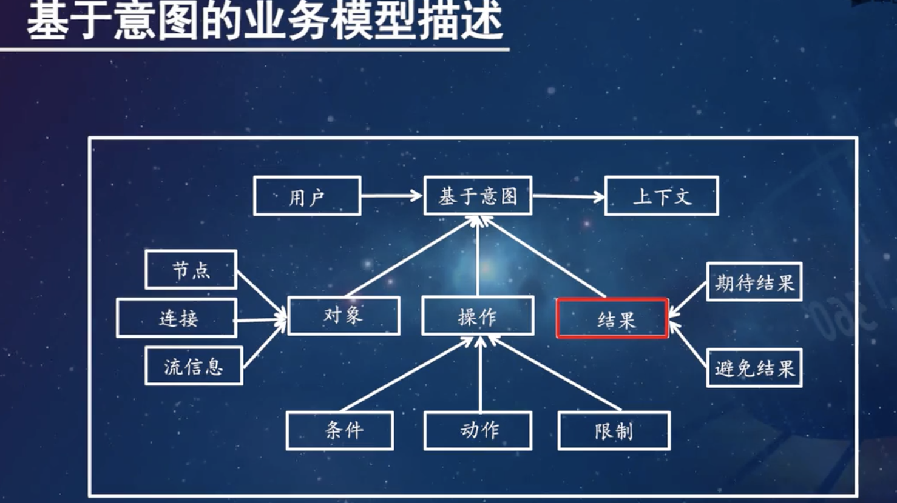

# NBI

[TOC]

:link:【软件定义网络技术 Software Defined Networking，SDN 黄辉、施晓秋】 https://www.bilibili.com/video/BV1S4411C7Zx/?p=20&share_source=copy_web&vd_source=7740584ebdab35221363fc24d1582d9d

> :warning: So far there are no standard form of NBI

## Field Leaders

### ONF: NBI-WG

### IRTF: SDNRG

### IETF: SFC

 

## 🧰 Functional NBI

## 🤩 Intent-based NBI

## NBI Implementation

### Restful API

### Yang

