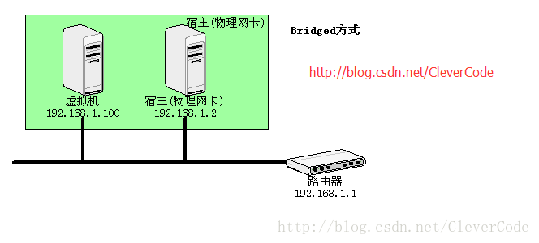

# VMware vmnet

[TOC]

## Res

### Related Topics

## Intro

## Networking Modes in VMware --- Bridged, Host-only, NAT | `vmnet0`, `vmnet1`, `vmnet8`
#bridged #host-only #nat #network #linux #VMware 

①Adapter=VMnet1=eth0(host-only)  
虚拟机之间、主机与虚拟机之间互访，但虚拟机无法访问外网。  

②Adapter2=VMnet8=eth8(nat)  
虚拟机之间、主机与虚拟机之间互访，虚拟机可以通过主机访问外网，外网无法访问虚拟机 

③Adapter3=VMnet0=eth2(Bridged)  
虚拟机相当于一台实体机，可以自由访问与被访问及上网

安装VMware workstation的时候，默认会安装3块虚拟网卡，分别是VMnet0、VMnet1、VMnet8

① VMnet1默认不能访问VMnet8与VMnet0  
从图3-10中可以看到，连接到VMnet1的虚拟机（A11、A12、A13），与连接到VMnet8的虚拟机以及连接到VMnet0的虚拟机（A01、A02、A03），默认情况下，是不能互相访问的。  
如果它们之间要想互相访问，必须在物理主机A上，启用默认路由或者代理服务器功能，才可以互相（或者单向）访问。例如，物理主机可以安装Windows Server 2003（或Windows 2000 Server、Windows Server 2008），在该计算机上，启用“路由和远程访问”功能，并且将该计算机做成一个“路由器”，这时候，各虚拟机之间，可以互相访问。  
如果物理主机安装的是Windows 2000、XP等操作系统，可以启用“Internet连接共享功能”，让VMnet1单向访问VMnet8或VMnet0，反之亦然。例如，可以让VMnet8单向访问VMnet1等，这都是很容易的事情。

② VMnet8默认不能访问VMnet1  
VMnet8在默认情况下，不能访问VMnet1，可以通过虚拟路由器，单向访问VMnet0。如果VMnet8想要访问VMnet1，则像VMnet1访问VMnet8一样，在主机A上启用“路由器”或“Internet连接共享服务”。

③ VMnet0默认不能访问VMnet8、VMnet1  
VMnet0默认情况下，不能访问VMnet1与VMnet8。如果要想访问VMnet8，除了启用“路由器”或“Internet连接共享外”，还可以通过配置“VMnet8”到“VMnet0”之间的“虚拟路由器”，进行端口映射的方式，访问VMnet8中的虚拟机。

### Bridged Network Mode | `vmnet0`
①使用VMnet0（桥接网络），虚拟机相当于网络当中的一台真实的机器，虚拟机如果选择VMnet0（或桥接网络），则通过“VMnet0虚拟交换机”连接到主机所属网络，这时与主机“VMnet0虚拟网卡”是否设置IP地址无关。  
②下图中，如果虚拟机A11、A12、A13使用VMnet0虚拟交换机，不管主机VMnet0虚拟网卡，是否设置了正确的IP地址、子网掩码与网关，只要A11、A12、A13设置了正确的IP地址、子网掩码、网关等参数，是可以访问主机之外网络上的其他计算机（例如B），以及Internet网络上的其他计算机。  
**（ 使用VMnet0的虚拟机A11、A12、A13可以与A、B之间通讯！！！）**  
在这里插入图片描述

### Host-only Network Mode | `vmnet1`
当虚拟机选择使用VMnet1网卡时，表示这台虚拟机连接到VMnet1虚拟交换机  
VMnet1，官方定义为仅主机网路，其默认的网络行为，只与主机或使用VMnet1虚拟网卡的虚拟机有网络连接，使用VMnet1的虚拟网卡的虚拟机，不能访问与物理主机之外的其他计算机。  
下图中，虚拟机A11、A12、A13使用Vmnet1虚拟网卡，表明连接到VMnet1交换机，则 **A11、A12、A13和A之间是可以互相通信的。**  
在这里插入图片描述

注意：
**①在同一交换机上怎么才能通信**  
要注意防火墙设置、是否在同一网段、IP是否冲突等问题

**②注意主机多块网卡**  
注意主机的三款块网卡Vmnet0（物理网络）、VMnet1（虚拟网络）、VMnet8（虚拟网络）  
假如A11、A12、A13的网络是192.168.10.0/24,但是VMnet1不是这个网段的，而VMnet0、VMnet8是这个网络的，那么A与A11、A12、A13是不能通讯的！！！但是把A设置成同A11、A12、A13同一网段就可以通讯，即使A、A11、A12、A13与VMnet1不在同一网端！！！  
**（ 只要连接到VMnet1虚拟网络，且主机和虚拟机在同一网段就可以通讯。  
不要管VMnet1网段和虚拟机或主机是否在同一网段就行！！！）**

**③使用VMnet1虚拟网卡的计算机默认不能上网**  
使用VMnet1虚拟网卡的计算机，不能上网，外网也不能访问使用虚拟网卡的计算机。

### NAT | `vmnet8`
①如果虚拟机使用VMnet8，则虚拟机可以通过主机网络，单向（从虚拟机到主机、外网）访问物理主机之外的网络，而主机以外的网络不能访问使用VMnet8的虚拟机。但这个的前提是，主机要能访问外网（或网络上的其他计算机），如果主机不能访问外网，则配置为VMnet8虚拟网卡的虚拟机，也不能访问外网。  
在这里插入图片描述

②主机A的VMnet8虚拟网卡，连接到VMnet8虚拟交换机，VMnet8虚拟交换机连接到“虚拟路由器”，“虚拟路由器”再连接到“VMnet0虚拟网卡(也即主机物理网卡)”，并通过“VMnet0虚拟网卡”连接到“VMnet0虚拟交换机”，“VMnet0虚拟交换机”连接到主机物理网络。这也就表明，连接到“VMnet8虚拟交换机”的计算机（虚拟机或主机），需要通过“虚拟路由器”→“VMnet0虚拟网卡”→“VMnet0虚拟交换机”的方向连接到主机物理网络。

## Ref
[vmware的vmnet-概念的解说]: https://developer.aliyun.com/article/494310
[👍  vmware中VMnet0、VMnet1、VMnet8是干什么的]: http://t.csdnimg.cn/4HqoQ

[网络配置三种模式对比（桥接模式，主机模式，网络地址转换）]: https://cloud.tencent.com/developer/article/1184666