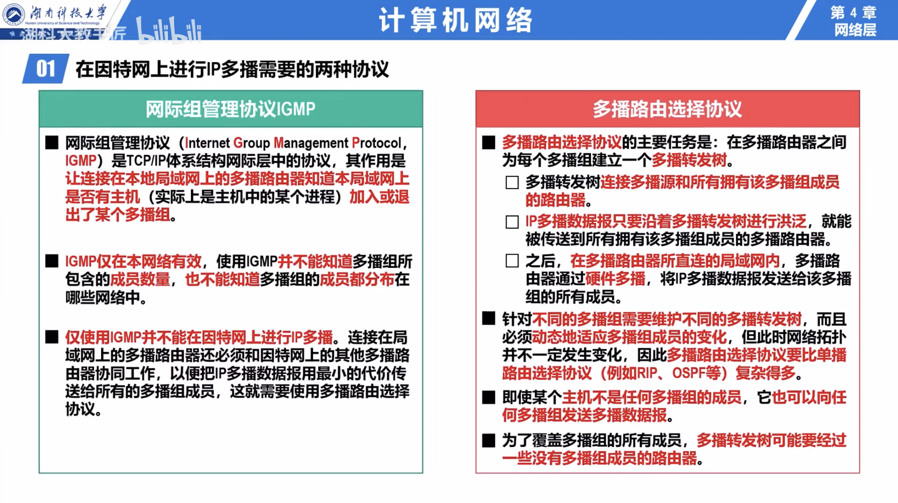

# IP Multicasting (Group Communication)（多播 | 组播）

[TOC]

## Res
🔗 【深入浅出计算机网络 - 4.7.1~4.7.2 IP多播技术的相关基本概念、IP多播地址和多播组】 https://www.bilibili.com/video/BV16f4y1Z7bS/?share_source=copy_web&vd_source=7740584ebdab35221363fc24d1582d9d

## Overview
- Multicasting Group
- Multicasting Address

### 1️⃣ Group Member Management in Multicasting
↗ [Multicast Group Member Management](Multicast%20Group%20Member%20Management/Multicast%20Group%20Member%20Management.md)

### 2️⃣ Route Selection for Multicasting
↗ [Multicast Route Selection Protocols](Multicast%20Route%20Selection%20Protocols/Multicast%20Route%20Selection%20Protocols.md)

## 👉 IP Multicast via IPv4

### MAC Multicast (LAN, IPv4, Link Layer)
↗ [MAC Multicast](../../../../0x06%20Data%20Link%20Layer/📌%20Link%20Layer%20(Switched%20Network)%20Basics/📌%20MAC%20(Media%20Access%20Control)%20Protocol/MAC%20Multicast.md)

### IP Multicasting (LAN, IPv4, Network Layer)
#TODO 

## 👉 IP Multicast via IPv6
### MAC Multicast (LAN, IPv6, Link Layer)
#TODO 

### IP Multicasting (LAN, IPv6, Network Layer)

## 🌏 IP Multicast on Internet
🔗 【深入浅出计算机网络 微课视频】 https://www.bilibili.com/video/BV1NT411g7n6/?p=68&share_source=copy_web&vd_source=7740584ebdab35221363fc24d1582d9d

【深入浅出计算机网络 微课视频-哔哩哔哩】 https://b23.tv/oyVtOkt

To be able to multicast on Internet, 
1. within each router it uses **IGMP (IPv4) or MLD (IPv6)** to be informed synchronically of its subnet hosts' multicasting group list;
2. meanwhile interbetween each routers different **routing protocols for multicasting** are used to generate **multicasting forwarding tree** to route the multicast packages. 

↗ [Multicast Route Selection Protocols](Multicast%20Route%20Selection%20Protocols/Multicast%20Route%20Selection%20Protocols.md)

↗ [Multicast Group Member Management](Multicast%20Group%20Member%20Management/Multicast%20Group%20Member%20Management.md)

Multicast communication can have single or multiple senders and receivers and thus, IGMP can be used in 📹 streaming videos, 🎮 gaming or 🖥 web conferencing tools. 

## Ref
[Multicast | Wikipedia]: https://en.wikipedia.org/wiki/Multicast
