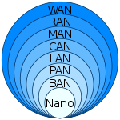

# [Chapter 1. Introduction](https://www.hackers-arise.com)

[TOC]

## Network

## 🚛 Circuit Switching, Tele Switching & Package Switching

## Computer Network

🔗【深入浅出计算机网络 - 1.4 计算机网络的定义和分类】 https://www.bilibili.com/video/BV1BP411j7XH/?share_source=copy_web&vd_source=7740584ebdab35221363fc24d1582d9d

### [Computer network](https://en.wikipedia.org/wiki/Computer_network) types by spatial scope

- [Nanoscale](https://en.wikipedia.org/wiki/Nanonetwork)
- [Near-field (NFC)](https://en.wikipedia.org/wiki/Near-field_communication)
- [Body](https://en.wikipedia.org/wiki/Body_area_network)
- [Personal (PAN)](https://en.wikipedia.org/wiki/Personal_area_network)
- [Near-me](https://en.wikipedia.org/wiki/Near-me_area_network)
- Local (LAN)
  - [Storage (SAN)](https://en.wikipedia.org/wiki/Storage_area_network)
  - [Wireless (WLAN)](https://en.wikipedia.org/wiki/Wireless_LAN)
  - [Virtual (VLAN)](https://en.wikipedia.org/wiki/VLAN)
- [Home (HAN)](https://en.wikipedia.org/wiki/Home_network)
- [Building](https://en.wikipedia.org/wiki/Building_area_network)
- [Campus (CAN)](https://en.wikipedia.org/wiki/Campus_network)
- [Backbone](https://en.wikipedia.org/wiki/Backbone_network)
- Metropolitan (MAN)
  - [Municipal wireless (MWN)](https://en.wikipedia.org/wiki/Municipal_wireless_network)
- [Wide (WAN)](https://en.wikipedia.org/wiki/Wide_area_network)
- [Cloud](https://en.wikipedia.org/wiki/Internet_area_network)
- Internet
- [Interplanetary Internet](https://en.wikipedia.org/wiki/Interplanetary_Internet)

## Internet
> 💡 [Internet](https://www.henduohao.com/product/1065.html)

The **Internet** (or **internet**)[[a\]](https://en.wikipedia.org/wiki/Internet#cite_note-1) is the **global system of interconnected [computer networks](https://en.wikipedia.org/wiki/Computer_network) that uses the [Internet protocol suite](https://en.wikipedia.org/wiki/Internet_protocol_suite) (TCP/IP)[[b\]](https://en.wikipedia.org/wiki/Internet#cite_note-3) to communicate between networks and devices**. It is a *[network of networks](https://en.wikipedia.org/wiki/Internetworking)* that consists of private, public, academic, business, and government networks of local to global scope, linked by a broad array of electronic, wireless, and [optical networking](https://en.wikipedia.org/wiki/Optical_networking) technologies. The Internet carries a vast range of information resources and services, such as the inter-linked [hypertext](https://en.wikipedia.org/wiki/Hypertext) documents and [applications](https://en.wikipedia.org/wiki/Web_application) of the [World Wide Web](https://en.wikipedia.org/wiki/World_Wide_Web) (WWW), [electronic mail](https://en.wikipedia.org/wiki/Email), [telephony](https://en.wikipedia.org/wiki/Internet_telephony), and [file sharing](https://en.wikipedia.org/wiki/File_sharing).

The Internet has no single centralized governance in either technological implementation or policies for access and usage; each constituent network sets its own policies.[[5\]](https://en.wikipedia.org/wiki/Internet#cite_note-7) 

- The overreaching definitions of the two principal [name spaces](https://en.wikipedia.org/wiki/Name_space) in the Internet, the [Internet Protocol address](https://en.wikipedia.org/wiki/IP_address) (IP address) space and the [Domain Name System](https://en.wikipedia.org/wiki/Domain_Name_System) (DNS), are directed by a maintainer organization, **the [Internet Corporation for Assigned Names and Numbers](https://en.wikipedia.org/wiki/Internet_Corporation_for_Assigned_Names_and_Numbers) (ICANN)**.
- The technical underpinning and standardization of the core protocols is an activity of the **[Internet Engineering Task Force](https://en.wikipedia.org/wiki/Internet_Engineering_Task_Force) (IETF)**, a non-profit organization of loosely affiliated international participants that anyone may associate with by contributing technical expertise.[[6\]](https://en.wikipedia.org/wiki/Internet#cite_note-8) 

### Development of Internet

### ISP

### Hierachy of Internet

## 🆚 Network, internet, Internet, WWW (Web)

 

Network = Links + Nodes + (Switches)

internet = Network(Network)

Internet = an instance of interenet 

| internet     | VS | Internet |
| :--: | :--: | :--: |
| General Term |      | Exclusive Term |
| 互联网 |      | 因特网 |
| Any Protocols |      | TCP/IP |

## ✍🏾 HW

