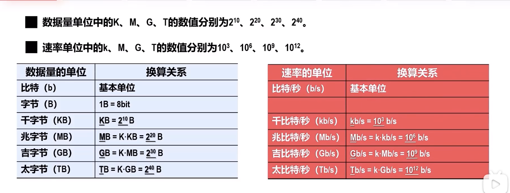
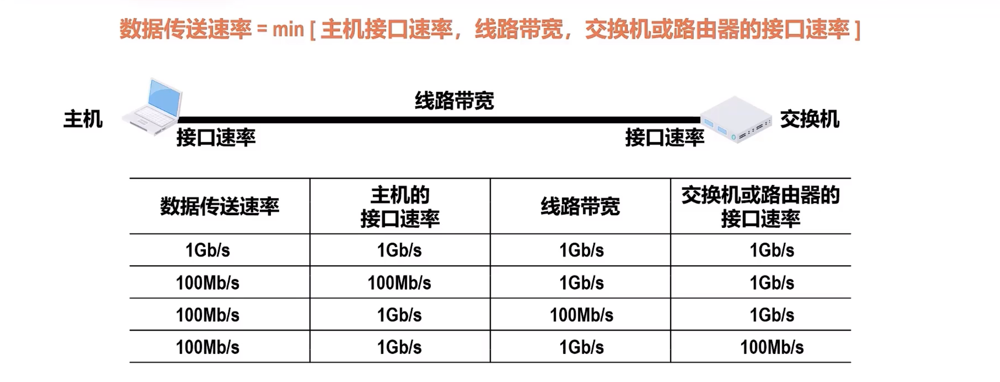
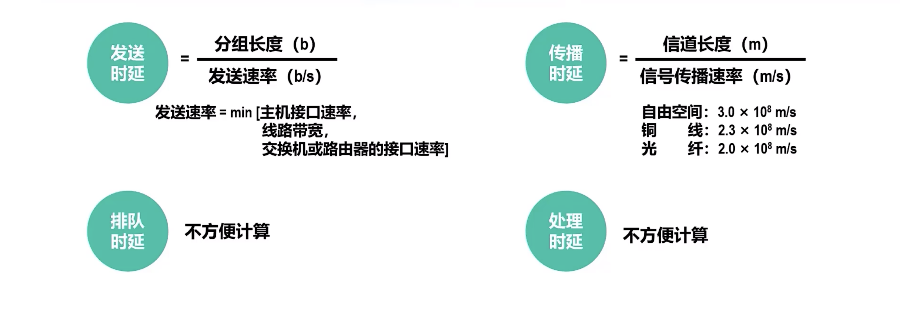
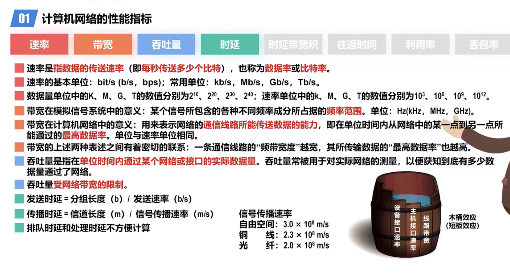
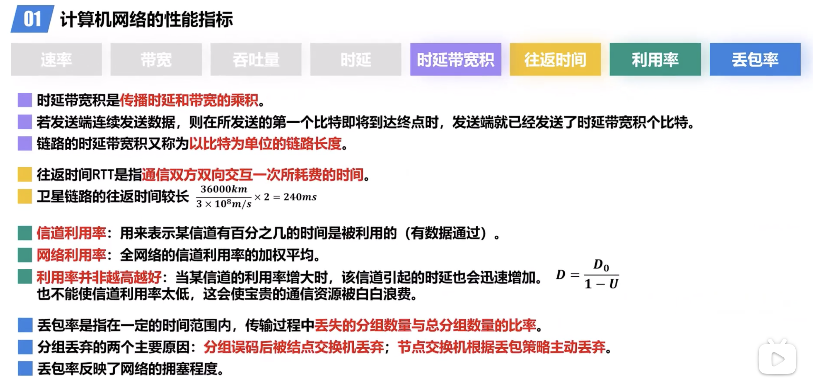

# Computer Network Performance

[TOC]

:link: 【深入浅出计算机网络 - 1.5 计算机网络的性能指标-速率、带宽、吞吐量、时延】 https://www.bilibili.com/video/BV1pN4y1V7er/?share_source=copy_web&vd_source=7740584ebdab35221363fc24d1582d9d

:link: 【深入浅出计算机网络 - 1.5 计算机网络的性能指标——时延带宽积、往返时间、利用率、丢包率】 https://www.bilibili.com/video/BV12d4y1w72n/?share_source=copy_web&vd_source=7740584ebdab35221363fc24d1582d9d

## Data Rate / Bit Rate

## BandWidth

## Thoroughput

Fiber wire: transmitting rate slower than Copper wier, but bandwidth larger than Copper wire.

## Timelag

## Timelag product

## RTT

## Utilization

##  Drop Rate

## Summary

