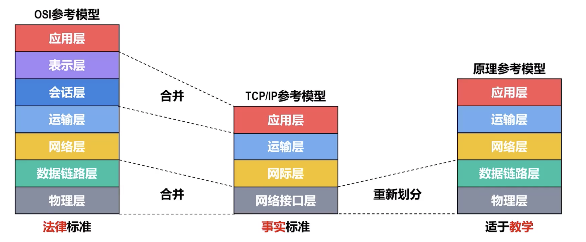
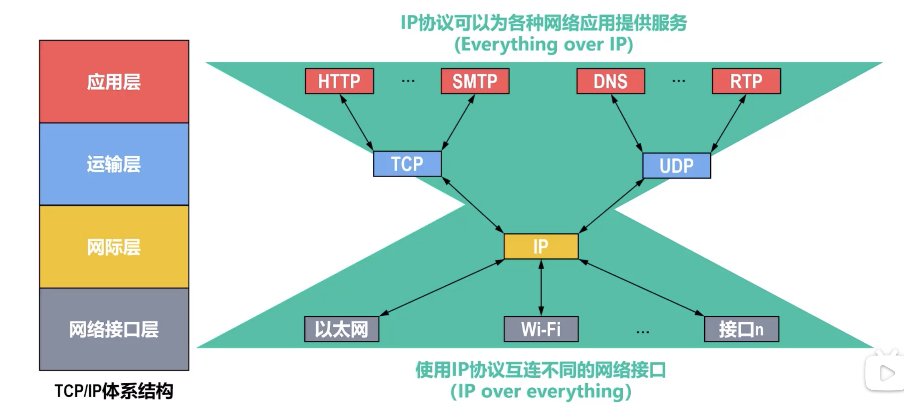
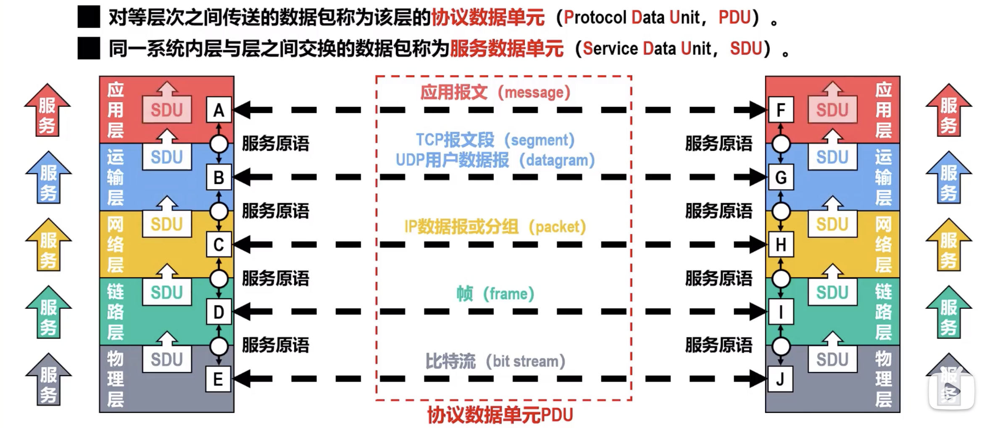
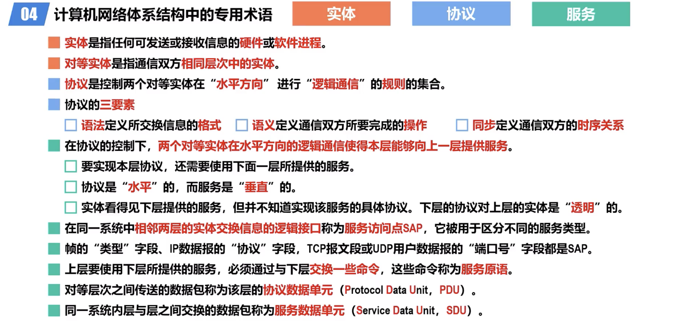

# Computer Network System

[TOC]

:link:【深入浅出计算机网络 - 1.6.1 常见的三种计算机网络体系结构】 https://www.bilibili.com/video/BV1na411G74W/?share_source=copy_web&vd_source=7740584ebdab35221363fc24d1582d9d

:link: 【深入浅出计算机网络 - 1.6.2 计算机网络体系结构分层的必要性】 https://www.bilibili.com/video/BV1cg411k7cZ/?share_source=copy_web&vd_source=7740584ebdab35221363fc24d1582d9d

:link: 【深入浅出计算机网络 - 1.6.3 计算机网络体系结构分层思想举例】 https://www.bilibili.com/video/BV1ad4y1d7Wx/?share_source=copy_web&vd_source=7740584ebdab35221363fc24d1582d9d

:link: 【深入浅出计算机网络 - 1.6.4 计算机网络体系结构中的专用术语】 https://www.bilibili.com/video/BV1gT411w7pJ/?share_source=copy_web&vd_source=7740584ebdab35221363fc24d1582d9d

## Network Layering

