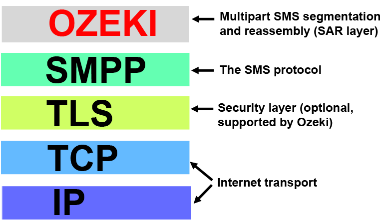
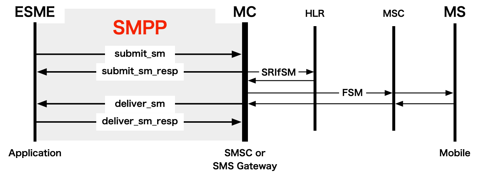

# [SMPP](https://smpp.org)

[TOC]

## Intro

> :link: https://smpp.org

The protocol used to transfer SMS messages over the Internet is called [SMPP protocol](https://ozeki-sms-gateway.com/p_7617-smpp-connection-to-sms-service-providers.html). It is a client server protocol that requires an [SMPP server](https://ozeki-sms-gateway.com/p_6729-how-to-setup-your-own-secure-smpp-server.html) such as [Ozeki SMS Gateway](https://ozeki-sms-gateway.com/) and an [SMPP client](https://ozeki-sms-gateway.com/p_5953-how-to-setup-an-smpp-client-connection-to-the-mobile-network.html).

The SMPP (Short Message Peer-to-Peer) protocol is an open, industry standard protocol designed to provide a flexible data communications interface for the transfer of short message data between External Short Message Entities (ESME), Routing Entities (RE) and Message Centres (MC). It is a means by which applications can send and receive SMS messages to and from mobile devices. Applications do this using an SMPP connection to a Short Message Service Center (SMSC), [SMS gateway](https://smpp.org/sms-gateway.html) ([UK](https://smpp.org/sms-gateway.html#uk)), SMPP gateway or hub.

It can also be used as an API for use with USSD, CBC and other mobile services.

## Ref

[SMPP protocol ]: https://ozeki-sms-gateway.com/p_260-introduction-to-the-sms-protocol.html

