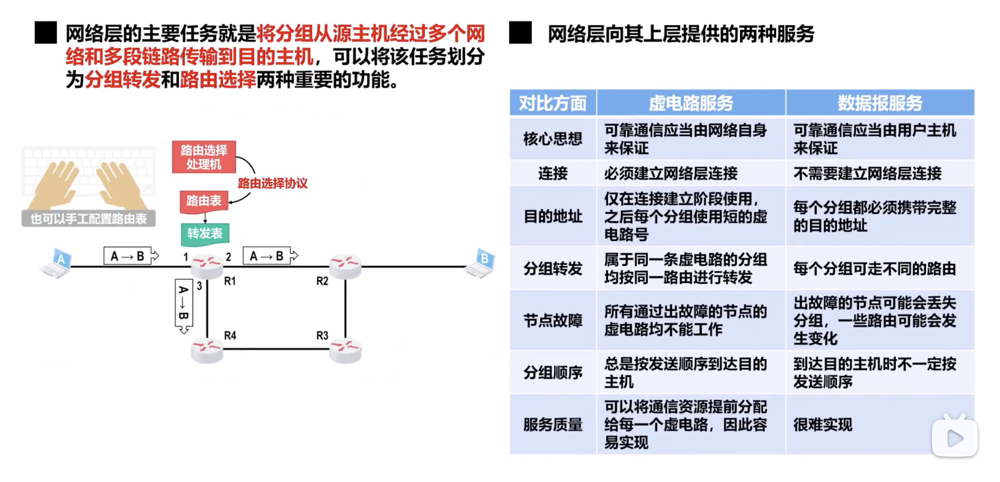
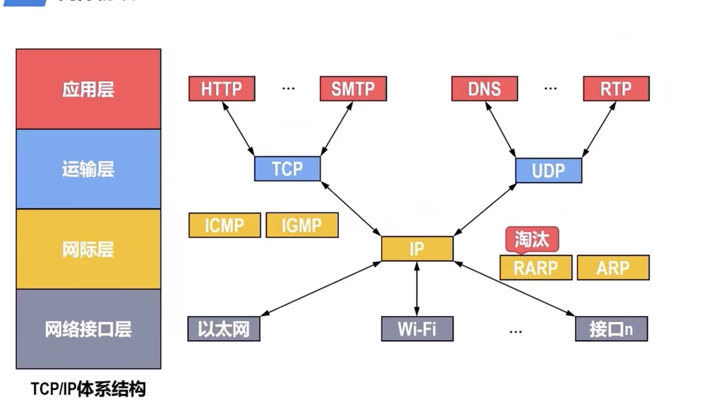
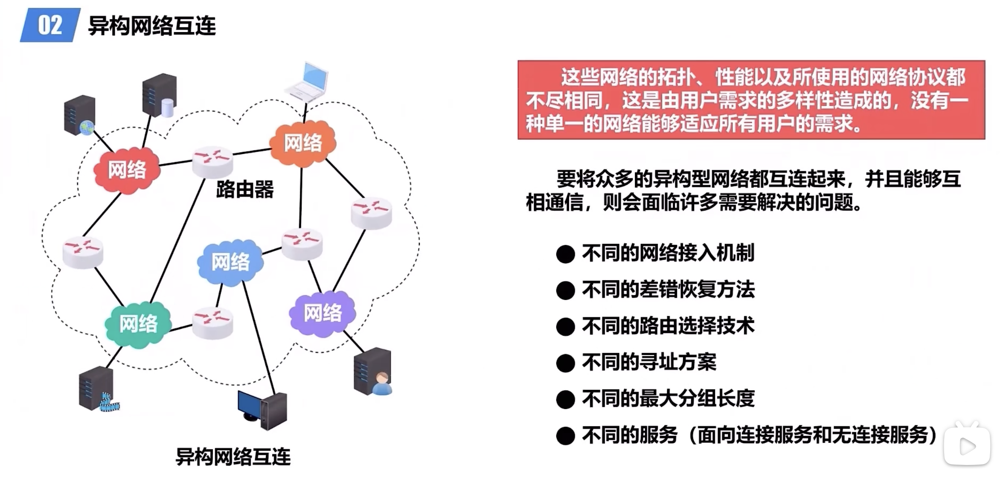

# Network Layer

[TOC]

## Overview

## Router

> :running: For more info, check out [Router.md](Data%20Plane/Router.md) 

## 👾 IP(Internet Protocol)

> :running: For more info, check out [Internet Protocol](Internet Protocol.md) 

## 🛂 ICMP

> :running:
>
>  [ICMPv4.md](Data%20Plane/Internet%20Protocol/IPv4/ICMPv4.md) 
>
> [ICMPv6.md](Data%20Plane/Internet%20Protocol/IPv6/ICMPv6.md) 

## 👻 VPN

:link: 【深入浅出计算机网络 - 4.6 虚拟专用网VPN和网络地址转换NAT】 https://www.bilibili.com/video/BV1mV4y1M7Xs/?share_source=copy_web&vd_source=7740584ebdab35221363fc24d1582d9d

↗️ This notes can be seen on [VPN](../../Anonymity Network/VPN/VPN.md).

## ⚧️ NAT

:link: 【深入浅出计算机网络 - 4.6 虚拟专用网VPN和网络地址转换NAT】 https://www.bilibili.com/video/BV1mV4y1M7Xs/?share_source=copy_web&vd_source=7740584ebdab35221363fc24d1582d9d 

NAPT, Network Address and Port Translation

## IP Multicasting

> :running: For more info, check out  [Multicasting](Data%20Plane/Multicasting.md).

## Mobile IP

> :running: For more info, check out [Mobile IP](Mobile IP.md) 

## SDN

> :running: For more info, check out [SDN](../../SDN/SDN.md) 

:link: 【深入浅出计算机网络 - 4.10 软件定义网络SDN】 https://www.bilibili.com/video/BV19P411J77K/?share_source=copy_web&vd_source=7740584ebdab35221363fc24d1582d9d

