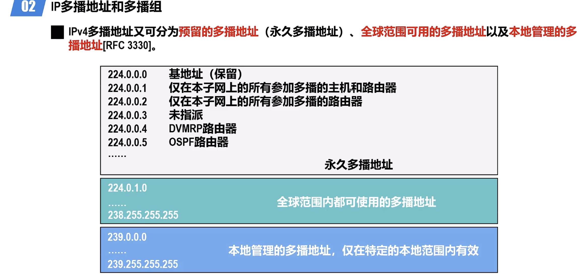
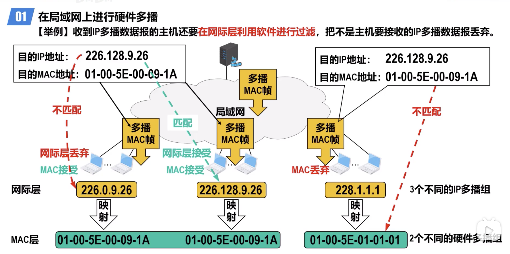
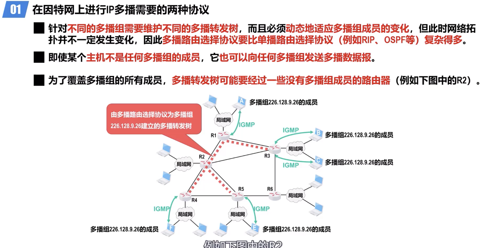
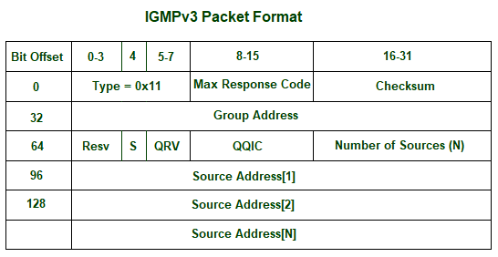

# Multicasting

[TOC]

:link: 【深入浅出计算机网络 - 4.7.1~4.7.2 IP多播技术的相关基本概念、IP多播地址和多播组】 https://www.bilibili.com/video/BV16f4y1Z7bS/?share_source=copy_web&vd_source=7740584ebdab35221363fc24d1582d9d

## Overview

- Multicasting Group
- Multicasting Address

## Multicasting on LAN

## Multicasting on Internet

To be able to multicast on Internet, within each router it uses **IGMP (IPv4) or MLD (IPv6)** to be informed synchronically of its subnet hosts' multicasting group list; meanwhile interbetween each routers different **routing protocols for multicasting** are used to generate **multicasting forwarding tree** to route the multicast packages. 

Multicast communication can have single or multiple senders and receivers and thus, IGMP can be used in :video_camera: streaming videos, :video_game:  gaming or :desktop_computer:   web conferencing tools. 

### IGMP (IPv4)

:link: 【深入浅出计算机网络 - 4.7.5 网际组管理协议IGMP】 https://www.bilibili.com/video/BV1cU4y1D797/?share_source=copy_web&vd_source=7740584ebdab35221363fc24d1582d9d

:link: [What is IGMP(Internet Group Management Protocol)?](https://www.geeksforgeeks.org/what-is-igmpinternet-group-management-protocol/)

**IGMP** is acronym for **Internet Group Management Protocol**. IGMP is a communication protocol used by hosts and adjacent routers for multicasting communication with IP networks and uses the resources efficiently to transmit the message/data packets. 

The latest version of IGMP is IGMPv3 released on 2002.

#### IGMPv3

<small>IGMPv3 Packet Format</small>

- **Max Response Time –** This field is ignored for message types other than membership query. For membership query type, it is the maximum time allowed before sending a response report. The value is in units of 0.1 seconds.
- **Checksum –** It is the one’s complement of the one’s complement of the sum of IGMP message.
- **Group Address –** It is set as 0 when sending a general query. Otherwise, multicast address for group-specific or source-specific queries.
- **Resv –** It is set zero of sent and ignored when received.
- **S flag –** It represents Suppress Router-side Processing flag. When the flag is set, it indicates to suppress the timer updates that multicast routers perform upon receiving any query.
- **QRV –** It represents Querier’s Robustness Variable. Routers keeps on retrieving the QRV value from the most recently received query as their own value until the most recently received QRV is zero.
- **QQIC –** It represents Querier’s Query Interval Code.
- **Number of sources –** It represents the number of source addresses present in the query. For general query or group-specific query, this field is zero and for group-and-source-specific query, this field is non-zero.
- **Source Address[i] –** It represents the IP unicast address for N fields.

### MLD (IPv6)

### Routing Protocols for Multicasting

:link: 【深入浅出计算机网络 - 4.7.6 多播路由选择协议】 https://www.bilibili.com/video/BV1YB4y1e7NV/?share_source=copy_web&vd_source=7740584ebdab35221363fc24d1582d9d

#### Source-Based Tree

RPM

- RPB
- Flooding

#### Group-Shared Tree

#### List of Routing Protocols for Multicasting

