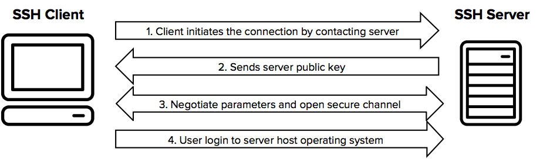

# SSH

[TOC]


> This page was largely based on the inventor of SSH, [Tatu Ylonen](https://ylonen.org/) (twitter: [@tjssh](https://twitter.com/tjssh)). He wrote ssh-1.x and ssh-2.x, and still works on related topics. The open source OpenSSH implementation is based on his free version.
>
> 🔗 original link: https://www.ssh.com/academy/ssh


## Res

✨ [SSH Official Docs](https://www.ssh.com/academy/ssh)


## Intro
The SSH protocol uses encryption to secure the connection between a client and a server. All user authentication, commands, output, and file transfers are encrypted to protect against attacks in the network. For details of how the SSH protocol works, see the [protocol page](https://www.ssh.com/ssh/protocol/). To understand the SSH File Transfer Protocol, see the [SFTP](https://www.ssh.com/ssh/sftp) page.




### 🚀 Quick-Start
```ssh
# copy local ssh public key to target host's ~/.ssh/authoried.host

ssh-copy-id <use_name>@<ip>


```


## Running & Configuring SSH
This section contains links topics around using, configuring, and administering SSH.

- [Command line options](https://www.ssh.com/ssh/command)
- [Tectia SSH manuals](https://www.ssh.com/manuals/)
- [sshd](https://www.ssh.com/ssh/sshd) - The SSH server on Unix/Linux
- [sshd_config](https://www.ssh.com/ssh/sshd_config) - Server configuration file on Unix/Linux
- [ssh_config](https://www.ssh.com/ssh/config) - Client configuration file on Unix/Linux
- [SSH port](https://www.ssh.com/ssh/port), and how it got that number


## Security of SSH and attacks against it
The SSH protocol is believed to be secure against cryptographic attacks on the network, provided keys and credentials are properly managed. However, we do not recommend using `diffie-hellman-group1-sha1` key exchange. It uses a 768 bit Diffie-Hellman group, which may be breakable by governments today. Larger groups are probably ok. Recent OpenSSH versions have disabled this group by default. See [sshd_config](https://www.ssh.com/ssh/sshd_config) for configuring what key exchanges to use.

- [Analysis of BothanSpy and Gyrfalcon - the presumed CIA hacking tools](https://www.ssh.com/ssh/cia-bothanspy-gyrfalcon)
- [Man-in-the-middle attacks against SSH](https://www.ssh.com/attack/man-in-the-middle)
- [Imperfect forward secrecy - How Diffie-Hellman fails in practice](https://weakdh.org/)


## Automate with SSH keys, but manage them
SSH keys can be used to automate access to servers. They are commonly used in scripts, backup systems, configuration management tools, and by developers and sysadmins. They also provide single sign-on, allowing the user to move between his/her accounts without having to type a password every time. This works even across organizational boundaries, and is highly convenient.

However, unmanaged SSH keys can become a major risk in larger organizations.

- [What is an SSH key](https://www.ssh.com/ssh/key/)
- [What SSH life cycle management means](https://www.ssh.com/iam/ssh-key-management)
- [Universal SSH Key Manager](https://www.ssh.com/products/universal-ssh-key-manager)
- [ssh-keygen](https://www.ssh.com/ssh/keygen) - Create keys
- [ssh-copy-id](https://www.ssh.com/ssh/copy-id) - Provision access on servers
- [authorized_keys](https://www.ssh.com/ssh/authorized_keys) - Authorized keys file format

The [PrivX On-Demand Access Manager](https://www.ssh.com/products/privx/) can be used as an alternative for SSH keys, eliminating the need for permanent keys and passwords on servers entirely.


## SSH Implementaions
↗ [SSH Implementation](SSH%20Implementation.md)


## Ref

