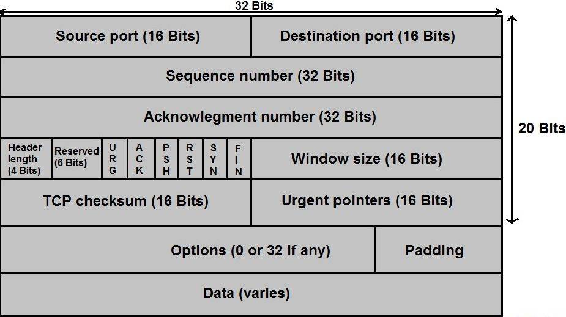

# TCP Header Format

[TOC]

## Res
🔗【深入浅出计算机网络 - 5.3.1 TCP报文段的首部格式】 https://www.bilibili.com/video/BV1Ce4y1674L/?share_source=copy_web&vd_source=7740584ebdab35221363fc24d1582d9d

## TCP Header Fields Overview

<small>TCP Segment Header</small>

<small>Source: <a>https://skminhaj.wordpress.com/2016/02/15/tcp-segment-vs-udp-datagram-header-format/</a></small>

## 🤕 TCP Header Fields
### Src Port Number & Dst Port Number

### Sequence Number & Acknowledgment Number & ACK

### Offset Number

### Reserved Number

 
### Windows Number (`rwnd`)

### Checksum

### Optional Fields

### Padding

## 🏴‍☠️ TCP Flag Fields
### SYN

### FIN

### RST

### PSH

### URG & URG Pointer

## Ref

