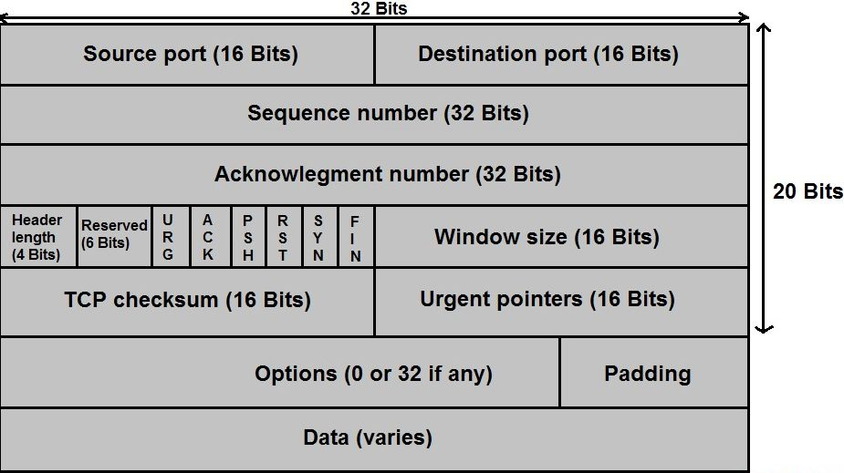

# TCP

[TOC]

## Res
↗ [🍻 Principles of Reliable Data Transfer](../../RDT/🍻%20Principles%20of%20Reliable%20Data%20Transfer.md)

## Overview

### TCP Connections
#### Send/Receive Buffers
Once a TCP connection is established, the two application processes can send data to each other. 

Let’s consider the sending of data from the client process to the server process. The client process passes a stream of data through the socket (the door of the process). Once the data passes through the door, the data is in the hands of TCP running in the client. TCP directs this data to the connection’s **send buffer**, which is one of the buffers that is set aside during the initial three-way handshake. From time to time, TCP will grab chunks of data from the send buffer and pass the data to the network layer. 

Interestingly, the TCP specification [RFC 793] is very laid back about specifying when TCP should actually send buffered data, stating that TCP should “send that data in seg- ments at its own convenience.”

Each side of the connection has its own send buffer and its own receive buffer. (You can see the online flow-control interactive animation at 🔗 http://www.awl.com/kurose-ross, which provides an anima- tion of the send and receive buffers.)

#### Maximum Segment Size, MSS
The maximum amount of data that can be grabbed and placed in a segment is limited by the **maximum segment size (MSS)**. 
- The MSS is typically set by first determining the length of the largest link-layer frame that can be sent by the local sending host (the so-called **maximum transmission unit, MTU**), and then setting the MSS to ensure that a TCP segment (when encapsulated in an IP datagram) plus the TCP/IP header length (typically 40 bytes) will fit into a single link-layer frame.
	- Both Ethernet and PPP link-layer protocols have an MTU of 1,500 bytes. Thus, a typical value of MSS is 1460 bytes.
	- Approaches have also been proposed for discovering the **path MTU**: the largest link-layer frame that can be sent on all links from source to destination [RFC 1191] -- and setting the MSS based on the path MTU value.
- Note that the MSS is the maximum amount of application-layer data in the segment, not the maximum size of the TCP segment including headers. (This terminology is confusing, but we have to live with it, as it is well entrenched.)

## TCP Segment Header Structure
🔗【深入浅出计算机网络 - 5.3.1 TCP报文段的首部格式】 https://www.bilibili.com/video/BV1Ce4y1674L/?share_source=copy_web&vd_source=7740584ebdab35221363fc24d1582d9d

<small>TCP Segment Header</small>

<small>Source: <a>https://skminhaj.wordpress.com/2016/02/15/tcp-segment-vs-udp-datagram-header-format/</a></small>

## TCP Connection Management
### 👏 3-way Handshake
🔗【深入浅出计算机网络 - 5.3.2 TCP的运输连接管理（1）——”三报文握手“建立TCP连接】 https://www.bilibili.com/video/BV12d4y1z7YQ/?share_source=copy_web&vd_source=7740584ebdab35221363fc24d1582d9d

### 👋🏻 4-way Handshake
🔗 【深入浅出计算机网络 - 5.3.2 TCP的运输连接管理（2）——”四报文挥手“释放TCP连接】 https://www.bilibili.com/video/BV1LB4y1776Q/?share_source=copy_web&vd_source=7740584ebdab35221363fc24d1582d9d

## TCP Timer Management
### RTT Estimation

### Setting and Managing the Retransmission Timeout Interval

## 🚰 TCP Flow Control
🔗【深入浅出计算机网络 - 5.3.3 TCP的流量控制】 https://www.bilibili.com/video/BV1w841147JB/?share_source=copy_web&vd_source=7740584ebdab35221363fc24d1582d9d

## 🚦 TCP Congestion Control
🔗【深入浅出计算机网络 - 5.3.4~5.3.5 TCP的拥塞控制以及与网际层拥塞控制的关系】 https://www.bilibili.com/video/BV1h24y1o7Uj/?share_source=copy_web&vd_source=7740584ebdab35221363fc24d1582d9d

### AIMD (Additive Increase, Multiplicative Decrease)

### QUBIC

### Reno

### 🆚 TCP Congestion Control & Network Congestion Control

## TCP Reliable Datra Transfer
🔗【深入浅出计算机网络 - 5.3.6 TCP可靠传输的实现】 https://www.bilibili.com/video/BV16d4y1M7qc/?share_source=copy_web&vd_source=7740584ebdab35221363fc24d1582d9d
 

### Round Trip Time: Time Out (RTO)
🔗【深入浅出计算机网络 - 5.3.7 TCP超时重传时间的选择】 https://www.bilibili.com/video/BV1cg411e7xv/?share_source=copy_web&vd_source=7740584ebdab35221363fc24d1582d9d

### TCP Selective Repeat, SACK, [RFC 2018] recommand
🔗【深入浅出计算机网络 - 5.3.8 TCP的选择确认】 https://www.bilibili.com/video/BV1dW4y1h7TR/?share_source=copy_web&vd_source=7740584ebdab35221363fc24d1582d9d

## 🛸 Evolusion of Transport Layer Functionality

🙈 See [QUIC](../../QUIC.md) 

