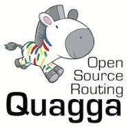

# [Quagga](https://www.nongnu.org/quagga/)

[TOC]

## Res

## Intro

[Quagga](http://www.quagga.net/) is a routing software suite, providing implementations of OSPFv2, OSPFv3, RIP v1 and v2, RIPng and BGP-4 for Unix platforms, particularly FreeBSD, Linux, Solaris and NetBSD. Quagga is a fork of [GNU Zebra](http://www.zebra.org/) which was developed by Kunihiro Ishiguro. 

The Quagga architecture consists of a core daemon, *zebra*, which acts as an abstraction layer to the underlying Unix kernel and presents the Zserv API over a Unix or TCP stream to Quagga clients. It is these Zserv clients which typically implement a routing protocol and communicate routing updates to the zebra daemon. Existing Zserv implementations are: 

| IPv4  | IPv6                                                         | Notes                                     |
| ----- | ------------------------------------------------------------ | ----------------------------------------- |
| zebra | - kernel interface, static routes, zserv server              |                                           |
| ripd  | ripngd                                                       | - RIPv1/RIPv2 for IPv4 and RIPng for IPv6 |
| ospfd | ospf6d                                                       | - OSPFv2 and OSPFv3                       |
| bgpd  | - BGPv4+ (including address family support for multicast and IPv6) |                                           |
| isisd | - IS-IS with support for IPv4 and IPv6                       |                                           |

Quagga daemons are each configurable via a network-accessible CLI (called a 'vty'). The CLI follows a style similar to that of other routing software. There is an additional tool included with Quagga called 'vtysh', which acts as a single cohesive front-end to all the daemons, allowing one to administer nearly all aspects of the various Quagga daemons in one place.

Please see the [Documentation](https://www.nongnu.org/quagga/docs.html) for further detailed information. Community support is also available via the [mailling lists](https://www.nongnu.org/quagga/lists.html).

## Similar projects
Other community-driven, free software / open-source routing projects include:
- The [BIRD Internet Routing Daemon Project](http://bird.network.cz/), supported by [cz.nic](https://www.nic.cz/).
- The [OpenBGPd and OpenOSPFd](http://www.openbgpd.org/) project, primarily developed for [OpenBSD](https://www.openbsd.org/).

## Reading List
[想玩路由器吗？使用 Quagga 将你的 CentOS 变成 OSPF 路由器]: https://linux.cn/article-4232-2.html

[Dynamic Linux Routing with Quagga]: https://www.linux.com/topic/networking/dynamic-linux-routing-quagga/

