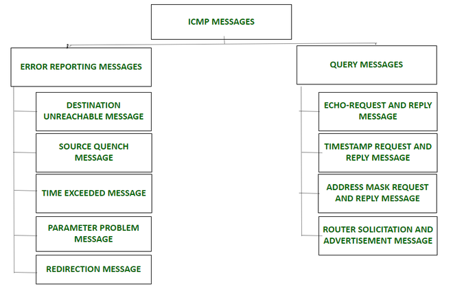

# ICMP (IPv4)

[TOC]

## Res
🔗 【深入浅出计算机网络 - 4.5 网际控制报文协议ICMP】 https://www.bilibili.com/video/BV1jW4y1q7So/?share_source=copy_web&vd_source=7740584ebdab35221363fc24d1582d9d

## Overview

Internet Control Message Protocol, [RFC 792]

## ICMPv4 Header

## ICMPv4 Messages

### Error Reporting Messages
🔗 https://www.geeksforgeeks.org/internet-control-message-protocol-icmp/

- Source Quench Message
- Parameter Problem Message
- Time Exceeded Message
- Destination Un-reachable Message
- Redirection Message

### Query Messages
- Echo-Request and Reply Message
- Timestamp Request and Reply Message
- Address Mask Request and Reply Message
- Router Solicitation and Advertisement Message

## Ref

