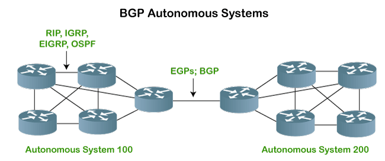

# BGP (Border Gateway Protocol)

[TOC]

## Res

## Intro

> 🔗 https://en.wikipedia.org/wiki/Border_Gateway_Protocol

**Border Gateway Protocol** (**BGP**) is a standardized [exterior gateway protocol](https://en.wikipedia.org/wiki/Exterior_gateway_protocol "Exterior gateway protocol") designed to exchange routing and reachability information among [autonomous systems](https://en.wikipedia.org/wiki/Autonomous_system_(Internet) "Autonomous system (Internet)") (AS) on the Internet. BGP is classified as a [path-vector routing protocol](https://en.wikipedia.org/wiki/Path-vector_routing_protocol "Path-vector routing protocol"), and it makes routing decisions based on paths, network policies, or rule-sets configured by a [network administrator](https://en.wikipedia.org/wiki/Network_administrator "Network administrator").

BGP used for routing within an autonomous system is called **Interior Border Gateway Protocol**, **Internal BGP** (**iBGP**). In contrast, the Internet application of the protocol is called **Exterior Border Gateway Protocol**, **External BGP** (**eBGP**).

## Reading List
[BGP网络学习总结](https://www.cnblogs.com/Anker/p/8166294.html) 

[Dale工作学习笔记](https://www.cnblogs.com/Anker/) 

[软件定义网络 -- 肖宏辉的知乎文章合集](https://www.zhihu.com/column/software-defined-network)

## Ref
