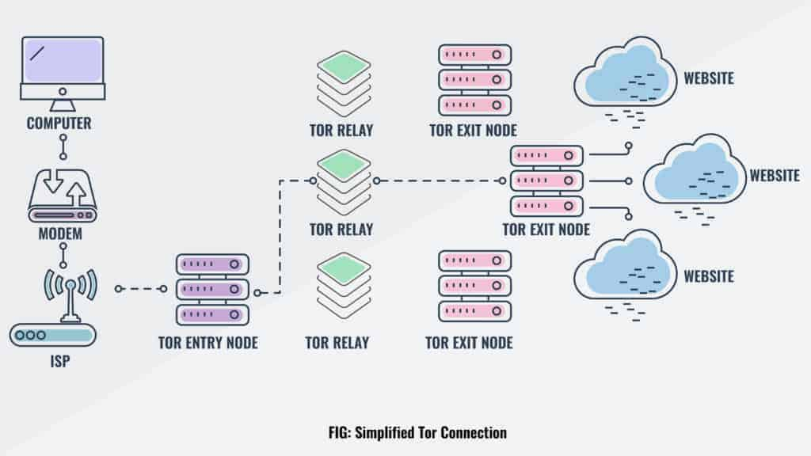

# Dark Net

## Quotes

A handful of dark net search engines that do index .onion sites include [NotEvil](https://hss3uro2hsxfogfq.onion.to/), [Ahmia](http://msydqstlz2kzerdg.onion/), [Candle](http://gjobqjj7wyczbqie.onion/), and [Torch](http://xmh57jrzrnw6insl.onion/). There are also directories like [dark.fail](https://dark.fail/).

Reddit is also a valuable resource for finding the dark net or deep website you’re looking for. Try the /r/deepweb, /r/onions, and /r/Tor subreddits.

Always exercise extreme caution when using publicly posted onion URLs. If you can’t get a personal recommendation from someone you trust, verify the URL from multiple different sources.

## DN & Tor

For many, Tor is synonymous with the [dark web](https://www.avast.com/c-dark-web) — the unindexed part of the internet that’s only accessible with certain browsers. The connection between Tor and the dark web started with the [Silk Road, the first dark web market](https://www.avast.com/c-silk-road-dark-web-market) where customers could buy drugs and other illegal goods. When in operation, the notorious online marketplace could only be accessed through Tor.

As a browser that enables anonymity to both website hosts and visitors, the appeal of Tor to dark web participants is obvious. And though the dark web is not just a haven for illicit activity, accessing the dark web via the onion browser is popular with criminals.

But Tor was not designed with criminality in mind, or intended to be the “dark web browser.” Tor is a legitimate and effective online privacy tool that’s used by a variety of users who value their online privacy and data security.

Some dark web browsers besides Tor:

- **Subgraph OS:** This open-source operating system is designed to be resistant to surveillance and other snoops. It’s been mentioned by whistleblower Edward Snowden as showing potential.
- **Firefox:** Though this popular and accessible browser can access the dark web, it lacks safety features.
- **Waterfox:** Based on Firefox, the Waterfox browser is fast and features tracking protection to safeguard your privacy.
- **I2P - Invisible Internet Project:** Similar to Tor, this is a fully-encrypted, private network layer.

## Other Support

- [How to Access the Dark Web Safely: Step-by-Step Guide](https://www.comparitech.com/blog/vpn-privacy/access-dark-web-safely-vpn/)
- [中国最佳VPN排行(含所有設備) – 2022年11月实测 – 墻知乎](https://wallzhihu.com/ranks-vpn/)
- [10 Best Dark Web Monitoring Tools for Network Admins](https://www.comparitech.com/net-admin/best-dark-web-monitoring-tools/)
  - [**CrowdStrike Falcon Intelligence Recon EDITOR’S CHOICE**](https://www.comparitech.com/go/crowdstrike-dark-web-monitoring-learn-more-best-dark-web-monitoring-tools/l/list_dd_d__post__240532/u/29a9-9b84-bb14-808b-da9dc2+x+240532++d/) This intelligence feed scans the Dark Web for mentions of your brand and corporate identifiers, such as email addresses on your domain. Available in two plan levels and delivered from a cloud platform. Start a [15-day free trial](https://www.comparitech.com/go/crowdstrike-dark-web-monitoring-free-trial-best-dark-web-monitoring-tools/l/lcta_dd_d__post__240532/u/ec7b-8b6e-9307-a6cd-020eaa+x+240532++d/).
  - **Echosec Beacon** Checks the Dark Web for compromised account credentials, and stolen personal information and financial data.
  - **DarkOwl Vision** A threat intelligence service that includes a Dark web scanner as an information source.
  - **SpyCloud ATO Prevention** Account takeover prevention with a threat intelligence database derived from Dark Web scans.
  - **Digital Shadows SearchLight** A corporate brand protection service.
  - **DigitalStakeout Scout** A data loss prevention system and threat protection system that includes a Dark Web scanner.
  - **Alert Logic Dark Web Scanner** An account takeover prevention system based around a Dark Web scanner.
  - **ACID Cyber Intelligence** A threat intelligence service that scans all known sources of illegal data.
  - **WhatsUp Gold** A network traffic monitor that can identify traffic from the Tor network.
  - **Dashlane Business** A comprehensive password protection system that includes a Dark Web scanner.
  - **Have I Been Pwned?** A free email address-related Dark Web scan.