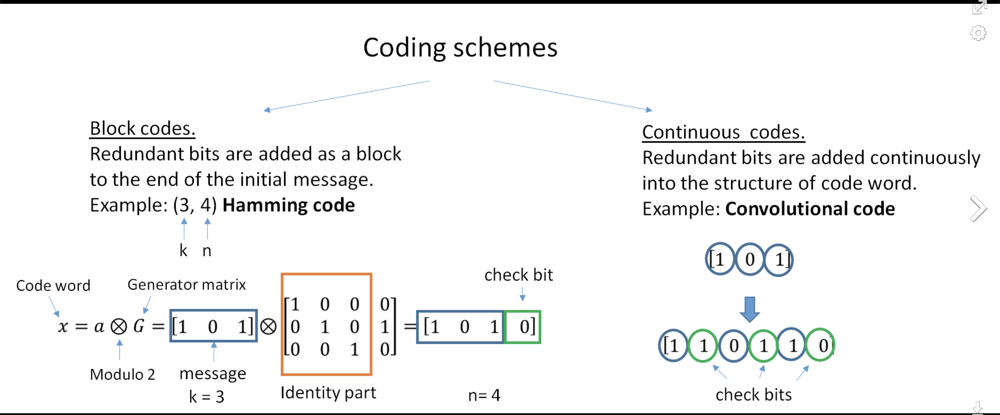

# Error Conrection

[TOC]

## Intro

> :link: https://en.wikipedia.org/wiki/Error_correction_code

In [computing](https://en.wikipedia.org/wiki/Computing), [telecommunication](https://en.wikipedia.org/wiki/Telecommunication), [information theory](https://en.wikipedia.org/wiki/Information_theory), and [coding theory](https://en.wikipedia.org/wiki/Coding_theory), an **error correction code**, sometimes **error correcting code**, (**ECC**) is used for [controlling errors](https://en.wikipedia.org/wiki/Error_control) in data over unreliable or noisy [communication channels](https://en.wikipedia.org/wiki/Communication_channel).[[1\]](https://en.wikipedia.org/wiki/Error_correction_code#cite_note-1)[[2\]](https://en.wikipedia.org/wiki/Error_correction_code#cite_note-Hamming-2) <u>The central idea is the sender encodes the message with [redundant information](https://en.wikipedia.org/wiki/Redundancy_(information_theory)) in the form of an ECC.</u> The redundancy allows the receiver to detect a limited number of errors that may occur anywhere in the message, and often to correct these errors without retransmission. The American mathematician [Richard Hamming](https://en.wikipedia.org/wiki/Richard_Hamming) pioneered this field in the 1940s and invented the first error-correcting code in 1950: the [Hamming (7,4) code](https://en.wikipedia.org/wiki/Hamming_(7,4)_code).[[2\]](https://en.wikipedia.org/wiki/Error_correction_code#cite_note-Hamming-2)

ECC contrasts with [error detection](https://en.wikipedia.org/wiki/Error_detection) in that errors that are encountered can be corrected, not simply detected. The advantage is that a system using ECC does not require a [reverse channel](https://en.wikipedia.org/wiki/Reverse_channel) to request retransmission of data when an error occurs. The downside is that there is a fixed overhead that is added to the message, thereby requiring a higher forward-channel bandwidth. ECC is therefore applied in situations where retransmissions are costly or impossible, such as one-way communication links and when transmitting to multiple receivers in [multicast](https://en.wikipedia.org/wiki/Multicast). Long-latency connections also benefit; in the case of a satellite orbiting around [Uranus](https://en.wikipedia.org/wiki/Uranus), retransmission due to errors can create a delay of five hours. ECC information is usually added to [mass storage](https://en.wikipedia.org/wiki/Mass_storage) devices to enable recovery of corrupted data, is widely used in [modems](https://en.wikipedia.org/wiki/Modem), and is used on systems where the primary memory is [ECC memory](https://en.wikipedia.org/wiki/ECC_memory).

## Types of ECC

The two main categories of ECC codes are [block codes](https://en.wikipedia.org/wiki/Block_code) and [convolutional codes](https://en.wikipedia.org/wiki/Convolutional_code).

- Block codes work on fixed-size blocks (packets) of bits or symbols of predetermined size. Practical block codes can generally be hard-decoded in [polynomial time](https://en.wikipedia.org/wiki/Polynomial_time) to their block length.
- Convolutional codes work on bit or symbol streams of arbitrary length. They are most often soft decoded with the [Viterbi algorithm](https://en.wikipedia.org/wiki/Viterbi_algorithm), though other algorithms are sometimes used. Viterbi decoding allows asymptotically optimal decoding efficiency with increasing constraint length of the convolutional code, but at the expense of [exponentially](https://en.wikipedia.org/wiki/Exponential_time) increasing complexity. A convolutional code that is terminated is also a 'block code' in that it encodes a block of input data, but the block size of a convolutional code is generally arbitrary, while block codes have a fixed size dictated by their algebraic characteristics. Types of termination for convolutional codes include "tail-biting" and "bit-flushing".

There are many types of block codes; [Reed–Solomon coding](https://en.wikipedia.org/wiki/Reed–Solomon_error_correction) is noteworthy for its widespread use in [compact discs](https://en.wikipedia.org/wiki/Compact_disc), [DVDs](https://en.wikipedia.org/wiki/DVD), and [hard disk drives](https://en.wikipedia.org/wiki/Hard_disk_drive#Error_rates_and_handling). Other examples of classical block codes include [Golay](https://en.wikipedia.org/wiki/Golay_code_(disambiguation)), [BCH](https://en.wikipedia.org/wiki/BCH_code), [Multidimensional parity](https://en.wikipedia.org/wiki/Multidimensional_parity-check_code), and [Hamming codes](https://en.wikipedia.org/wiki/Hamming_code).

