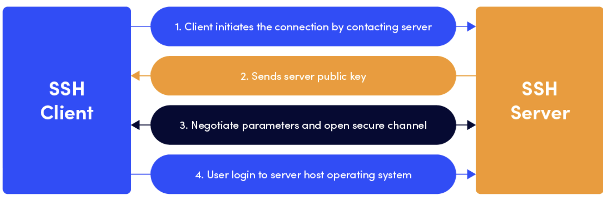

# SSH Protocol

[TOC]

This page is about the SSH protocol. For the company behind it, see [SSH Communications Security](https://www.ssh.com/). For using the Linux ssh command, see [ssh command usage](https://www.ssh.com/ssh/command). For SSH clients, servers, and technical information, see [SSH (Secure Shell) home page](https://www.ssh.com/ssh/).

The protocol is used in corporate networks for:

- providing secure access for users and automated processes
- interactive and automated file transfers
- issuing remote commands
- managing network infrastructure and other mission-critical system components.

## How does the SSH protocol work

The protocol works in the client-server model, which means that the connection is established by the SSH client connecting to the SSH server. The SSH client drives the connection setup process and uses public key cryptography to verify the identity of the SSH server. After the setup phase the SSH protocol uses strong symmetric encryption and hashing algorithms to ensure the privacy and integrity of the data that is exchanged between the client and server.

The figure below presents a simplified setup flow of a secure shell connection.

## IETF SSH standard and detailed technical documentation

### The core protocol

When the SSH protocol became popular, Tatu Ylonen took it to the [IETF](http://ietf.org/) for standardization. It is now an internet standard that is described in the following documents:

[RFC 4251 - The Secure Shell (SSH) Protocol Architecture](https://www.ssh.com/hubfs/SSH Academy/RFC_4251_-_The_Secure_Shell__SSH__Protocol_Architecture)

[RFC 4253 - The Secure Shell (SSH) Transport Layer Protocol](https://www.ssh.com/hubfs/SSH Academy/RFC_4253_-_The_Secure_Shell__SSH__Transport_Layer_Protocol)

[RFC 4252 - The Secure Shell (SSH) Authentication Protocol](https://www.ssh.com/hubfs/SSH Academy/RFC_4252_-_The_Secure_Shell__SSH__Authentication_Protocol)

[RFC 4254 - The Secure Shell (SSH) Connection Protocol](https://www.ssh.com/hubfs/SSH Academy/RFC_4254_-_The_Secure_Shell__SSH__Connection_Protocol)

### SFTP file transfer protocol

The [SFTP (SSH File Transfer Protocol)](https://www.ssh.com/ssh/sftp/) is probably the most widely used secure file transfer protocol today. It runs over SSH, and is currently documented in

[draft-ietf-secsh-filexfer-02](https://www.ssh.com/hubfs/SSH Academy/draft-ietf-secsh-filexfer-02)

### Public key file format

The public key file format is not a formal standard (it is an informational document), but many implementations support this format.

[RFC 4716 - The Secure Shell (SSH) Public Key File Format](https://www.ssh.com/hubfs/SSH Academy/RFC_4716_-_The_Secure_Shell__SSH__Public_Key_File_Format)