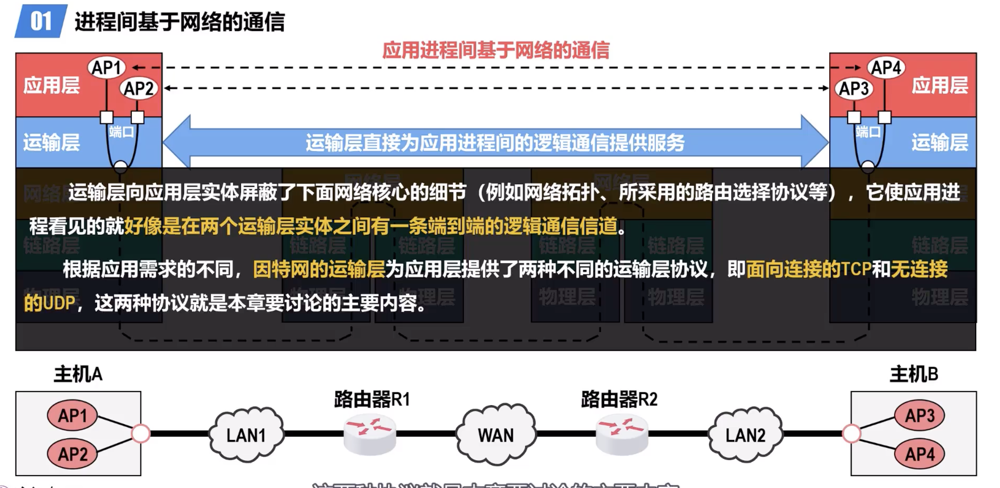
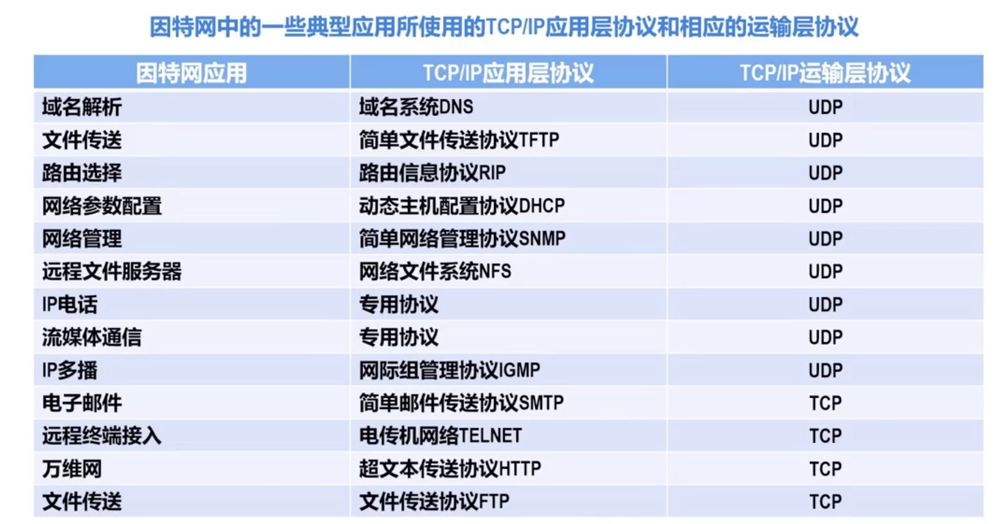
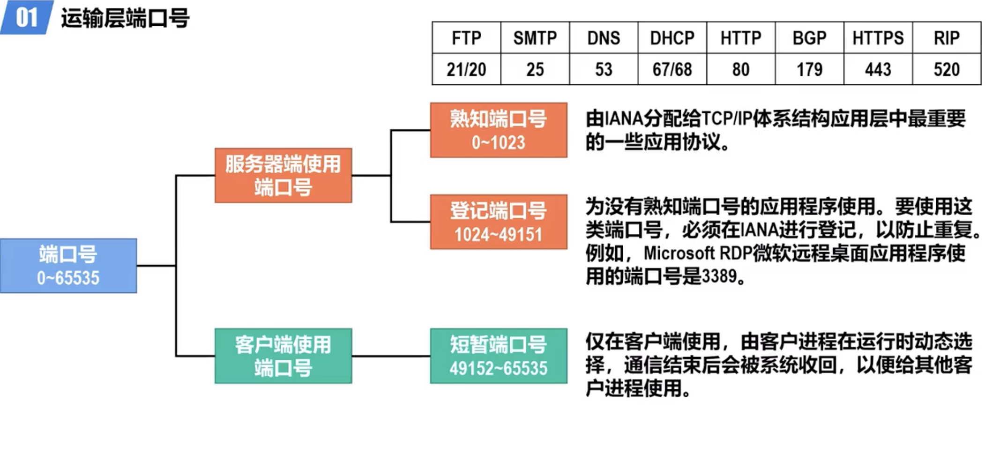
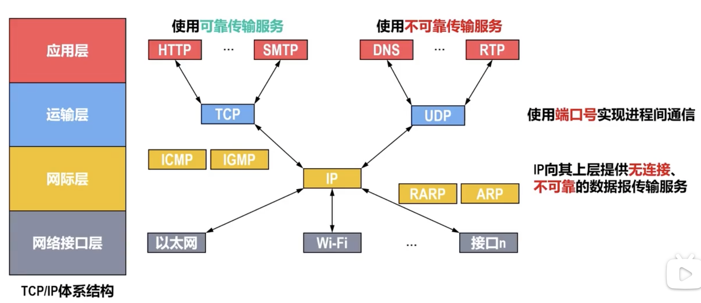
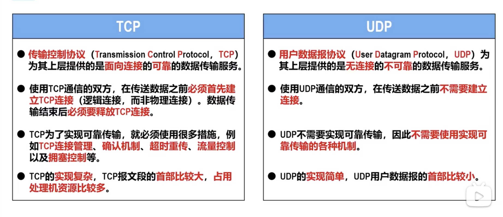
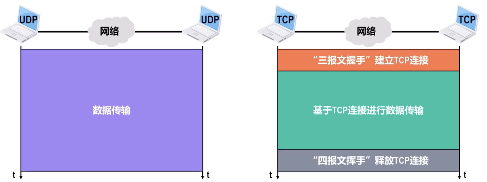
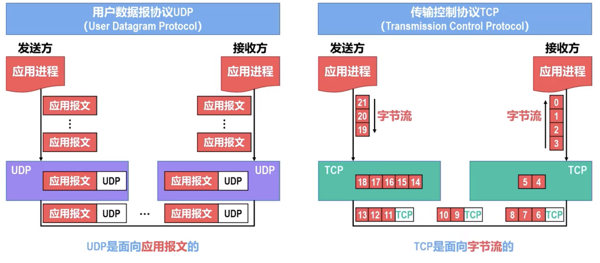
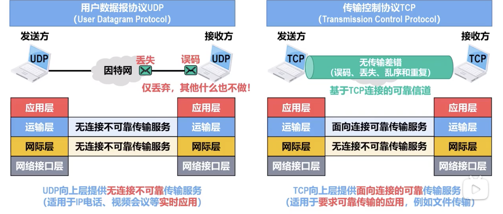
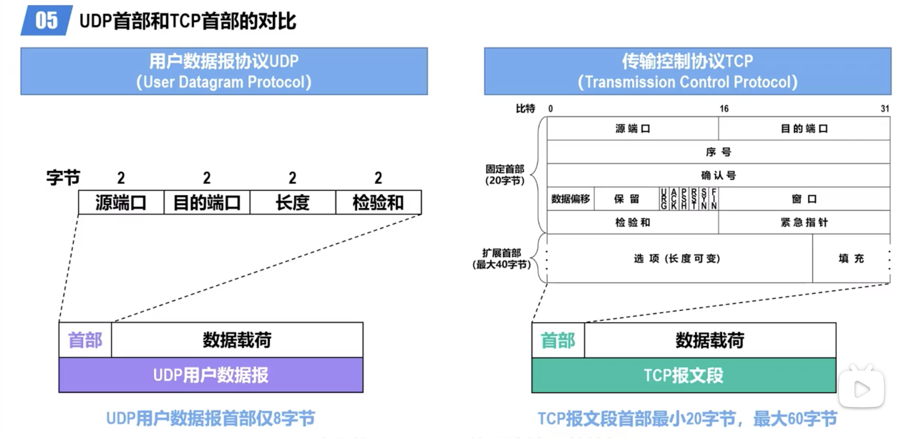

# Transport Layer

[TOC]

## Overview

:link:【深入浅出计算机网络 - 5.1.1 进程间基于网络的通信】 https://www.bilibili.com/video/BV1bD4y117Y8/?share_source=copy_web&vd_source=7740584ebdab35221363fc24d1582d9d

Transport Layer takes in charge with **port-to-port communication** between **two process**. IP routing is beyond Transport Layer (Network Layer). 

Data processed in transport layer is referred as **Segment**.

There are two most important transport layer protocols: TCP and UDP.

Communication between app layer and trans layer is implemented by Socket. The machenism of Socket is about multiplexing and demultiplexing.

## Port Number

## Multiplexing & Demultiplexing

:link: 【深入浅出计算机网络 - 5.1.3 运输层端口号、复用与分用的概念】 https://www.bilibili.com/video/BV1N841147b6/?share_source=copy_web&vd_source=7740584ebdab35221363fc24d1582d9d

In C/S model, server side has to deal with multiple influx of segments from different clients simotaniously --- this handling uses demultiplexing; the client side has to deal with multiple exflux of segment to different servers simotaniously --- this handling uses multiplexing. 

- Multiplexing, demultiplexing: based on segment, datagram header field values

- **UDP:** demultiplexing using destination port number (only)

- **TCP:** demultiplexing using 4-tuple: source and destination IP addresses, and port numbers

- Multiplexing/demultiplexing happen at *all* layers

## UDP 🆚 TCP

:link:【深入浅出计算机网络 - 5.1.2 TCP/IP体系结构运输层中的两个重要协议】 https://www.bilibili.com/video/BV1Zd4y1o7Sv/?share_source=copy_web&vd_source=7740584ebdab35221363fc24d1582d9d

