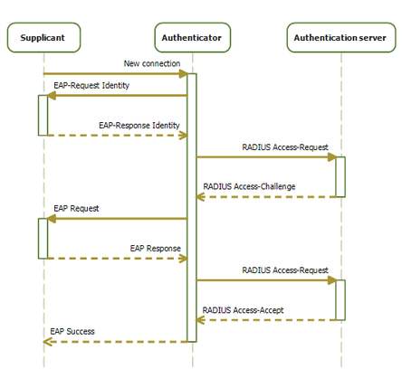

# IEEE 802.1x

[TOC]

## Intro

> :link: https://en.wikipedia.org/wiki/IEEE_802.1X

‼️ **IEEE 802.1X** is an [IEEE Standard](https://en.wikipedia.org/wiki/IEEE_Standard) for **port-based** [Network Access Control](https://en.wikipedia.org/wiki/Network_Access_Control) (PNAC). It is part of the [IEEE 802.1](https://en.wikipedia.org/wiki/IEEE_802.1) group of networking protocols. It provides an [authentication](https://en.wikipedia.org/wiki/Authentication) mechanism to devices wishing to attach to a [LAN](https://en.wikipedia.org/wiki/Local_area_network) or [WLAN](https://en.wikipedia.org/wiki/Wireless_LAN).

‼️ IEEE 802.1x defines EAPol as authentication machanism. Before authenticated, 802.1x denied any traffic except EAPoL package; After successfully authenticated, 802.1x allowed any traffic from that authenticated user. 

<small>EAP data is first encapsulated in EAPOL frames between the Supplicant and Authenticator, then re-encapsulated between the Authenticator and the Authentication server using RADIUS or [Diameter](https://en.wikipedia.org/wiki/Diameter_(protocol)).</small>

<small>Sequence diagram of the 802.1X progression</small>

## 802.1x Prerequisites

## 802.1x Trigger

## 802.1x Authentication Principle

## Techniques paired with 802.1x

### VLAN下发

### Guest VLAN

#### PGV（Port-based Guest VLAN）

#### MGV（MAC-based Guest VLAN）

### Auth-Fail VLAN

#### PAFV（Port-based Auth-Fail VLAN）

#### MAFV（MAC-based Auth-Fail VLAN）

### ACL

### Port-specific Mandatory Domain

指定端口的强制认证域

## Endpoint Admission Defense, EAD

802.1X支持EAD快速部署配置

[Endpoint Admission Defense -- H3C](https://www.h3c.com/en/Products_and_Solutions/InterConnect/Campus_Network/Solutions/202210/1701424_748048_0.htm)

[HP IMC Endpoint Admission Defense Software - Overview](https://support.hpe.com/hpesc/public/docDisplay?docId=emr_na-c04459926)

## Ref

[802.1x（dot1x）协议详解 - 大西洋里的鱼的文章 - 知乎]: https://zhuanlan.zhihu.com/p/151693854
[802.1X认证原理]: http://www.tlcement.com/366410.html
[802.1X(dot1x)技术简介]: https://cshihong.github.io/2019/05/30/802.1X认证原理/
[5.1802.1X原理]: https://www.bilibili.com/video/BV1CP411V7Bf/?share_source=copy_web&vd_source=7740584ebdab35221363fc24d1582d9d
[20 - 802.1x & EAP]: https://www.bilibili.com/video/BV1nK411V7Dw/?share_source=copy_web&vd_source=7740584ebdab35221363fc24d1582d9d
[Wi-Fi 安全协议 - 802.1X]: https://blog.csdn.net/xiaozy115/article/details/102930808

