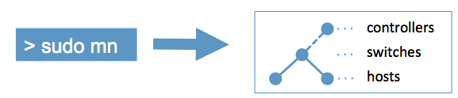

# [Mininet](http://mininet.org)

[TOC]

## Resources

📂 [Introduction to Mininet](https://github.com/mininet/mininet/wiki/Introduction-to-Mininet#creating)

[Github/Mininet](https://github.com/mininet/mininet)

[util](https://github.com/mininet/mininet/tree/master/util)

[examples](https://github.com/mininet/mininet/tree/master/examples)  -- mininet python api examples ✨

[Mininet Python API Reference Manual](http://mininet.org/api/annotated.html)

In addition to the API documentation (`make doc`), much useful information, including a Mininet walkthrough and an introduction to the Python API, is available on the [Mininet Web Site](http://mininet.org/). There is also a wiki which you are encouraged to read and to contribute to, particularly the Frequently Asked Questions (FAQ) at [http://faq.mininet.org](http://faq.mininet.org/).


## Features

Mininet includes:

- A command-line launcher (`mn`) to instantiate networks.

- A handy Python API for creating networks of varying sizes and topologies.

- Examples (in the `examples/` directory) to help you get started.

- Full API documentation via Python `help()` docstrings, as well as the ability to generate PDF/HTML documentation with `make doc`.

- Parametrized topologies (`Topo` subclasses) using the Mininet object. For example, a tree network may be created with the command:

  `mn --topo tree,depth=2,fanout=3`

- A command-line interface (`CLI` class) which provides useful diagnostic commands (like `iperf` and `ping`), as well as the ability to run a command to a node. For example,

  `mininet> h11 ifconfig -a`

  tells host h11 to run the command `ifconfig -a`

- A "cleanup" command to get rid of junk (interfaces, processes, files in /tmp, etc.) which might be left around by Mininet or Linux. Try this if things stop working!

  `mn -c`


## Intro

Mininet creates a **realistic virtual network**, running **real kernel, switch and application code**, on a single machine (VM, cloud or native), in seconds, with a single command:



Because you can easily [interact with](http://mininet.org/sample-workflow/#interacting-with-a-network) your network using the Mininet [CLI](http://mininet.org/walkthrough/#interact-with-hosts-and-switches) (and [API](http://mininet.org/api/annotated.html)), [customize](http://mininet.org/sample-workflow/#customizing-a-network) it, [share](http://mininet.org/sample-workflow/#sharing-a-network) it with others, or [deploy](http://mininet.org/sample-workflow#running-on-hardware) it on real hardware, Mininet is useful for [development](http://mininet.org/sample-workflow), [teaching](http://mininet.org/teaching), and [research](http://reproducingnetworkresearch.wordpress.com/).

Mininet is also a great way to develop, share, and experiment with Software-Defined Networking (SDN) systems using [OpenFlow](https://opennetworking.org/software-defined-standards/specifications/) and [P4](http://p4.org/).

Mininet is actively developed and supported, and is released under a permissive BSD Open Source [license](https://github.com/mininet/mininet/blob/master/LICENSE). We encourage you to [contribute](http://mininet.org/contribute) code, bug reports/fixes, documentation, and anything else that can improve the system!

### How does it work?

Mininet creates virtual networks using process-based virtualization and network namespaces - features that are available in recent Linux kernels. In Mininet, hosts are emulated as `bash`processes running in a network namespace, so any code that would normally run on a Linux server (like a web server or client program) should run just fine within a Mininet "Host". The Mininet "Host" will have its own private network interface and can only see its own processes. Switches in Mininet are software-based switches like Open vSwitch or the OpenFlow reference switch. Links are virtual ethernet pairs, which live in the Linux kernel and connect our emulated switches to emulated hosts (processes).


### Get-started

#### [Setup](http://mininet.org/vm-setup-notes/)

1. Download the Mininet VM from https://github.com/mininet/mininet/wiki/Mininet-VM-Images .

2. Set up `qemu` vm instance:(on mac using `hvf` accellerator)

   ```shell
   qemu-system-x86_64 -m 2048 mininet-vm-disk1.vmdk -machine accel=hvf -net nic,model=virtio -net user,net=192.168.101.0/24,hostfwd=tcp::8022-:22
   ```

3. Log in to vm via ssh/passwd: (default: mininet/mininet)

   ```shell
   # user + psword
   mininet-vm login: mininet
   Password: mininet
   
   # ssh
   # If you’re running the VM under QEMU/KVM with -net user and the 
   # hostfwd option as recommended above, the VM IP address is 
   # irrelevant. Instead you tell SSH to connect to port 8022 on the host:
   ssh -Y -p 8022 mininet@localhost
   ```

4. Set up SSH auto-login (👩🏼‍🍳 optional). 

   1. Check [Mininet vm setup notes](http://mininet.org/vm-setup-notes/) for details. 


#### [Automating Controller Startup](http://mininet.org/blog/2013/06/03/automating-controller-startup/)


## Ref

[【Mininet从入门到精通】第1讲 Mininet环境搭建]: https://www.jianshu.com/p/4754c5fb854a
[Mininet教程(三)：Mininet命令操作]: https://blog.csdn.net/qq_29229567/article/details/105230800
