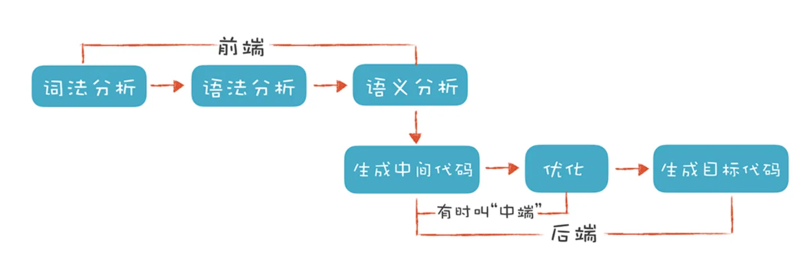
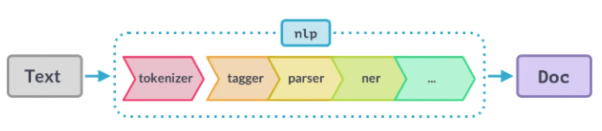
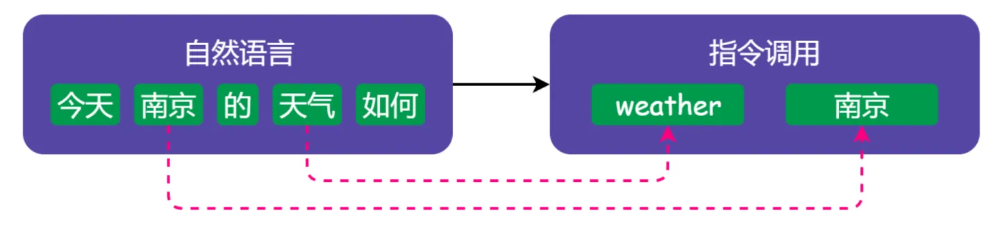

# Compiler Construction

[TOC]

## Res
### References
↗ [CC (Compiler Compiler)](../🐛%20Programming%20Tools%20Chain/CC%20(Compiler%20Compiler)/CC%20(Compiler%20Compiler).md)

### Getting Start
如何学习编译原理？ - 腾讯技术工程的回答 - 知乎 https://www.zhihu.com/question/21515496/answer/1689704074

>  [编译原理 -- 笔记](https://github.com/wangfupeng1988/read-notes/blob/master/video/编译原理.md)
>  
> 《编译原理》由 中科大 华保健老师 讲。视频地址 https://mooc.study.163.com/course/1000002001 （B 站也有相关资源）
>
> 看完了 [计算机组成](https://github.com/wangfupeng1988/read-notes/blob/master/video/计算机组成.md) 和 [汇编语言](https://github.com/wangfupeng1988/read-notes/blob/master/video/汇编语言.md) 就来看编译原理，接下来看会再去看操作系统，这四部分算是计算机学科的基础知识体系。其实一开始看汇编语言找到的是 [哈工大的一门课](https://www.bilibili.com/video/av17649289?from=search&seid=3383969367865956125) ，从一开始就看不懂，但是也不能轻易放弃啊，就坚持看了 1/3 左右。看弹幕上评论，感觉这门课是跟考研有关的，怪不得全都是一些理论知识，因此推荐考研的同学可以去尝试看一下。但是一直看不懂，那就是方法有问题，于是就切换频道，找到了中科大华保健老师的这门课。刚看了大约一个小时，就感觉老师讲的太好了，真的是深入浅出，想学编译原理的同学一定要看这门课。

### Courses
👍  [Stanford - CS 143 - Compilers Principle](../../🏠 Assets/Stanford/CS143:Compilers/Intro.md) 

【第一课，编译原理介绍】 https://www.bilibili.com/video/BV1kq4y147DF?share_source=copy_web&vd_source=7740584ebdab35221363fc24d1582d9d

## 🌕 Overview

<small>The process of compilation</small>

<small>The process of NLP</small>

## Ref

