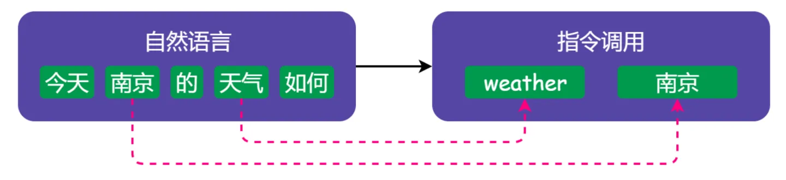

# Program Language Translation

[TOC]

## Res
### References
↗ [CC (Compiler Compiler)](../../🛠️%20Programming%20Tools%20Chain/CC%20(Compiler%20Compiler)/CC%20(Compiler%20Compiler).md)

### Getting Start
如何学习编译原理？ - 腾讯技术工程的回答 - 知乎 https://www.zhihu.com/question/21515496/answer/1689704074

>  [编译原理 -- 笔记](https://github.com/wangfupeng1988/read-notes/blob/master/video/编译原理.md)
>  
> 《编译原理》由 中科大 华保健老师 讲。视频地址 https://mooc.study.163.com/course/1000002001 （B 站也有相关资源）
>
> 看完了 [计算机组成](https://github.com/wangfupeng1988/read-notes/blob/master/video/计算机组成.md) 和 [汇编语言](https://github.com/wangfupeng1988/read-notes/blob/master/video/汇编语言.md) 就来看编译原理，接下来看会再去看操作系统，这四部分算是计算机学科的基础知识体系。其实一开始看汇编语言找到的是 [哈工大的一门课](https://www.bilibili.com/video/av17649289?from=search&seid=3383969367865956125) ，从一开始就看不懂，但是也不能轻易放弃啊，就坚持看了 1/3 左右。看弹幕上评论，感觉这门课是跟考研有关的，怪不得全都是一些理论知识，因此推荐考研的同学可以去尝试看一下。但是一直看不懂，那就是方法有问题，于是就切换频道，找到了中科大华保健老师的这门课。刚看了大约一个小时，就感觉老师讲的太好了，真的是深入浅出，想学编译原理的同学一定要看这门课。

### Courses
👍  [Stanford - CS 143 - Compilers Principle](../../🏠 Assets/Stanford/CS143:Compilers/Intro.md) 

【第一课，编译原理介绍】 https://www.bilibili.com/video/BV1kq4y147DF?share_source=copy_web&vd_source=7740584ebdab35221363fc24d1582d9d

## Overview

<small>The process of compilation</small>

<small>The process of NLP</small>

## Compilation Process

<small>A examplary illustration of the compilation process</small>

Although the machine we presented is quite different from a real machine, the assembly process we described is not. Virtually every assembler in use today passes twice through the source code. The first pass assembles as much code as it can, while building a symbol table; the second pass completes the binary instructions using address values retrieved from the symbol table built during the first pass.

The final output of most assemblers is **a stream of relocatable binary instructions**. Binary code is relocatable when the addresses of the operands are relative to the location where the operating system has loaded the program in memory, and the operating system is free to load this code wherever it wants. 

### 1️⃣ Preprocess

### 2️⃣ Compiling

### 3️⃣ Assembling

### 4️⃣Address Binding
#### Compile-time Binding

#### Loadtime Binding

#### Runtime Binding

### 5️⃣ Linking
#### Dynamic Linking
##### Loadtime Dynamic Linking

##### Runtime Dynamic Linking

#### Static Linking

## Compilation Strategies
- [Ahead-of-time](https://en.wikipedia.org/wiki/Ahead-of-time_compilation "Ahead-of-time compilation") (AOT)
- [Just-in-time](https://en.wikipedia.org/wiki/Just-in-time_compilation "Just-in-time compilation") (JIT)
- [Tracing just-in-time](https://en.wikipedia.org/wiki/Tracing_just-in-time_compilation "Tracing just-in-time compilation")
- [Compile and go system](https://en.wikipedia.org/wiki/Compile_and_go_system "Compile and go system")
- [Precompilation](https://en.wikipedia.org/wiki/Precompilation "Precompilation")
- [Transcompilation](https://en.wikipedia.org/wiki/Source-to-source_compiler "Source-to-source compiler")
- [Recompilation](https://en.wikipedia.org/wiki/Dynamic_recompilation "Dynamic recompilation")

## Ref

