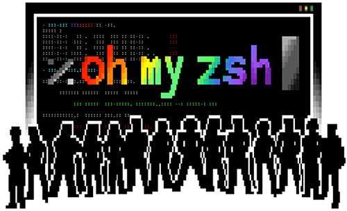

# ZSH

[TOC]

## Intro

:link: Index to `zsh` info: https://www.zsh.org

:link: `zsh` web page of U.S.A (one of listed above): https://zsh.sourceforge.io

**Zsh** is a shell designed for interactive use, although it is also a powerful scripting language. Many of the useful features of *bash*, *ksh*, and *tcsh* were incorporated into zsh; many original features were added.

1️⃣The [introductory document](https://zsh.sourceforge.io/Intro/intro_toc.html) details some of the unique features of zsh. It assumes basic knowledge of the standard UNIX shells; the intent is to show a reader already familiar with one of the other major shells what makes zsh more useful or more powerful. This document is not at all comprehensive;2️⃣ [read the manual](https://zsh.sourceforge.io/Doc/) entry for a description of the shell that is complete, concise and up-to-date, although somewhat overwhelming and devoid of examples. 3️⃣ Alternatively, the [user guide](https://zsh.sourceforge.io/Guide/zshguide.html) offers wordy explanations of many of the shell's features. If you want to read something that has been polished by a professional editor you can [buy the book](https://www.amazon.com/exec/obidos/tg/detail/-/1590593766/).

| Information                                                  | Documentation                                                | Support                                                      |      |
| ------------------------------------------------------------ | ------------------------------------------------------------ | ------------------------------------------------------------ | ---- |
| [News](https://zsh.sourceforge.io/News/) 2022-05-14          | [Manual](https://zsh.sourceforge.io/Doc/)                    | [Frequently Asked Questions (FAQ)](https://zsh.sourceforge.io/FAQ/) |      |
| [About these pages](https://zsh.sourceforge.io/about.html)   | [User-friendly user guide](https://zsh.sourceforge.io/Guide/) | [Mailing lists & Archives](https://zsh.sourceforge.io/Arc/mlist.html) |      |
| [Release Notes](https://zsh.sourceforge.io/releases.html)[Useful links](https://zsh.sourceforge.io/links.html) | [Reference card](https://zsh.sourceforge.io/Refcard/)        | [IRC](https://zsh.sourceforge.io/Arc/irc.html)               |      |
|                                                              |                                                              | [Scripts & contributions](https://zsh.sourceforge.io/Contrib/) |      |

## 🌐 Overview

📖 Docs:

+ [zsh Documentation](https://zsh.sourceforge.io/Doc/)
+ [A User's Guide to the Z-Shell](https://zsh.sourceforge.io/Guide/zshguide.html)

👨‍🏫  Tutorial:

+ [linux 中国](https://docs.microsoft.com/en-us/windows-server/administration/windows-commands/ping)

## 😻 oh-my-zsh

  [oh-my-zsh](Shell Helper/oh-my-zsh.md) is a feature rich zsh framework.

> Oh My Zsh is an open source, community-driven framework for managing your [zsh](https://www.zsh.org/) configuration.
>
> Sounds boring. Let's try again.
>
> **Oh My Zsh will not make you a 10x developer...but you may feel like one.**

Once installed, your terminal shell will become the talk of the town *or your money back!* With each keystroke in your command prompt, you'll take advantage of the hundreds of powerful plugins and beautiful themes. Strangers will come up to you in cafés and ask you, *"that is amazing! are you some sort of genius?"*

Finally, you'll begin to get the sort of attention that you have always felt you deserved. ...or maybe you'll use the time that you're saving to start flossing more often. 😬

To learn more, visit [ohmyz.sh](https://ohmyz.sh/), follow [@ohmyzsh](https://twitter.com/ohmyzsh) on Twitter, and join us on [Discord](https://discord.gg/ohmyzsh).

## 🔗Reading List

1. [oh my zsh 简单插件开发之终端启动欢迎界面](https://blog.isuoge.com/a/oh-my-zsh-jian-dan-cha-jian-kai-fa-zhi-zhong-duan-.html)
2. [Best character image generator (ASCII Art text)](https://www.reddit.com/r/rpg/comments/nzmv4c/best_character_image_generator/)
3. [on-my-zsh 完全学习手册](https://blog.csdn.net/JENREY/article/details/118600067)
4. 👍 [Top popular Zsh plugins on GitHub (2021)](https://safjan.com/top-popular-zsh-plugins-on-github-2021/)

## Refs：

[网络测速](https://juejin.cn/post/6844904152108105742)
[zsh 变量和语句](https://kennethfan.github.io/2017/09/20/zsh-变量和语句/) #unsolved 
[更改shell 为 zsh](https://blog.csdn.net/weixin_40002692/article/details/116994108)

- ` usermod -s /bin/zsh username`
- `chsh -s /bin/zsh`

