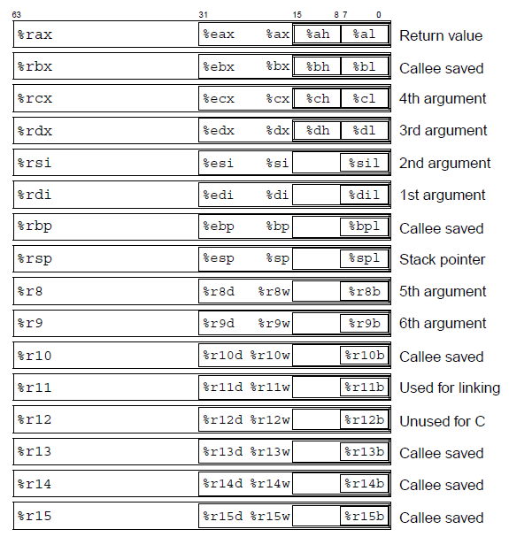

# x86 ISA Based ASM

[TOC]

## Res
📂 [x86-64 Tour of Intel Manuals](http://x86asm.net/articles/x86-64-tour-of-intel-manuals/), MazeGen, 2007-10-04
📂 [X86 64 Register and Instruction Quick Start](https://wiki.cdot.senecacollege.ca/wiki/X86_64_Register_and_Instruction_Quick_Start)
📂 [x86 Assembly](https://en.wikibooks.org/wiki/X86_Assembly#Table_of_Contents)
📂 [Processor Architecture | Microsoft Docs - Windbg](https://learn.microsoft.com/en-us/windows-hardware/drivers/debugger/processor-architecture)

## Intro

## Ref
[汇编中NEG和NOT的区别（汇编初学者简单笔记）| CSDN]: https://blog.csdn.net/Cassie_zkq/article/details/80384600

NEG：把操作数按位取反加一 （可以用来求一个数的相反数）
NOT：把操作数按位取反
很明显可以看出区别：NEG比NOT指令多了一步“加一”操作

[汇编 lea指令和mov指令 | CSDN]: https://blog.csdn.net/fengshh2301/article/details/53327120

**lea指令**
load effective address, 加载有效地址，可以将有效地址传送到指定的的寄存器。指令形式是从存储器读数据到寄存器, 效果是将存储器的有效地址写入到目的操作数, 简单说, 就是C语言中的”&”.

**mov指令**
在CPU内或CPU和存储器之间传送字或字节，它传送的信息可以从寄存器到寄存器，立即数到寄存器，立即数到存储单元，从存储单元到寄存器，从寄存器到存储单元，从寄存器或存储单元到除CS外的段寄存器(注意立即数不能直接送段寄存器)，从段寄存器到寄存器或存储单元。 
但是注意 
（1） MOV指令中的源操作数绝对不能是立即数和代码段CS寄存器； 
（2） MOV指令中绝对不允许在两个存储单元之间直接传送数据； 
（3） MOV指令中绝对不允许在两个段寄存器之间直接传送数据； 
（4） MOV指令不会影响标志位

**使用[]区别**
第二操作数加不加中括号[]的区别就是:

lea对变量没有影响是取地址,对寄存器来说加[]时取值,第二操作数不加[]非法

mov对变量来说没有影响是取值,对寄存器来说是加[]时取地址,第二操作数不加[]是取值