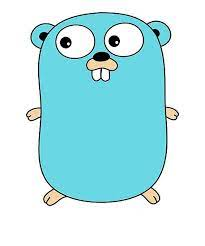

# Golang

[TOC]

## Res
🏠 https://go.dev
- [The Go Resources](https://go.dev/learn/)
- [The Go Ducomentation](https://go.dev/doc/)
- [The Go Blog](https://go.dev/blog/)

🔍 [THe Go Packages](https://pkg.go.dev)
- [The Go Packages - Standard Library](https://pkg.go.dev/std)

### Related Topics
↗ [Golang Runtimes Environments](../../🛠️%20Programming%20Tools%20Chain/🚠%20Application%20Runtimes%20&%20SDKs/Golang%20Runtimes%20Environments/Golang%20Runtimes%20Environments.md)
↗ [Go Web](../../../../Software%20Engineering/👾%20Web%20Development/🗄️%20Web%20BackEnd%20Dev/Go%20Web/Go%20Web.md)

### Learning Resources
🫂 https://studygolang.com (Go语言中文网)

🔥 👨‍💻 https://www.topgoer.cn (Go 学习路线)
🔗 https://www.topgoer.com
🔗 https://www.topgoer.cn
_欢迎大家加我微信大家一起学习 **yzy85215215** (需要视频教程也可以加我)_
很多小伙伴不知道怎么学习go，需要掌握哪些知识点，据此我找了一个学习线路图[**go学习线路图**](https://www.topgoer.com/%E5%BC%80%E6%BA%90/go%E5%AD%A6%E4%B9%A0%E7%BA%BF%E8%B7%AF%E5%9B%BE.html "go学习线路图")

👨‍💻 https://chai2010.cn/advanced-go-programming-book/index.html (Go语言高级编程(Advanced Go Programming))
本书涵盖CGO、Go汇编语言、RPC实现、Web框架实现、分布式系统等高阶主题，针对Go语言有一定经验想深入了解Go语言各种高级用法的开发人员。对于刚学习Go语言的读者，建议先从[《Go语言圣经》](https://github.com/golang-china/gopl-zh)开始系统学习Go语言的基础知识。如果希望深入学习Go语言语法树结构，可以参考[《Go语法树入门——开启自制编程语言和编译器之旅》](https://github.com/chai2010/go-ast-book)。如果希望了解Go2的最新动向，可以参考[《Go2编程指南》](https://github.com/chai2010/go2-book)。如果想从头实现一个玩具Go语言可以参考[《从头实现µGo语言》](https://github.com/chai2010/ugo-compiler-book)。

🎬 [【整整500集】清华大佬196小时讲完的Go语言教程（golang进阶实战）全程干货无废话！（golang开发/golang项目/golang实战](https://www.bilibili.com/video/BV1Pg41187AS/?p=3&share_source=copy_web&vd_source=7740584ebdab35221363fc24d1582d9d)

[Go 语言设计与实现](https://draveness.me/golang/)

[深入Go语言之旅](https://go.cyub.vip/index.html)

[Build-web-app-with-golang](https://github.com/astaxie/build-web-application-with-golang/blob/master/en/preface.md)

[👏👏👏最全空降Golang[资料补给包]](https://github.com/0voice/Introduction-to-Golang)

[8小时转职Golang工程师](https://www.yuque.com/aceld/mo95lb/dsk886)
【8小时转职Golang工程师(如果你想低成本学习Go语言)】 https://www.bilibili.com/video/BV1gf4y1r79E/?share_source=copy_web&vd_source=7740584ebdab35221363fc24d1582d9d
【Golang深入理解GPM模型】 https://www.bilibili.com/video/BV19r4y1w7Nx/?share_source=copy_web&vd_source=7740584ebdab35221363fc24d1582d9d
【zinx-Golang轻量级TCP服务器框架(适合Go语言自学-深入浅出)】 https://www.bilibili.com/video/BV1wE411d7th/?share_source=copy_web&vd_source=7740584ebdab35221363fc24d1582d9d

## Intro

> [Best Golang Use Cases: What’s Possible With Go?](https://www.agiratech.com/golang-use-cases)
> [go 语言 介绍+前景](https://www.topgoer.com)

Go is a **fast-compiled**, **garbage-collected**, **concurrent** systems programming language. It has the following advantages:

- Compiles a large project within a few seconds.
- Provides a software development model that is easy to reason about, avoiding most of the problems associated with C-style header files.
- Is a static language that does not have levels in its type system, so users do not need to spend much time dealing with relations between types. It is more like a lightweight object-oriented language.
- Performs garbage collection. It provides basic support for concurrency and communication.
- Designed for multi-core computers. ✅

Go is a compiled language. It combines the development efficiency of interpreted or dynamic languages with the security of static languages. It is going to be the language of choice for modern, multi-core computers with networking. For these purposes, there are some problems that need to inherently be resolved at the level of the language of choice, such as a richly expressive lightweight type system, a native concurrency model, and strictly regulated garbage collection. For quite some time, no packages or tools have emerged that have aimed to solve all of these problems in a pragmatic fashion; thus was born the motivation for the Go language.

## Ref
