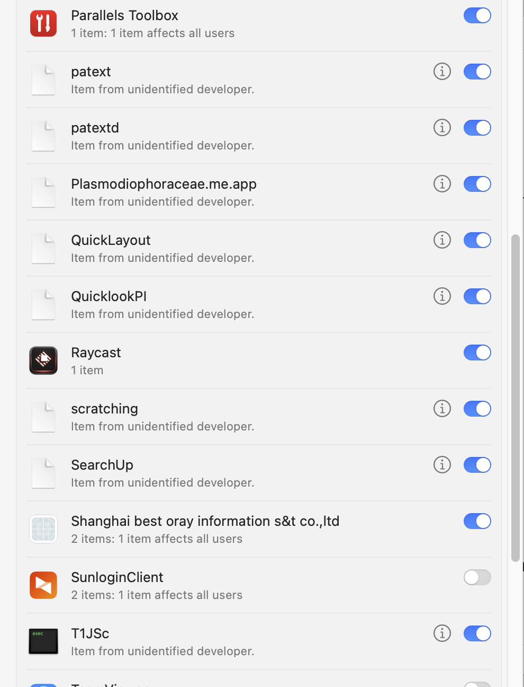

# 🛠 Troubleshooting 

[TOC]


Miscs

TODO

[sharing files](https://support.apple.com/zh-cn/guide/mac-help/mh17131/mac)

[check IPv6 on local host](https://www.cnblogs.com/cuihongyu3503319/p/7422877.html)

[compress file + .DS_Store](https://blog.csdn.net/doublebaidu/article/details/121417602)


## 👉👉 AXVisualSupportAgent taking up to much memory

This have bothered me for several times. First i found it was eating my ram a couple times, then today it seemed to cause my mac crack down for a while (i had to reboot to get things back to work) which is just putting me on the edge of my endurance. 

After a little research this process seems have something to do with the Accessibility Control on Mac, voice control and zoom function specifically. Because idk specifically the machanism of the process, i did the following according to anwsers listed at the end:

1. shut down the whole voice control system, including Siri and dictation
2. turn off zoom function (sooth image as well as it is metioned in the answser post)


:link: 

[What is AXVisualSupportAgent, and why does it eat my RAM?]:https://apple.stackexchange.com/questions/400349/what-is-axvisualsupportagent-and-why-does-it-eat-my-ram
[What is AXVisualSupportAgent?]: https://www.reddit.com/r/osx/comments/d6xshv/what_is_axvisualsupportagent/?utm_source=share&utm_medium=web2x&context=3
[How do I remove "gamecontrollerd", "AXVisualSupportAgent" and "ViewBridgeAuxiliary" processes from being a passive listener on key tap events?]: https://discussions.apple.com/thread/252046047


## 👉👉 [WindowServer taking up to much memory](https://macsecurity.net/view/393-windowserver-mac)

> :link: [降低 WindowServer 的 CPU 占用](https://blog.mynook.info/post/macos-windowserver-calm-down/)
>
> 在使用 M1 Pro / M1 Max 芯片的 2021 款 Macbook 上，使用出厂系统（macOS Monterey）有时也可轻松重现 WindowServer 高CPU占用率的问题；在少数情况下，WindowServer 甚至会长时间占满单个性能核心（在 `top` 命令或活动监视器中显示为 CPU 100%）。
>
> 其原因似乎是 Google Chrome 浏览器自带的一个更新组件 [Keystone 触发了 macOS 内部的某种 bug](https://chromeisbad.com/)。有很多其他用户也都发现了这两者间的关联。触发这个问题并不要求 Chrome 正在运行，部分用户仅仅是安装 Chrome 就可轻易重现。
>
> 目前可行的解决方案仅有**完全卸载** Chrome 浏览器。你可以转为使用自带的 Safari 浏览器（在观看视频时拥有更高的效能，更加省电），或者使用其他基于 Chromium 的浏览器（包括但不限于 Microsoft Edge / Vivaldi / Brave 等）。卸载可使用 CleanMyMac X完成，或遵照 [Chrome is Bad](https://chromeisbad.com/) 网站上的操作步骤。仅从「应用程序」目录中删除 Chrome.app 可能并不足以解决问题。
>
> 
>
> 更多内容查看原文链接。

**What is WindowServer on MAC**

[WindowServer on Mac](https://iboysoft.com/wiki/windowserver-mac.html) is responsible for window management. It serves as a connection between your applications and your display. It reflects the application's behavior on your screen, which means whatever you want the application to do, WindowServer demonstrates the graphics that you see on the display. 

In another word, **whatever you see on your screen, was put there by the WindowServer process**. Every time you launch an app, open a new window, or play a game, WindowServer is actively redrawing your screen.

The WindowServer process gets activated the moment you log into your Mac, and it will stop running once you log out. Since it is a core macOS process, this means that it plays an important role in the system, and force-killing WindowServer will result in some serious consequences.

**Why WindowServer taking high CPU**

As we've said, WindowServer draws all the graphical elements and keeps track of all the changes for window positioning, desktop icons, fonts, Spaces, animations, visual effects, etc. It's also responsible for all the external displays.

Therefore, a few things can cause **WindowServer to use so many CPU cycles**. Normally, these include:

- Applications misbehaving
- Having multiple displays
- A desktop cluttered with icons (each of these has to be redrawn every time the screen contents change)
- Older Macs that are running the most recent version of macOS and struggling with some visual effects.

**Steps to improve performance **

As qutoed, the real reason behind this problem is at a high chance google chrome. Despite this, though, below lists some steps to reduce windowserver process workload.

1. Anti-virus & malicious softwraes scanning 
2. reset NVRAM/PRAM (though this step's ligitity is questionable )
3. re-install the latest macOS
4. turnoff the second prompt of the clock in menu bar
5. change the desktop backgroud to a solid color (to reduce the redering effort ??)
6. System Preferences > Accessibility > Display > Reduce transparency & Differenciate without color
7. System Preferences > Mission Control > disable Displays have separate Spaces (were no external monitor being used)


:link:

[How to Fix WindowServer High CPU on Your Mac (2022)]: https://iboysoft.com/howto/mac-windowserver-high-cpu.html


## 👉 Suspicious Login items / background itmes



IDK what are these for...

TODO


## 👉 [to Quick-look/preview any source file on mac](https://paaatrick.com/2020-04-05-make-mac-quicklook-any-code-source-file/) #unsolved

+ brew 
  + qlcolorcode
    + support high-light code
  + qlstephen
    + support customized source-file preview

+ config
  + `~/Library/QuickLook/QLColorCode.qlgenerator/Contents/Info.plist`
  + `Document types > Item 0 > Document Content Type UTIs (CFBundleDocumentTypes > Item 0 > LSItemContentTypes`
  + use command line `mdls -name kMDItemContentType ./main.dart ` to check out a file's type name. example here look into the file './main.dart' and it returns as `kMDItemContentType = "com.apple.disk-image-dart"`. in real case change the file name to the real one. 


## 👉 [Garbled on macOS](https://www.jianshu.com/p/8b3de75f2658)  #unsolved

**第一种乱码类型**

在网络上查了一圈，找到三个相关答案：

1.  下载的文件名总是「乱码」？这里有各平台的解决方法 ：  
    [https://sspai.com/post/44360](https://links.jianshu.com/go?to=https%3A%2F%2Fsspai.com%2Fpost%2F44360)  
    Automator 流程:  
    [https://cl.ly/2v1E3n3f1q2M](https://links.jianshu.com/go?to=https%3A%2F%2Fcl.ly%2F2v1E3n3f1q2M)
2.  Mac OS X 下文件名乱码出现的原因和解决方法：  
    [https://zzi.io/?p=275](https://links.jianshu.com/go?to=https%3A%2F%2Fzzi.io%2F%3Fp%3D275)
3.  预组字符：  
    [https://zh.wikipedia.org/wiki/预组字符](https://links.jianshu.com/go?to=https%3A%2F%2Fzh.wikipedia.org%2Fwiki%2F%25E9%25A2%2584%25E7%25BB%2584%25E5%25AD%2597%25E7%25AC%25A6)


## 👉 macOS Mail

- [config mail](https://blog.csdn.net/houseq/article/details/39297111)

  

## 👉 [Mac 配置本地https 服务](https://www.jianshu.com/p/d22baeae50ea) #unsolved

1. built-in [apache http server](https://httpd.apache.org/#essentials)


## 👉 开机启动

https://www.jianshu.com/p/eee8a7de179c


## 👉 disable "Background item added" notification on macos Ventura

This seems to be a current bug due to migrating from a previous version of macOS and most people are forced to simply wait for an update that resolves the issue.

Consider reinstalling the offending applications. As an added precaution, once they are uninstalled visit these locations and delete the associated Google Launcher and Citrix Systems files:

`/Library/LaunchAgents`

`/Library/LaunchDaemons`

`/Users/[username]/Library/LaunchAgents`

  After carefully deleting those files reinstall the apps and see if that fixes their associations.


[how to disable "Background items Added" notification in mac os Ventura]:https://superuser.com/questions/1761503/how-to-disable-background-items-added-notification-in-mac-os-ventura
[Perpetual "Background Items Added"]: https://discussions.apple.com/thread/254341579


## 👉 [Mac上的欧路词典单词本迁移到有道词典 #node.js](https://www.cnblogs.com/howmacist/p/6240863.html)

TBD..


## 👉  [Git is not working after macOS Update (xcrun: error: invalid active developer path (/Library/Developer/CommandLineTools)](https://stackoverflow.com/questions/52522565/git-is-not-working-after-macos-update-xcrun-error-invalid-active-developer-pa)

In my case i entered following:

```shell
xcode-select --install
```

And follow the prompt. Everything Done!

**More info:**

[Install Xcode Command Line Tools]: https://mac.install.guide/commandlinetools/index.html


