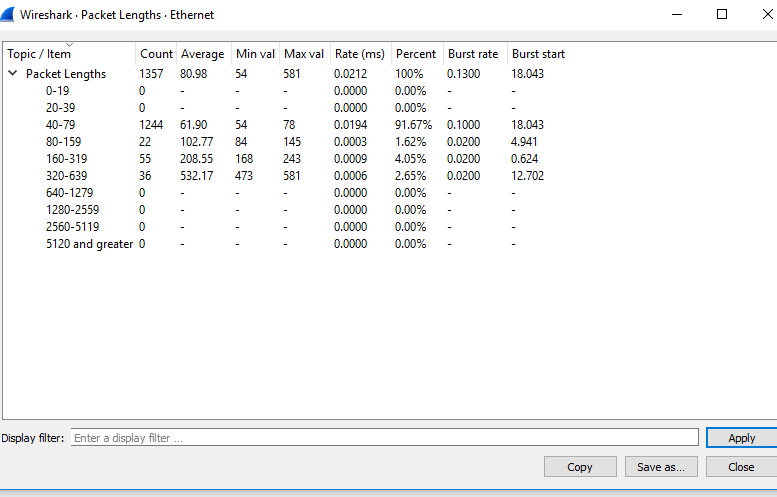

# [Wireshark](https://www.wireshark.org)

[TOC]

Wireshark is a widely used net tool. It can capture pkg and run analysis on that pkg. (distribution of pkg is NOT supported) 

## Support

👉 [Wireshark GUI 中文使用教程](https://www.wangan.com/docs/1110) 
👉 [Wireshark GUI Tutorial EN](https://www.wireshark.org/docs/wsug_html_chunked/)

 [Wireshark Tutorial](https://www.javatpoint.com/wireshark)

🎬 [Intro to packet analysis with TShark](https://youtu.be/fu1USvVXQn4)

🎬 [TShark - Basic Commands & Overview](https://youtu.be/NvKiyHCRXrU)

[Termshark User Guide](https://github.com/gcla/termshark/blob/master/docs/UserGuide.md#table-of-contents)

## Ref

### A List of often-used Filters

| Filters                                                      | Description                                                  |
| :----------------------------------------------------------- | :----------------------------------------------------------- |
| **ip.addr** Example- ip.addr==10.0.10.142 ip.src ip.dst      | It is used to specify the IP address as the source or the destination. This example will filter based on this IP address as a source and a destination. If we want for a particular source or destination then, It is used for the source filter. It is used for the destination. |
| **protocol** Example- dns or http 'Dns and http' is never used. | This command filters based on the protocol. It requires the packet to be either dns protocol or http protocol and will display the traffic based on this. We would not use the command 'dns and http' because it requires the packet to be both, dns as well as http, which is impossible. |
| **tcp.port** Example: tcp.port==443                          | It sets filter based on the specific port number. It will filter all the packets with this port number. |
| **4. udp.port**                                              | It is same as tcp.port. Instead, udp is used.                |
| **tcp.analysis.flags** example is shown in **fig(5)**.       | Wireshark can flag TCP problems. This command will only display the issues that Wireshark identifies. Example, packet loss, tcp segment not captured, etc. are some of the problems. It quickly identifies the problem and is widely used. |
| **6.!()** For example, !(arp or dns or icmp) This is shown in **fig (6)**. | It is used to filter the list of protocols or applications, in which we are not interested. It will remove arp, dns, and icmp, and only the remaining will be left or it clean the things that may not be helpful. |
| Select any packet. Right-click on it and select 'Follow' and then select' TCP stream.' Shown in fig. (7). | It is used if you want to work on a single connection on a TCP conversation. Anything related to the single TCP connection will be displayed on the screen. |
| tcp contains the filter For example- tcp contains Facebook  Or udp contains Facebook | It is used to display the packets which contain such words. In this, Facebook word in any packet in this trace file i.e., finding the devices, which are talking to Facebook. This command is useful if you are looking for a username, word, etc. |
| **http.request** For the responses or the response code, you can type http.response.code==200 | It will display all the http requests in the trace file. You can see all the servers, the client is involved. |
| **tcp.flags.syn==1** This is shown in fig (10). tcp.flags.reset | This will display all the packets with the sync built-in tcp header set to 1. This will show all the packets with tcp resets. |

### List of Statistics in Wireshark

| **Capture file properties**         | It includes file, time, capture, interfaces (current interface in use), and Statistics (measurements). |
| ----------------------------------- | ------------------------------------------------------------ |
| **Resolved addresses**              | This option includes all the types of the Top IP addresses and DNS that were resolved in your packet capture. It gives the idea of the different accessed resources during the packet capture process. It is shown in fig (b). |
| **Protocol hierarchy**              | It is named as the tree of all the protocols listed in the capture process. The image is shown above in fig (c). |
| **Conversations**                   | Each row of the list gives the statistical value of a particular conversation. |
| **Endpoints**                       | It is defined as a logical endpoint of the separate protocol traffic of the specified protocol layer. For example0 IP address will send and receive all types of the packet to the particular IP addresses. |
| **Packet lengths**                  | It simply displays the characteristics of different packets lengths determined in the network.  |
| **I/O Graphs**                      | It is the term used to display the graph of the captured packets. You can also apply filters during this process. The process is explained below in detail. |
| **Service Response Time**           | It is the type of information which is available for many protocols. It is defined as the time it takes between the request and the response time. The protocol for which this service is available are: AFP (Apple Filing Protocol) CAMEL  DCE-RPC DIAMETER FC (Fiber Channel) GTP (GPRS Tunneling Protocol) H.225 RAS LDAP (Lightweight Directory Access Protocol) MEGACO MGCP (Media Gateway Control Protocol) NCP (NetWare Core Protocol) ONC-RPC RADIUS SCSI SMB (Server Message Block Protocol) SMB2 (Server Message Block Protocol version 2) |
| **DHCP (BOOTP) Statistics**         | It is implemented as the option of BOOTP. DHCP is client/server protocol, dynamically used to assign IP addresses to a DHCP client. If DHCP does not work, then some computer system uses APIPA (Automatic Private IP Address) to assign the IP addresses. |
| **ONC-RPC Programs**                | It stands for Open Network Computing- Remote Procedure Call. It can use TCP and UDP as its transport protocol. ONC-RPC cannot be applied directly to filter in a capture process, but you can use TCP or UDP to filter on that one. It is shown in fig (d). |
| **29West**                          | It is defined as ULLM technology. It stands for Ultra-Low Latency Messaging. |
| **ANCP**                            | It stands for **Access Node Control Protocol**. It is an L2CP (Layer 2 Control Protocol) and a TCP based one. It has its adjacency layer which decides the messages exchange by the ANCP endpoints with the use of 'Capabilities.' |
| **BACnet**                          | It was designed specially to meet the communication needs of control systems and building automation. It is used for applications such as fire detecting systems, light control, etc. It provides the structure to exchange information despite the particular building service it performs. |
| **Collectd**                        | It is used to monitor the traffic on the specific TCP port.  |
| **DNS**                             | It stands for Domain Name Server, which gives a detailed analysis of the DNS traffic. It provides the list of the codes returned in DNS. You can also view the errors through the traffic. |
| **Flow-graph**                      | It is a method to check connections between the client and the server. It is an efficient way to verify the connections between two endpoints. It also assists us with troubleshooting capabilities. |
| **HART-IP**                         | It gives the detail for the response, request, publishes, and error packets. It stands for Highway Addressable Remote Transducer over IP stats. |
| **HPFEEDS**                         | It determines the 'payload size per channel and Opcodes.'    |
| **HTTP**                            | It has four options:Packet counter (request types and response codes)Requests (based on URL and the host)Load distribution (based on server address and host)Request sequences (sequences the HTTP's capture request as a tree) |
| **HTTP2**                           | It is the HTTP version 2.                                    |
| **Sametime**                        | It is used to analyze the slow network traffic when the server and client have the sametime. |
| **TCP Stream Graphs**               | It is explained below in detail:                             |
| **UDP Multicast Streams**           | Through this command, stream parameters and burst parameters can be set. It includes OSPF, IGMP, and video streams. |
| **F5**                              | It includes the virtual server distribution and the tmm distribution. It specifies the tcpdump commands. |
| **IPv4 Statistics IPv6 Statistics** | These options determine all addresses, destination and ports, IP protocol types, and the source and destination address. |

### Telephony

- | **VoIP calls**             | It stands for Voice over Internet Protocol. It gives the list of all the detected VoIP calls in the captured traffic. It shows the **start time, stop time, initial speaker, protocol, duration, packet, state**. |
  | -------------------------- | ------------------------------------------------------------ |
  | **ANSI**                   | It stands for American National Standards Institute. ANSI standards are developed by organizations who are authorized by it. |
  | **GSM**                    | It stands for Global System for Mobile. It has various options. It has multiple options, which are used to view the messages count over the traffic. For this, you have to connect your phone to the computer through the USB-TTL converter, verify the layer. After you have to load layer 1 Firmware into the osmocon. Run mobile and specify the interface for sending GSM TAP to listen to the interface through Wireshark. |
  | **IAX2 Stream Analysis**   | It shows the graph with the forward and the reverse streams. |
  | **ISUP Messages**          | It stands for **ISDN User Parts**. It is used to establish and release calls between telephone exchanges. It shows the messages by count and direction. |
  | **LTE**                    | It stands for **Long Term Evolution**. It uses RRC (Radio Resource Control) protocol, which controls MAC and RLC layers in the LTE interface. It shows the statistics of the captured LTE MAC and LTE RLC traffic. |
  | **MTP3**                   | It provides messaging routing between signaling points in the SS7 network. It shows its statistics and summary. It stands for **Message Transfer Part**. |
  | **Osmux**                  | It is a multiplex protocol, which reduces the bandwidth by substituting the voice and signaling traffic. If it is not detected then Wireshark display this information of Osmux on UDP packets or flow. |
  | **RTP**                    | It is called as RTP streams. It starts with the sequence number, packet number, and further stats are created based on the jitter, packet size, arrival time, and delay. It stands for **Real-time Transport Protocol**. |
  | **RTSP**                   | It stands for Real-Time Streaming Protocol. It provides information about the packet counter of response packets and requests packets. |
  | **SCTP**                   | It stands for Stream Control Transmission Protocol. It is designed to transmit PSTN signaling messages over IP networks. It is only applicable for broader applications. |
  | **SMPP Operations**        | It stands for Short Messages Peer to Peer. It determines the response, request, and operations of SMPP. |
  | **UCP Messages**           | It is used to determine whether the captured packet is UCP or Nacks. |
  | **H.225**                  | It is a streamed packetization and signaling protocol used for packet-based multimedia communication systems. |
  | **SIP Flows**              | It stands for Session Initiation Protocol. There is no need for any regular connection or multiples lines. Instead, it is installed on your current internet connection. It works with VoIP. |
  | **SIP Statistics**         | It gives information about the request methods and all of the SIP requests over a connection. |
  | **WAP-WSP Packet Counter** | WSP stands for **Wireless Session Protocol**. It indicates the packets counts for all the Extended post methods, status codes, and PDU types. WAP uses short messages as a carrier. |

## Reading List

[tshark -- wireshark 的命令行抓包工具](https://juejin.cn/post/6994232948618690591)
[tshark: Basic Tutorial with Practical Examples](https://allabouttesting.org/tshark-basic-tutorial-with-practical-examples/)
learn kali Linux
computer network: a top down approach from a programmer's perspective

[A Guide to the Wireshark Command Line Interface “tshark”](https://linuxhint.com/wireshark-command-line-interface-tshark/)

[tshark(1) Manual Page](https://www.wireshark.org/docs/man-pages/tshark.html)

[tshark抓包小结](https://blog.csdn.net/chen8238065/article/details/53714514?ops_request_misc=%7B%22request%5Fid%22%3A%22162754324616780357260704%22%2C%22scm%22%3A%2220140713.130102334..%22%7D&request_id=162754324616780357260704&biz_id=0&utm_medium=distribute.pc_search_result.none-task-blog-2~all~sobaiduend~default-6-53714514.first_rank_v2_pc_rank_v29&utm_term=tshark&spm=1018.2226.3001.4187)

[tshark详解](https://blog.csdn.net/cpongo3/article/details/93995895)

🤔 [wireshark的命令行抓包工具-tshark!](https://juejin.cn/post/6994232948618690591)

[Wireshark User's Guide](https://www.wireshark.org/docs/wsug_html_chunked/)

