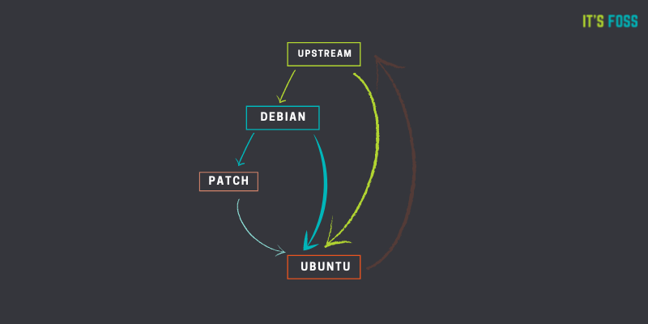

# [Ubuntu](https://ubuntu.com)

[TOC]

## Res

[Ubuntu wiki](https://wiki.ubuntu.com/Home)

[Ubuntu Server documentation](https://ubuntu.com/server/docs)

## Intro

Ubuntu is derived from Debian. It means that Ubuntu uses the same APT packaging system as Debian and shares a huge number of packages and libraries from Debian repositories. It utilizes the Debian infrastructure as base.

That’s what most ‘derived’ distributions do. They use the same package management system and share packages as the base distribution. But they also add some packages and changes of their own. And that is how Ubuntu is different from Debian despite being derived from it.

> [Debian](https://www.debian.org/) is a volunteer project that has developed and maintained a GNU/Linux operating system for well over a decade.
>
> Canonical leads the Ubuntu ecosystem, partnering with public cloud and hardware providers.
>
> :point_right: more info on difference of the two distros [FAQ](../Debian/FAQ.md#👉 Diff between Ubuntu & Debian).

