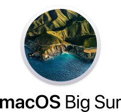
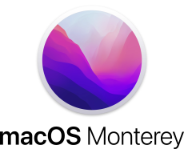
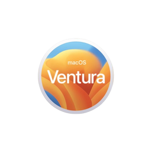

# MacOS (Derived From UNIX Family)

[TOC]

    
	
	
	

	<small>macOS logo history at <a>https://logos.fandom.com/wiki/MacOS#2022–present</a></small>

## Intro

## ⛲️ Resources
⭐️ [macOS Dev Setup](https://github.com/nicolashery/mac-dev-setup)
A beginner's guide to setting up a development environment on macOS

[machow2](https://machow2.com)

[Switchingtomac](https://www.switchingtomac.com)

## Architecture

## Ref

