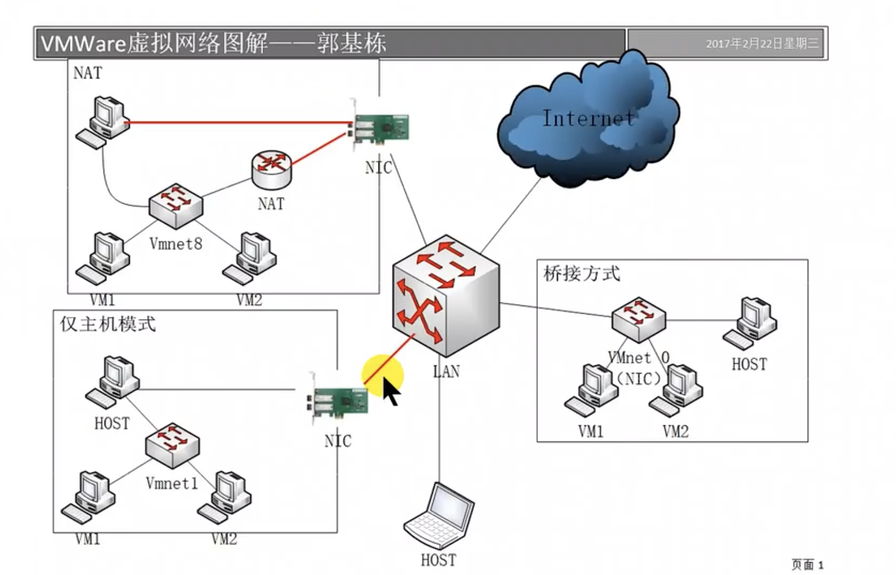

# FAQ

[TOC]


## 🏞 OS Management

### 👉 hardware info

[Linux下查看电脑硬件环境的命令](https://blog.csdn.net/wjlwangluo/article/details/77511692) 


### 👉 Boot Linux on USB

[Rufus](https://rufus.ie/en/)

[在实体PC机上安装Linux系统](https://blog.csdn.net/Blazar/article/details/79168116)


### 👉 Env veriables

> 🖇 [How to Set and List Environment Variables in Linux](https://linuxize.com/post/how-to-set-and-list-environment-variables-in-linux/)

#### What is `env variables`

In Linux and Unix based systems **environment variables are a set of dynamic named values**, stored within the system that are used by applications launched in shells or subshells. In simple words, an environment variable is a variable with a name and an associated value.

Environment variables allow you to customize how the system works and the behavior of the applications on the system. For example, the environment variable can store information about the default [text editor](https://linuxize.com/post/how-to-use-nano-text-editor/) or browser, the path to executable files, or the system locale and keyboard layout settings.

#### How to list `env variables`

There are several commands available that allow you to list and set environment variables in Linux:

For `environment variables`:

- `env` – The command allows you to run another program in a custom environment without modifying the current one. When used without an argument it will print a list of the current environment variables.
- `printenv` – The command prints all or the specified environment variables.

For `environment variables` & `shell variables`: 

- `set` – The command sets or unsets shell variables. When used without an argument it will print a list of all variables including environment and shell variables, and shell functions.
- `unset` – The command deletes shell and environment variables.
- `export` – The command sets environment variables.


### 👉 Hostname

[如何在 Ubuntu 20.04 上修改主机名](https://cloud.tencent.com/developer/article/1649332)

```shell
hostname
hostnamectl set-hostname
```


### 👉 Shutdown a machine

> [Linux关机和重启命令](http://c.biancheng.net/view/793.html)

```shell
reboot

shutdown 

halt

poweroff

init 
```


## 🗄 File Management

### 👉 Linux directory hirachy

#### [/etc](https://blog.csdn.net/blueair_ren/article/details/79937599)

etc不是什么缩写，是and so on的意思 来源于 法语的 et cetera 翻译成中文就是 等等 的意思. 至于为什么在/etc下面存放配置文件， 按照原始的UNIX的说法([linux文件结构](https://www.baidu.com/s?wd=linux%E6%96%87%E4%BB%B6%E7%BB%93%E6%9E%84&from=1012015a&fenlei=mv6quAkxTZn0IZRqIHckPjm4nH00T1Y4mW79ryP-Pj-BP17WnWwb0ZwV5Hcvrjm3rH6sPfKWUMw85HfYnjn4nH6sgvPsT6KdThsqpZwYTjCEQLGCpyw9Uz4Bmy-bIi4WUvYETgN-TLwGUv3EPjcvPjm4PHRv)参考UNIX的教学实现MINIX) 这下面放的都是一堆零零碎碎的东西, 就叫etc, 这其实是个历史遗留.


#### /opt & /usr

1. /opt
   Aka optional, where optional files are stored. Trying out the latest Firefox beta? Install it to /opt where you can delete it without affecting other settings. **Programs here usually live inside a single folder whick contains all of their data, libraries, etc.**

 > 举个例子：刚才装的测试版firefox，就可以装到/opt/firefox_beta目录下，/opt/firefox_beta目录下面就包含了运 行firefox所需要的所有文件、库、数据等等。要删除firefox的时候，你只需删除/opt/firefox_beta目录即可，非常简单。

2. /usr/local
   This is where most manually installed(ie. outside of your package manager) software goes.It has the same structure as /usr. It is a good idea to leave /usr to your package manager and put any custom scripts and things into /usr/local, since nothing important normally lives in /usr/local.


### 👉 [比较文件/目录的不同](https://www.cnblogs.com/f-ck-need-u/p/9071033.html) #unsolved


### 👉 diff between hard linlk & soft link (symlink, symbolic link)


<small>This illustration is not acurate though</small>

#### Unix File System

Unix files consist of two parts: the data part and the filename part.

```shell
# the data part:

                               .---------------> ! data ! ! data ! etc
                              /                  +------+ +------+
        ! permbits, etc ! data addresses !
        +------------inode---------------+
        
        
# the filename part: 

                        .--------------> ! permbits, etc ! addresses !
                        /                 +---------inode-------------+
        ! filename ! inode # !
        +--------------------+
```

The hark link is two filename referring to the same inode number:

```shell
        ! filename ! inode # !
        +--------------------+
                        \
                         >--------------> ! permbits, etc ! addresses !
                        /                 +---------inode-------------+
        ! othername ! inode # !
        +---------------------+
```

While the soft link (or symbolic link, symlink ) is the redirection of filename link: 

```shell
       ! filename ! inode # !
        +--------------------+
                        \
                         .-------> ! permbits, etc ! addresses !
                                   +---------inode-------------+
                                                      /
                                                     /
                                                    /
    .----------------------------------------------'
   ( 
    '-->  !"/path/to/some/other/file"! 
          +---------data-------------+
                  /                      }
    .~ ~ ~ ~ ~ ~ ~                       }-- (redirected at open() time)
   (                                     }
    '~~> ! filename ! inode # !
         +--------------------+
                         \
                          '------------> ! permbits, etc ! addresses !
                                         +---------inode-------------+
                                                            /
                                                           /
     .----------------------------------------------------'
    (
     '->  ! data !  ! data ! etc.
          +------+  +------+ 

```

Now, the filename part of the file is stored in a special file of its own along with the filename parts of other files; this special file is called a directory. The directory, as a file, is just an array of filename parts of other files.

When a directory is built, it is initially populated with the filename parts of two special files: the '.' and '..' files. The filename part for the '.' file is populated with the inode# of the directory file in which the entry has been made; '.' is a hardlink to the file that implements the current directory.

The filename part for the '..' file is populated with the inode# of the directory file that contains the filename part of the current directory file. '..' is a hardlink to the file that implements the immediate parent of the current directory.

The 'ln' command knows how to build hardlinks and softlinks; the 'mkdir' command knows how to build directories (the OS takes care of the above hardlinks).

There are restrictions on what can be hardlinked (both links must reside on the same filesystem, the source file must exist, etc.) that are not applicable to softlinks (source and target can be on seperate file systems, source does not have to exist, etc.). OTOH, softlinks have other restrictions not shared by hardlinks (additional I/O necessary to complete file access, additional storage taken up by softlink file's data, etc.)

In other words, there's tradeoffs with each.


#### A further note with respect to hardlink files

When deleting files, the data part isn't disposed of until all the filename parts have been deleted. There's a count in the inode that indicates how many filenames point to this file, and that count is decremented by 1 each time one of those filenames is deleted. When the count makes it to zero, the inode and its associated data are deleted.

By the way, the count also reflects how many times the file has been opened without being closed (in other words, how many references to the file are still active). This has some ramifications which aren't obvious at first: you can delete a file so that no "filename" part points to the inode, without releasing the space for the data part of the file, because the file is still open.

Have you ever found yourself in this position: you notice that `/var/log/messages` (or some other syslog-owned file) has grown too big, and you

```shell
rm /var/log/messages
touch /var/log/messages
```

to reclaim the space, but the used space doesn't reappear? This is because, although you've deleted the filename part, there's a process that's got the data part open still (syslogd), and the OS won't release the space for the data until the process closes it. In order to complete your space reclamation, you have to

```shell
kill -SIGHUP `cat /var/run/syslogd.pid`
```

to get syslogd to close and reopen the file.

You can use this to your advantage in programs: have you ever wondered how you could hide a temporary file? Well, you could do the following:

```C++
{
	FILE *fp;
	fp = fopen("some.hidden.file","w");
	unlink("some.hidden.file"); /* deletes the filename part */

	/* some.hidden.file no longer has a filename and is truely hidden */
    fprintf(fp,"This data won't be found\n"); /* access the data part */
    /*etc*/
    fclose(fp); /* finally release the data part */
}
```


#### Refs

[ The difference between hard and soft links]:https://linuxgazette.net/105/pitcher.html
[Questions on Stackoverflow]:https://stackoverflow.com/questions/185899/what-is-the-difference-between-a-symbolic-link-and-a-hard-link
[askubuntu]:https://askubuntu.com/questions/108771/what-is-the-difference-between-a-hard-link-and-a-symbolic-link


### 👉 Source release & Binary release?

see [this](https://stackoverflow.com/a/5280925/16542494) answer on stack overflow. A source release is the source code of the packeg, which means user have to compile and construct the software themselves. While Binary release is the to-go software. 


### 👉 Binary code analysis

⭐️ [Radare2: The Libre Unix-Like Reverse Engineering Framework](https://github.com/radareorg/radare2)

🤔 [在 Linux 上分析二进制文件的 10 种方法](https://linux.cn/article-12187-1.html)

1. `file`
2. `idd`
3. `Itrace`
4. `hexdump`
5. `strings`
6. `readelf`
7. `objdump`
8. `strace`
9. `nm`
10. `gdb`

🤔 [Linux下查看二进制文件](https://blog.csdn.net/qq_19922839/article/details/115483499)

1. `hexdump`

2. `xdd`
3. `od`


## 👾 User Management

### 👉 用户/用户组/ 权限

```shell
# lookup users&groups
cat /etc/passwd
cat /etc/group

cat /etc/passwd|grep -v nologin|grep -v halt|grep -v shutdown|awk -F":" '{ print $1"|"$3"|"$4 }'|more

# delete user
userdel user_name

# force quit user
# w/ uptime/ finger/ ps/ top(htop gtop)
pkill -kill -t TTY

# change user group
usermod 

```

[Linux下查看用户列表和删除用户](https://blog.csdn.net/qq_36850813/article/details/83899789)
[Linux修改用户所在组方法](https://blog.csdn.net/czl8897098/article/details/51636407)
[权限详解](https://blog.csdn.net/u013197629/article/details/73608613)

添加用户并赋予权限

- https://blog.csdn.net/stormbjm/article/details/9086163
- [chmod](https://www.computerhope.com/unix/uchmod.htm)


## 📲 Network Management


### 👉 ssh

```shell
ssh-keygen -t -b

ssh-copy-id username@hostname
scp 
```

[scp (secure copy) command](https://linuxize.com/post/how-to-use-scp-command-to-securely-transfer-files/) #unsolved 
[ssh 登陆](https://blog.csdn.net/li528405176/article/details/82810342)
[ssh 高级应用](https://blog.csdn.net/pipisorry/article/details/52269785)


### 👉 Trafic

[Linux系统nload命令查看网速流量](https://www.5yun.org/20932.html) 


Ifconfig

> 🖇 https://www.cnblogs.com/machangwei-8/p/10352887.html

1. What is [NIC](https://zh.wikipedia.org/zh-cn/网卡) (Network Interface Controller)?

   The NIC may use one or more of the following techniques to indicate the availability of packets to transfer:

   - [Polling](https://en.wikipedia.org/wiki/Polling_(computer_science)) is where the [CPU](https://en.wikipedia.org/wiki/CPU) examines the status of the [peripheral](https://en.wikipedia.org/wiki/Peripheral) under program control.
   - [Interrupt](https://en.wikipedia.org/wiki/Interrupt_request)-driven I/O is where the peripheral alerts the CPU that it is ready to transfer data.

2. NICs may use one or more of the following techniques to transfer packet data:

- [Programmed input/output](https://en.wikipedia.org/wiki/Programmed_input/output), where the CPU moves the data to or from the NIC to memory.
- [Direct memory access](https://en.wikipedia.org/wiki/Direct_memory_access) (DMA), where a device other than the CPU assumes control of the [system bus](https://en.wikipedia.org/wiki/System_bus) to move data to or from the NIC to memory. This removes load from the CPU but requires more logic on the card. In addition, a packet buffer on the NIC may not be required and [latency](https://en.wikipedia.org/wiki/Latency_(engineering)) can be reduced.


### 👉 File transmission

[linux服务器之间传输文件的四种方式](https://blog.csdn.net/qw_xingzhe/article/details/80167888)

[Linux curl 命令下载文件](https://www.cnblogs.com/hujiapeng/p/8470099.html) 


### 👉 Port

⭐️ [Opening a port on Linux](https://www.digitalocean.com/community/tutorials/opening-a-port-on-linux)

TBD..


### 👉 Network Configuration --- Bridged, Host-only, NAT

> :link:  [网络配置三种模式对比（桥接模式，主机模式，网络地址转换）](https://cloud.tencent.com/developer/article/1184666)





#### 1. bridged(桥接模式)


#### 2. host-only(主机模式)


#### 3. NAT(网络地址转换模式)


## ⌛️ Process Management

[Linux查看系统服务](https://www.cnblogs.com/yychuyu/p/13428335.html)

