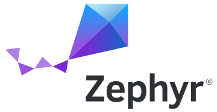

# [Zephyr](https://github.com/zephyrproject-rtos/zephyr)

[TOC]

## Intro

The Zephyr Project is a scalable real-time operating system (RTOS) supporting multiple hardware architectures, optimized for resource constrained devices, and built with security in mind.

The Zephyr OS is based on a small-footprint kernel designed for use on resource-constrained systems: from simple embedded environmental sensors and LED wearables to sophisticated smart watches and IoT wireless gateways.

The Zephyr kernel supports multiple architectures, including ARM (Cortex-A, Cortex-R, Cortex-M), Intel x86, ARC, Nios II, Tensilica Xtensa, and RISC-V, SPARC, MIPS, and a large number of [supported boards](http://docs.zephyrproject.org/latest/boards/index.html).

## Getting Started

Welcome to Zephyr! See the [Introduction to Zephyr](http://docs.zephyrproject.org/latest/introduction/index.html) for a high-level overview, and the documentation's [Getting Started Guide](http://docs.zephyrproject.org/latest/develop/getting_started/index.html) to start developing.

## Community Support

Community support is provided via mailing lists and Discord; see the Resources below for details.

## Resources

Here's a quick summary of resources to help you find your way around:

- **Help**: [Asking for Help Tips](https://docs.zephyrproject.org/latest/develop/getting_started/index.html#asking-for-help)
- **Documentation**: [http://docs.zephyrproject.org](http://docs.zephyrproject.org/) ([Getting Started Guide](http://docs.zephyrproject.org/latest/develop/getting_started/index.html))
- **Source Code**: https://github.com/zephyrproject-rtos/zephyr is the main repository; https://elixir.bootlin.com/zephyr/latest/source contains a searchable index
- **Releases**: https://github.com/zephyrproject-rtos/zephyr/releases
- **Samples and example code**: see [Sample and Demo Code Examples](http://docs.zephyrproject.org/latest/samples/index.html)
- **Mailing Lists**: [users@lists.zephyrproject.org](mailto:users@lists.zephyrproject.org) and [devel@lists.zephyrproject.org](mailto:devel@lists.zephyrproject.org) are the main user and developer mailing lists, respectively. You can join the developer's list and search its archives at [Zephyr Development mailing list](https://lists.zephyrproject.org/g/devel). The other [Zephyr mailing list subgroups](https://lists.zephyrproject.org/g/main/subgroups) have their own archives and sign-up pages.
- **Nightly CI Build Status**: https://lists.zephyrproject.org/g/builds The [builds@lists.zephyrproject.org](mailto:builds@lists.zephyrproject.org) mailing list archives the CI nightly build results.
- **Chat**: Real-time chat happens in Zephyr's Discord Server. Use this [Discord Invite](https://chat.zephyrproject.org/) to register.
- **Contributing**: see the [Contribution Guide](http://docs.zephyrproject.org/latest/contribute/index.html)
- **Wiki**: [Zephyr GitHub wiki](https://github.com/zephyrproject-rtos/zephyr/wiki)
- **Issues**: https://github.com/zephyrproject-rtos/zephyr/issues
- **Security Issues**: Email [vulnerabilities@zephyrproject.org](mailto:vulnerabilities@zephyrproject.org) to report security issues; also see our [Security](http://docs.zephyrproject.org/latest/security/index.html) documentation. Security issues are tracked separately at [https://zephyrprojectsec.atlassian.net](https://zephyrprojectsec.atlassian.net/).
- **Zephyr Project Website**: [https://zephyrproject.org](https://zephyrproject.org/)