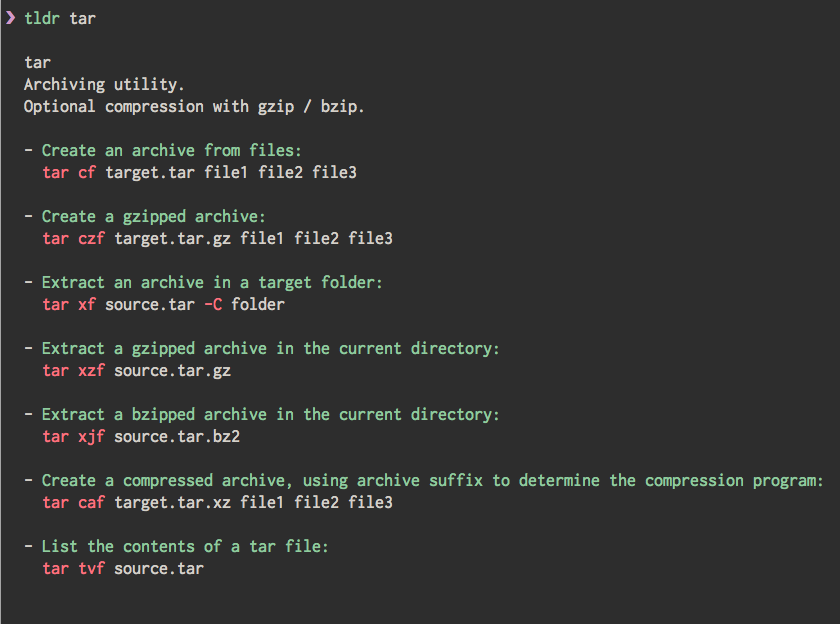

# tldr

[TOC]

## Res
🏠 https://tldr.sh

## Intro

### What does "tldr" mean?
TL;DR stands for "Too Long; Didn't Read". It originated as Internet slang, where it is used to indicate that a long text (or parts of it) has been skipped as too lengthy. Read more in How-To Geek's [article](https://www.howtogeek.com/435266/what-does-tldr-mean-and-how-do-you-use-it/).

### What is tldr-pages?
The tldr pages are a community effort to simplify the beloved [man pages](https://en.wikipedia.org/wiki/Man_page) with practical examples.

For more go to :arrow_right: [wiki](https://github.com/tldr-pages/tldr/wiki/tldr-pages-clients)

<small>tldr demo</small>

## Ref