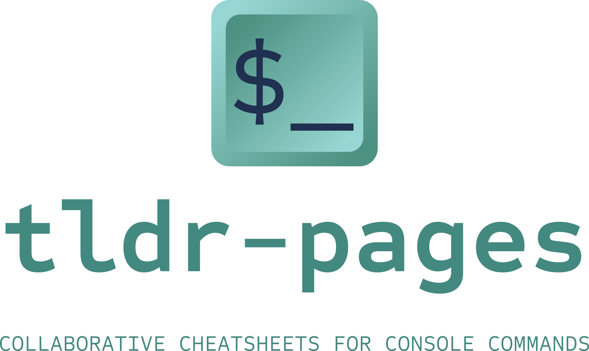

# [tldr](https://tldr.sh)

[TOC]

## What does "tldr" mean?

TL;DR stands for "Too Long; Didn't Read". It originated as Internet slang, where it is used to indicate that a long text (or parts of it) has been skipped as too lengthy. Read more in How-To Geek's [article](https://www.howtogeek.com/435266/what-does-tldr-mean-and-how-do-you-use-it/).

## What is tldr-pages?

The tldr pages are a community effort to simplify the beloved [man pages](https://en.wikipedia.org/wiki/Man_page) with practical examples.

For more go to :arrow_right: [wiki](https://github.com/tldr-pages/tldr/wiki/tldr-pages-clients)

<small>tldr demo</small>

## Similar projects

- [Cheat](https://github.com/cheat/cheat) allows you to create and view interactive cheatsheets on the command-line. It was designed to help remind *nix system administrators of options for commands that they use frequently, but not frequently enough to remember.
- [cheat.sh](https://cheat.sh/) Aggregates cheat sheets from multiple sources (including tldr-pages) into 1 unified interface.
- [devhints](https://devhints.io/) Rico's cheatsheets are not just focused on the command-line and include a plethora of other cheatsheets related to programming.
- [eg](https://github.com/srsudar/eg) provides detailed examples with explanations on the command-line. Examples come from the repository, but `eg` supports displaying custom examples and commands alongside the defaults.
- [kb](https://github.com/gnebbia/kb) is a minimalist command-line knowledge base manager. kb can be used to organize your notes and cheatsheets in a minimalist and clean way. It also supports non-text files.
- [navi](https://github.com/denisidoro/navi) is an interactive cheatsheet tool, which allows you to browse through specific examples or complete commands on the fly.
- [bropages (deprecated)](http://bropages.org/) are a highly readable supplement to man pages. It shows concise, common-case examples for Unix commands. The examples are submitted by the user base, and can be voted up or down; the best entries are what people see first when they look up a command.