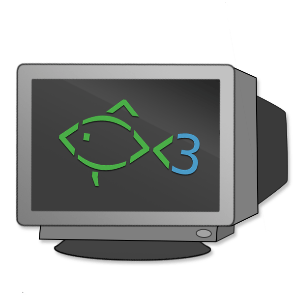

# FISH

## Res
🏠 https://fishshell.com

### Officials
- The [GitHub page](https://github.com/fish-shell/fish-shell/)
- The official [Gitter channel](https://gitter.im/fish-shell/fish-shell)
- The official mailing list at [fish-users@lists.sourceforge.net](https://lists.sourceforge.net/lists/listinfo/fish-users)

If you have an improvement for fish, you can submit it via the GitHub page.

### 📂 [Fish Documents](https://fishshell.com/docs/current/index.html)
- [Introduction](#)
- [Frequently asked questions](faq.html)
- [Interactive use](interactive.html)
- [The fish language](language.html)
- [Commands](commands.html)
- [Fish for bash users](fish_for_bash_users.html)
- [Tutorial](tutorial.html)
- [Writing your own completions](completions.html)
- [Design](design.html)
- [Release notes](relnotes.html)
- [License](license.html)

## Intro
fish is a smart and user-friendly command line shell for Linux, macOS, and the rest of the famil.

Some of the special features of fish are:

- **Extensive UI**: [Syntax highlighting](interactive.html#color), [Autosuggestions](interactive.html#autosuggestions), [tab completion](interactive.html#tab-completion) and selection lists that can be navigated and filtered.
- **No configuration needed**: fish is designed to be ready to use immediately, without requiring extensive configuration.
- **Easy scripting**: New [functions](language.html#syntax-function) can be added on the fly. The syntax is easy to learn and use.

### Where to go?
> 📂 [Fish Documents](https://fishshell.com/docs/current/index.html)

If this is your first time using fish, see the [tutorial](https://fishshell.com/docs/current/tutorial.html#tutorial).

==If you are already familiar with other shells like bash and want to see the scripting differences, see [Fish For Bash Users](https://fishshell.com/docs/current/fish_for_bash_users.html).==

For a comprehensive overview of fish’s scripting language, see [The Fish Language](https://fishshell.com/docs/current/language.html).

For information on using fish interactively, see [interactive use](https://fishshell.com/docs/current/interactive.html#interactive).

### Configuration
To store configuration write it to a file called `~/.config/fish/config.fish`.

`.fish` scripts in `~/.config/fish/conf.d/` are also automatically executed before `config.fish`.

These files are read on the startup of every shell, whether interactive and/or if they’re login shells. Use `status --is-interactive` and `status --is-login` to do things only in interactive/login shells, respectively.

This is the short version; for a full explanation, like for sysadmins or integration for developers of other software, see [Configuration files](language.html#configuration).

## 🎣 Fish for bash/zsh/ksh users
Fish is ==intentionally not POSIX-compatible== and as such some of the things you are used to work differently.

### Special variables
> 🔗 [Special Vairables | Fish docs, fish for bash users](https://fishshell.com/docs/current/fish_for_bash_users.html#special-variables "Permalink to this heading")

Some bash variables and their closest fish equivalent:
- `$*`, `$@`, `$1` and so on: `$argv`
- `$?`: `$status`
- `$$`: `$fish_pid`
- `$#`: No variable, instead use `count $argv`
- `$!`: `$last_pid`
- `$0`: `status filename`
- `$-`: Mostly `status is-interactive` and `status is-login`

### Builtins and other commands
> 🔗 [Builtins and other commands | Fish Docs, fish for bash users](https://fishshell.com/docs/current/fish_for_bash_users.html#builtins-and-other-commands "Permalink to this heading")

By now it has become apparent that fish puts much more of a focus on its builtins and external commands rather than its syntax. So here are some helpful builtins and their rough equivalent in bash:

- [string](https://fishshell.com/docs/current/cmds/string.html) - this replaces most of the string transformation (`${i%foo}` et al) and can also be used instead of `grep` and `sed` and such.
- [math](https://fishshell.com/docs/current/cmds/math.html) - this replaces `$((i + 1))` arithmetic and can also do floats and some simple functions (sine and friends).
- [argparse](https://fishshell.com/docs/current/cmds/argparse.html) - this can handle a script’s option parsing, for which bash would probably use `getopt` (zsh provides `zparseopts`).
- [count](https://fishshell.com/docs/current/cmds/count.html) can be used to count things and therefore replaces `$#` and can be used instead of `wc`.
- [status](https://fishshell.com/docs/current/cmds/status.html) provides information about the shell status, e.g. if it’s interactive or what the current linenumber is. This replaces `$-` and `$BASH_LINENO` and other variables.
- `seq(1)` can be used as a replacement for `{1..10}` range expansion. If your OS doesn’t ship a `seq` fish includes a replacement function.

## Ref